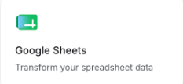
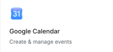

# 📑 AI First 實戰進階：AI 會議紀錄與行事曆中心（Google Sheets + Calendar 雙整合 🗓️）

> **30 秒專案介紹**：  
> 每天在會議室或 Google Meet 耗費數小時，會後筆記密密麻麻，但常因沒人認真追蹤而「開完會就石沉大海」嗎？手動把 Action Items 敲進試算表、再手動切換到 Google 日曆一個個設提醒，往往耗掉半天工時。  
> 本專案運用 **Gemini 語言推理模型** 與 **Google AI Studio 原生「雙 Workspace 整合」**，讓員工直接貼入雜亂筆記或錄音逐字稿，AI 秒級拆解出「決策重點」、「待辦負責人與截止日」及「關鍵會議日程」，**一鍵同步寫入 Google 試算表，並直接將 Deadline 與會議排入個人 Google 日曆**！  
> 透過 Google AI Studio 一鍵部署至 **Google Cloud Run**，享有 **Backend Proxy 伺服器代理機制**，零金鑰與憑證外洩風險！

---

## ⚡ Google Workspace 原生雙整合亮點

本專案同時深度串接 Google AI Studio 的兩大官方原生能力，無須自行在 GCP 建立複雜的 OAuth 2.0 Client ID 與處理 Token：

| 整合服務 | 官方功能卡片 | 核心串接機制 | 專題全景指引 |
| :--- | :---: | :--- | :--- |
| **Google Sheets** |  | 一鍵授權後，調用 Sheets API 將所有萃取出的 Action Items 任務批次追加（Append Rows）至指定追蹤試算表。 | [👉 查看 Google Workspace 14 大原生整合完整指南](../GoogleWorkspace原生整合說明/README.md) |
| **Google Calendar** |  | 調用 Calendar API 自動建立會議行程或任務 Deadline 事件，自動帶入 30 分鐘前推播提醒。 | [👉 查看 Google Workspace 14 大原生整合完整指南](../GoogleWorkspace原生整合說明/README.md) |

---

## 📥 第一步：下載課程素材檔案

我們為大家準備了 2 個可直接下載與檢視的教學素材，讓你在課堂上無須臨時翻找個人公司會議記錄即可秒測：

| 檔案名稱 | 格式 | 說明與用途 | 下載連結 |
| :--- | :---: | :--- | :---: |
| **2026專案會議追蹤表_範本.csv** | `CSV` | Google 試算表追蹤表範本（含任務名稱、負責人、優先級、截止日、備註、完成狀態 6 大欄位） | [📥 點我下載 CSV](./2026專案會議追蹤表_範本.csv) |
| **meeting_transcript_sample.md** | `MD` | 完整逼真的跨部門籌備會議逐字稿（含 PM、設計、工程主管、行銷、QA 發言記錄） | [📥 點我檢視 Markdown](./meeting_transcript_sample.md) |

> 🚨 **AI Studio 初始檔案格式重要提醒**：  
> Google AI Studio 首頁建立專案的對話框（Upload Files 按鈕）**只支援純文字檔案（如 `.csv`、`.md`、`.txt`）與圖片檔案（如 `.svg`、`.png`、`.jpg`）**，**無法直接上傳 `.docx`、`.xlsx`、`.pptx` 等 Office 二進位檔案**！  
> 因此若有 Word 會議記錄或 PPT 簡報，需先轉為 Markdown、純文字或截圖圖片，或直接複製文字貼入提示詞中。

<br>

<details>
<summary>📋 點擊展開：檢視 meeting_transcript_sample.md 完整示範會議內容（可直接複製測試）</summary>

```text
【會議名稱】2026 Q4 次世代產品上線跨部門籌備與進度同步會議
【會議時間】2026年10月15日 下午 14:00 - 15:30
【與會人員】David (PM), Sarah (設計), Alex (工程主管), Emily (行銷), Kevin (QA)

【會議討論摘要與關鍵發言紀要】
1. [設計團隊 Sarah]：必須在 2026/10/22 (四) 前完成所有 Figma 高傳真原型與切版規範交接，優先級「緊急」。
2. [工程團隊 Alex]：需在 2026/10/29 (四) 以前完成核心 API 併發 1000 QPS 壓力測試與資安弱點掃描並提交報告，優先級「高」。
3. [QA 團隊 Kevin]：需在 2026/10/25 (日) 前完成全鏈條回歸測試腳本自動化部署，優先級「中」。
4. [行銷團隊 Emily]：需在 2026/11/05 (四) 前完成上線預熱宣傳文案審批並發布首波 EDM 邀請信，優先級「中」。
5. [下一次重要里程碑會議約定]：全體團隊約定在 2026/10/30 (五) 下午 15:00 - 16:30 召開「線上 Pre-Launch 最終覆盤檢查會議」（線上 Google Meet）。
```

</details>

---

## 🚀 第二步：Google AI Studio 實作 3 步驟（SOP）

請依照以下簡單三步驟完成專案建置與 Google Cloud Run 雲端發布：

```
【步驟 1】複製第三步提示詞 ────────────────► 貼至 AI Studio 首頁對話框生成專案進入工作區
                                                  ▼
【步驟 2】開啟專案右側 Integrations 面板 ──► 啟用 Google Sheets 與 Google Calendar 完成授權
                                                  ▼
【步驟 3】網頁預覽立即測試 ────────────────► 貼上逐字稿、一鍵同步試算表與日曆、一鍵 Publish！
```

### 1. 貼入提示詞生成應用程式
- 開啟 [Google AI Studio](https://aistudio.google.com/)，點擊「**+ New app**」。
- （可選）點擊右上角齒輪 ⚙️ **Advanced settings**，確認模型為 Gemini 3.8 Flash、Framework 為 React，System instructions 可設定自訂繁體中文要求。
- 複製下方**「第三步」**的完整 RTCCF 提示詞，直接貼入首頁對話框「Describe an app and let Gemini do the rest」，點擊發送開始生成專案並進入專案工作區（Code & Preview 介面）。

### 2. 在專案中啟用 Google Sheets 與 Google Calendar 原生雙整合
- 專案建立完成後，查看右側側邊欄的 **`Integrations`** 面板（專案建立後才會出現）：
  - 找到 **`Google Sheets`** 並點擊 **`Enable（啟用）`** 完成授權。
  - 找到 **`Google Calendar`** 並點擊 **`Enable（啟用）`** 完成授權。

### 3. 測試與雲端發布
- **點擊一鍵填入範例**：在產出的網頁中，點擊「📋 填入示範會議紀錄」按鈕，快速帶入 1500 字跨部門籌備會議內容。
- **AI 結構化智慧解析**：點擊「🚀 開始 AI 智慧拆解」，Gemini 秒級萃取出「核心結論」、「行動任務清單（含負責人/截止日）」與「關鍵日曆日程」。
- **一鍵同步至 Google 試算表**：點擊「Sign in with Google」完成授權，點擊「📥 一鍵同步所有待辦至 Google Sheets」，任務批次寫入雲端追蹤表。
- **一鍵排入 Google 日曆**：點擊「📅 全部排入日曆」，行程與 Deadline 自動排入 Google Calendar 並附帶提前 30 分鐘推播提醒。
- **一鍵發布至 Cloud Run**：
  - 切換至右側工具列的 **`Publish`** 面板。
  - 自訂 App URL（例如 `meeting-sheets-calendar-hub`），點擊 **`Publish your app`**，30~60 秒內由 Google Cloud Run 全託管發布上線！

---

## 💡 如何用別的 AI 將「你日常真實會議記錄」轉成 RTCCF？

如果你未來想客製化自己部門特定的會議模板（例如：敏捷開發 Scrum Daily Standup、業務週會、跨國會議英文摘要），只要把你的會議記錄規範與追蹤欄位整理好，貼入下方指令，讓其他 AI（如 ChatGPT、Claude 或 Gemini）協助你轉換成標準 RTCCF 規格書：

<details>
<summary>👉 點擊展開：請其他 AI 協助客製會議追蹤系統的自然語言指令（可直接複製）</summary>

```text
我已經完成了一份我們部門慣用的會議記錄欄位規範與專案追蹤格式。
我想在 Google AI Studio 開發一個專為上班族設計的「AI 智慧會議秘書與日曆中心 SPA」，技術棧使用 Vite + React + TypeScript + Tailwind CSS，並同時使用 Google AI Studio 原生的 Google Sheets 與 Google Calendar Integrations。
功能需求：
1. 支援貼上雜亂會議文字，利用 Gemini 語言模型結構化拆解。
2. 自動歸納核心決策、待辦事項清單（含負責人、優先級、截止日）與重要行程。
3. 整合 Google 帳號授權，支援一鍵整批追加待辦至 Google 試算表。
4. 支援一鍵將關鍵 Deadline 或覆盤會議自動排入使用者的 Google 日曆。
請扮演資深全端架構師，使用標準 RTCCF 框架（包含：# 角色 Role、## 任務目標 Task、## 背景情境 Context、## 核心規則與限制 Constraints、## 輸出規格與風格 Format），將我的會議規範融入規格中：

[在此處貼上你部門自訂的會議記錄範本、追蹤表欄位需求或會議類型說明]
```

</details>

<br>

---

## 🤖 第三步：專案生成提示詞（點擊代碼框右上角一鍵複製）

請將以下整段提示詞複製，貼到 **Google AI Studio**：

```markdown
# 角色 (Role)
你是一位精通企業協作自動化、React 18+、TypeScript、Tailwind CSS 與 Google Workspace 原生整合的全端架構師，專精於運用 Google AI Studio 的 Google Sheets + Google Calendar 雙整合，打造極速會議落地工作流。

## 任務目標 (Task)
請開發一個極具現代生產力工具質感（Notion / Linear 風格）的單頁應用程式「AI 會議紀錄與日曆中心 (AI Meeting Action & Calendar Hub)」。

## 背景情境 (Context)
- 開發環境與技術棧：Google AI Studio (Build Mode)、Vite、React 18+、TypeScript、Tailwind CSS、Lucide React 圖示庫。
- 原生雙整合：已在 Google AI Studio 啟用 **Google Sheets Integration** 與 **Google Calendar Integration**。
- 適用對象：企業專案經理 (PM)、主管、執行秘書與跨部門團隊成員。
- **內建示範會議偽資料**：
  提供「📋 填入示範會議紀錄」按鈕，點擊可秒填入 2026 Q4 產品上線跨部門籌備會議內容（含 Sarah 設計交接、Alex 資安弱掃、Kevin QA 部署、Emily 行銷 EDM 與 10/30 全員線上覆盤會議）。

## 核心規則與限制 (Constraints)
1. 頂部 Google Workspace 整合授權列：
   - 整合 Google 登入（Sign in with Google），一次取得 Sheets 與 Calendar 存取授權。
   - 登入後顯示使用者頭像、姓名，以及「Sheets 🟢」與「Calendar 🟢」連線狀態徽章。
   - 提供「Google 試算表目標設定」折疊欄位（支援輸入 Spreadsheet ID 或網址）。
2. 會議筆記輸入與 AI 結構化解析核心：
   - 大文字輸入框（支援自訂輸入或點擊一鍵填入範例）。
   - 點擊「🚀 開始 AI 智慧拆解」，調用 Gemini 模型將散亂內容精準提煉為以下三個區塊：
     - **區塊 A：會議核心結論 (Executive Summary)**：3~4 點條列關鍵決策。
     - **區塊 B：行動任務清單 (Action Items)**：包含任務名稱、負責人姓名、優先等級（緊急/高/中/低）、截止日期 (YYYY-MM-DD)、驗收標準。
     - **區塊 C：日曆關鍵日程 (Calendar Events)**：包含會議名稱/任務 Milestone、開始日期時間、結束時間、地點（如 Google Meet 線上會議）、詳細說明。
3. 雙向雲端同步機制：
   - **Google Sheets 同步**：
     - 在「行動清單」區塊提供「📥 一鍵同步所有待辦至 Google Sheets」按鈕。
     - 透過 Google Sheets API 將所有 Action Items 批次新增（Append Rows）至目標試算表。
   - **Google Calendar 排程**：
     - 在「日曆日程」區塊提供個別「📅 加入 Google 日曆」與「🌟 全部排入日曆」按鈕。
     - 調用 Google Calendar API 自動建立日程，並設定 30 分鐘前推播提醒，成功後附帶「在 Google 日曆中檢視」連結。
4. 防呆與進度回饋：
   - 未登入 Google 時，點擊同步按鈕會友善提示引導完成登入授權。
   - 執行同步與建立排程時具備流暢的 Loading Spinner 與成功 Toast 提示。

## 輸出規格與風格 (Format)
- UI/UX 風格：現代極簡優雅生產力風格（乾淨白 Slate 50 畫布、深沉文字 Slate 900、藍紫 Indigo/Violet 科技主色調、標籤色彩分明、微邊框細緻圓角卡片）。
- 程式碼規範：
  - 提供完整、單一且具備完整 TypeScript 型別定義的 `App.tsx` 前端程式碼。
  - 核心功能模組化（Gemini 提示詞處理、Sheets 批次寫入、Calendar 事件建檔）。
  - 附帶相依套件安裝指令（`npm i lucide-react`）。
```

---

## 💡 常見問題與除錯指南 (FAQ)

### Q1：點擊「加入 Google 日曆」時日曆沒有即時出現？
- 請重新整理個人 [Google Calendar 頁面](https://calendar.google.com/)，並檢查是否切換到了與應用程式登入時相同的 Google 帳號。
- 若會議時間只有標明日期而沒有具體小時，系統會預設以「全天事件 (All-day Event)」形式建立在該日期的最頂部。

### Q2：如何確保 Google Sheets 與 Calendar 都有寫入權限？
- 初次登入彈出 Google OAuth 授權視窗時，請務必確認勾選了：
  1. 「**查看、編輯、建立和刪除您的 Google 試算表**」
  2. 「**查看、編輯、共享和永久刪除您可以使用 Google 日曆存取的所有日曆**」
  兩者皆需勾選，API 才能同時成功追加試算表列並建立新行程。

### Q3：AI 如何將「下週四」或「明天」轉換為正確的西元年月份？
- 在提示詞中已指示系統注入基準系統時間（System Time Context），Gemini 會以今天的日期為原點精準推算出具體的 `YYYY-MM-DD`，再送給 Google Calendar 與 Sheets API，完全避免日期格式錯亂。
