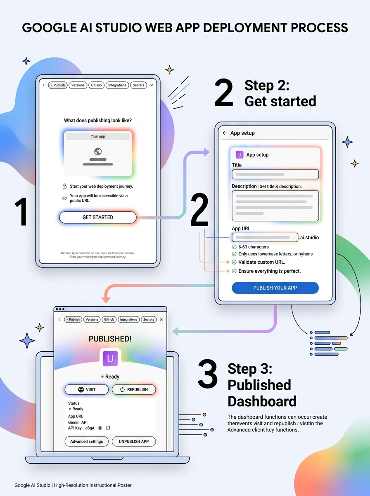
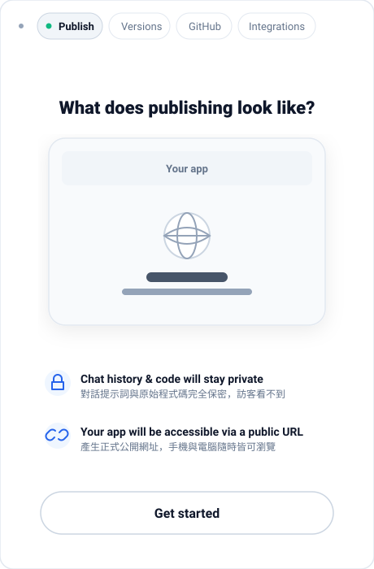
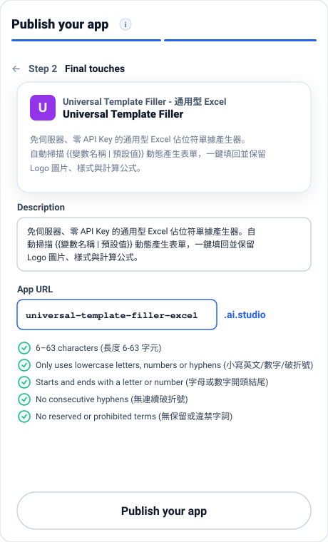
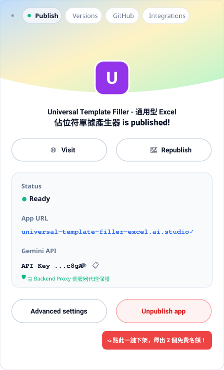
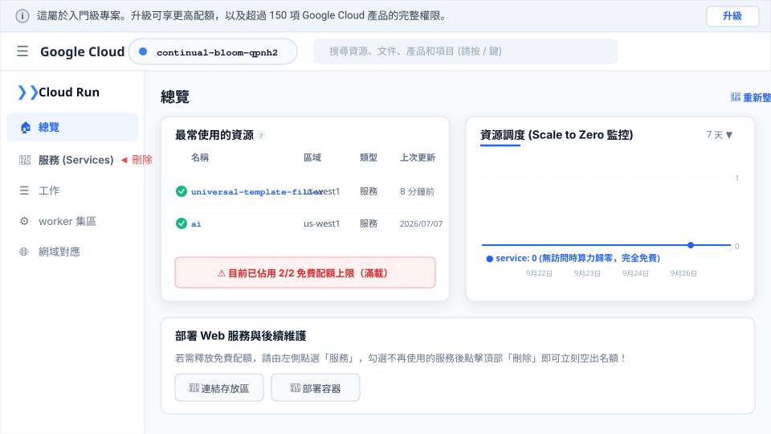
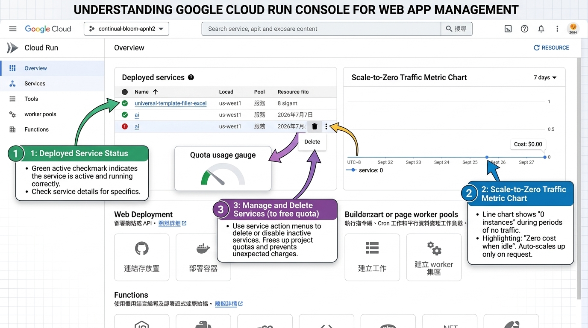

# 🚀 Google AI Studio 主動部署完全指南（發布、自訂網址、更新與一鍵下架）

> **30 秒核心導讀**：  
> 在 Google AI Studio 開發完網頁後，最令人興奮的時刻就是**「一鍵公開發布給主管或客戶看」**！  
> 本單元結合 **Google AI Studio 最新介面** 與 **Google Cloud Console 繁體中文控制台真實畫面**，帶你徹底掌握：  
> 1. **主動部署 2 步流程**：從「隱私確認」到「自訂專屬 `.ai.studio` 網址」。  
> 2. **發布後的控制面板**：如何一鍵造訪（Visit）、更新程式碼後重新發布（Republish）。  
> 3. **配額滿了怎麼辦？**：每個帳號在「入門級專案」中**最多同時保持 2 個免費服務**，教你如何透過 AI Studio 一鍵下架或在 GCP 後台手動刪除舊專案！  
> 4. **直擊 Google Cloud Run 後台**：親眼見證「縮容至 0 (Scale to Zero)」零費用真相與伺服器資源調度。

---

## 🗺️ 一、 主動部署 vs. 手動部署：有何不同？

| 比較維度 | 🚀 Google AI Studio 主動部署（推薦首選） | 🛠️ Google Cloud 手動部署（進階維運） |
| :--- | :--- | :--- |
| **操作介面** | 直接在 AI Studio 右側點擊 **Publish** 面板 | 前往 [Google Cloud Console - Cloud Run](https://console.cloud.google.com/run) |
| **操作門檻** | **零門檻**，完全不需懂 Docker 或伺服器配置 | 需理解容器映像檔、環境變數、連接埠 (Port) 與 IAM 權限 |
| **網址格式** | 享專屬頂級網域：`https://[你自訂的名稱].ai.studio` | 預設為隨機 `*.run.app`，需手動設定 DNS 綁定自訂網域 |
| **金鑰安全** | 系統自動啟用 **Backend Proxy**，API Key 自動由伺服器隔離保護 | 開發者需自行在 GCP Secret Manager 或環境變數配置金鑰 |
| **下架刪除** | 面板內一鍵點擊 **`Unpublish app`**，立即釋出配額 | 在 GCP Console 的「服務」清單勾選後點擊刪除 |
| **適合對象** | **辦公室同仁、課程學員、快速展示成果的 PM 與主管** | **企業正式營運系統、需自訂 VPC 私有網路的架構師** |

---

## ⚡ 二、 主動部署實戰 2 步驟（AI Studio 前端流程）

在 Google AI Studio 右側工具列點擊 **`Publish`** 按鈕，即可進入發布流程：

```
【步驟 1】啟動引導 (What does publishing look like?) ──► 點擊「Get started」
                                                           ▼
【步驟 2】最終設定 (Final touches) ──────────────────► 自訂 App URL ➜ 點擊「Publish your app」
                                                           ▼
【步驟 3】發布成功面板 (is published!) ──────────────► 點擊「Visit」立即造訪專屬網站！
```

### 🖼️ 3 步驟發布流程全景教學海報


### 步驟 1：啟動引導頁（What does publishing look like?）



- 🔒 **Chat history & code will stay private（對話紀錄與程式碼絕對私密）**：
  外部訪客只能操作編譯後的最終網頁，**完全看不到你在 AI Studio 中的提示詞（Prompts）、對話過程與原始程式碼**。
- 🔗 **Your app will be accessible via a public URL（產生正式公開網址）**：
  產生一個任何人用手機、平板或電腦皆可隨時造訪的獨立網址。
- 👉 **操作動作**：點擊下方的 **`Get started`** 按鈕進入下一步。

---

### 步驟 2：最終設定頁（Step 2 Final touches）



1. **Description（專案描述）**：系統自動產生摘要，亦可手動微調。
2. **App URL（自訂專屬網址）**：
   - 預設網址後綴為 **`.ai.studio`**。
   - 自訂前綴（例如輸入 `universal-template-filler-excel`），最終網址即為：  
     👉 **`https://universal-template-filler-excel.ai.studio`**
   - ⚠️ **系統即時檢核 5 大命名規則（全部綠勾方可發布）**：
     - ✅ **6–63 characters**（長度需介於 6 到 63 個字元）
     - ✅ **Only uses lowercase letters, numbers or hyphens**（只能使用小寫字母、數字或破折號 `-`）
     - ✅ **Starts and ends with a letter or number**（必須以字母或數字開頭及結尾）
     - ✅ **No consecutive hyphens**（不可有連續的破折號如 `--`）
     - ✅ **No reserved or prohibited terms**（不可使用系統保留字）
3. 👉 **操作動作**：點擊底部的 **`Publish your app`** 按鈕，約 30~60 秒內即可完成部署！

---

## 🎛️ 三、 發布成功控制台：管理、更新與一鍵下架



發布成功後，右側的 Publish 面板會常駐顯示發布狀態控制台：

- 🌐 **`Visit`**：開啟新分頁，直接瀏覽正式上線的網頁成果，方便立刻複製網址分享。
- 🔄 **`Republish`**：在 AI Studio 修改程式碼或提示詞後，**點擊 Republish 即可一鍵將最新代碼同步更新至雲端，網址完全不變**！
- 🟢 **Status: Ready**：代表雲端容器運作正常。
- 🔑 **Gemini API Key**：金鑰以遮罩顯示，由 Backend Proxy 在伺服器端妥善保護。
- 🛑 **`Unpublish app`**：一鍵取消發布，應用程式立刻停止對外服務，**免費 2 個專案的配額瞬間空出 1 個名額**！

---

## 🖥️ 四、 直擊 Google Cloud 控制台真實畫面（底層機制剖析）

當你在 Google AI Studio 點擊 Publish 後，Google 實際上是在 Google Cloud Platform (GCP) 的後台幫你建立了一套標準的 Cloud Run 資源。

打開 [Google Cloud Console - Cloud Run 頁面](https://console.cloud.google.com/run)，你會看見真實的運作資訊：



### 🖼️ Google Cloud Run 控制台管理與縮容機制教學圖解


### 🔍 真實畫面中的 4 大核心真相：
1. **頂部提示「這屬於入門級專案」**：
   - 代表此專案採用 Google 免費提供給初學者的 **Starter Tier（入門級專案）**，無需綁定信用卡即可免費運行。
2. **自動建立的專案名稱（如 `continual-bloom-qpnh2`）**：
   - 頂部選單顯示的名稱是 AI Studio 自動為你配發的 GCP 專案代碼。
3. **驗證 2/2 免費配額上限**：
   - 在「最常使用的資源」清單中，正好可以看到兩筆服務（例如 `universal-template-filler-excel` 與 `ai`）。
   - **這代表 2 個免費名額已經全數用完！** 若要再發布第 3 個專案，就必須刪除其中一個舊服務。
4. **「縮容至 0 (Scale to Zero)」完全不扣錢的鐵證**：
   - 右側的「資源調度」監控折線圖**長年平躺在 0**。
   - 這證明：當沒有訪客開啟網址時，雲端實例處於 100% 深度休眠，CPU 與記憶體消耗為零，**完全不會產生運算費用**！

---

## 🗑️ 五、 如何在 Google Cloud 控制台手動刪除舊服務（釋出額度 SOP）

除了直接在 AI Studio 點擊 `Unpublish app` 之外，如果你先前在 AI Studio 的對話專案已經被刪除，但 Cloud Run 雲端服務還在佔用名額，請依照以下步驟在 GCP 後台手動清除：

### 📋 GCP 後台刪除 5 步驟：
1. **前往 Cloud Run 頁面**：開啟 [Google Cloud Console - Cloud Run](https://console.cloud.google.com/run)。
2. **切換到正確專案**：在頂部專案下拉選單，確認切換至 AI Studio 建立的專案（如 `continual-bloom-qpnh2`）。
3. **進入「服務」清單**：
   - 點擊左側導航選單中「總覽」正下方的 **「服務 (Services)」** 分頁。
4. **勾選並刪除**：
   - 在服務清單中，找到想要下架的舊專案（例如過去測試的 `ai`），在名稱左側的**核取方塊打勾**。
   - 點擊上方工具列的 **「🗑️ 刪除 (Delete)」** 按鈕。
   - 彈出確認視窗後，依照指示輸入服務名稱確認刪除。
5. **配額瞬間釋放**：
   - 約 10 秒後服務完全清除，「最常使用的資源」從 2 個變回 1 個，你的免費額度立即空出，可以回到 AI Studio 繼續發布全新專案！

---

## 💰 六、 費用安全與運作常識總結 (Cost & Safety)

1. **免費額度有多大？**：
   - Google Cloud Run 提供每個月 **200 萬次請求（2 Million Requests）** 的永久免費層。
   - 專案部署在 `us-west1` 等標準區域，日常展示與辦公室小組使用絕不超標。
2. **需要輸入信用卡嗎？**：
   - 只要畫面頂部顯示「這屬於入門級專案」，就代表是在免費體驗階段，**完全不需要輸入信用卡**。
   - 除非你主動點擊右上角的「升級」按鈕啟用 GCP 帳單帳戶，否則 Google 絕對不會向你收費，請安心使用！
