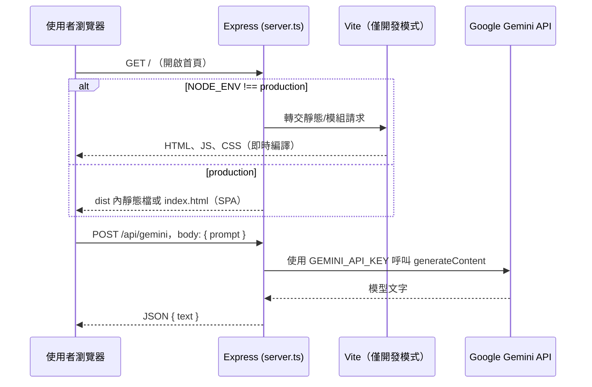

# `server.ts` 與使用者進站流程

本文件說明：**使用者在瀏覽器打開網站後，請求如何經過 Express（`server.ts`）與前端，最後取得 Gemini 回覆**。對應程式為專案根目錄的 `server.ts`。

## 整體概念

- **一個行程、一個網址**：本機開發時請用 **`http://localhost:3000`**（由 `npm run dev` → `tsx server.ts` 啟動）。
- **同一個主機名與 port**：HTML/JS 與 `POST /api/gemini` 都在同一個 origin，前端才能用相對路徑 `fetch("/api/gemini", …)`，不必處理跨網域金鑰或 CORS 細節。
- **金鑰只在伺服器**：`GEMINI_API_KEY` 只從 `.env` / `.env.local` 讀入 `process.env`，**絕不**包進前端 bundle。

## 流程圖（概念）

## 步驟說明（本機開發）

### 1. 啟動伺服器

執行 `npm run dev` 時，Node 會載入 `server.ts`：

1. 用 **dotenv** 從專案目錄載入 `.env`、`.env.local`。
2. 建立 **Express** `app`，掛上 `express.json()`、`cors()`。
3. 註冊 **`POST /api/gemini`**（後端代理 Gemini）。
4. 若**非** production：建立 **Vite（middleware 模式）** 並 `app.use(vite.middlewares)`。  
   之後多數「像網頁、JS、HMR」的請求會由 Vite 處理。
5. `app.listen(3000, "0.0.0.0")`，終端機會印出網址與 `GEMINI_API_KEY` 是否載入。

### 2. 使用者開啟網站（GET 請求）

使用者在網址列輸入 **`http://localhost:3000`**（或根路徑 `/`）：

1. 請求進入 Express。
2. **不是** `POST /api/gemini`，因此不會進 API 處理函式。
3. 請求是 **GET**，接著落到後面掛的 **Vite middleware**（開發模式）。
4. Vite 回傳 **React 單頁應用** 的入口（例如 `index.html`）與相關資源，瀏覽器載入後由 **`src/App.tsx`** 等元件渲染畫面。

此時使用者看到的是「一句話問答」介面，尚**未**呼叫 Gemini。

### 3. 使用者送出問題（POST 請求）

使用者在表單輸入文字並送出後，前端（`App.tsx`）會：

1. `fetch("/api/gemini", { method: "POST", body: JSON.stringify({ prompt }) })`  
   因為與頁面同源，path 用 **`/api/gemini`** 即可。
2. Express 的 **`app.post("/api/gemini", …)`** 接收請求：
   - 檢查 `prompt` 是否存在；否則 **400**。
   - 檢查 `process.env.GEMINI_API_KEY`；否則 **500**（設定問題）。
   - 使用 **`@google/genai`** 建立 client 並 `generateContent`，將模型回傳文字包成 **`{ text }`** JSON **200** 回傳。
   - 若 API 失敗則 **500**，並在伺服器 console 記錄錯誤。
3. 瀏覽器收到 JSON 後，前端把 `data.text` 顯示在頁面上（或顯示錯誤訊息）。

至此，**完整一輪「進站 → 看畫面 → 問答」**結束。

## 正式環境（`NODE_ENV=production`）的差異

- 不會掛 Vite middleware；改為 **`express.static("dist")`** 提供建置後的靜態檔。
- 任意 **GET** 路徑若沒對應到實體檔案，則由 **`app.get("*", …)`** 回傳 **`dist/index.html`**，方便 SPA 前端路由。
- **`POST /api/gemini`** 的後端邏輯與開發模式相同（仍只靠環境變數裡的金鑰）。

## 與「單獨跑 Vite（例如 5173）」的差別

若只用 Vite 預設 dev server、**沒有**跑 `server.ts`，則瀏覽器請求的 **`/api/gemini` 沒有對應的 Express 路由**，問答會失敗。因此本專案 README 才強調請開 **`http://localhost:3000`**。

## 相關檔案

| 檔案 | 角色 |
|------|------|
| `server.ts` | Express 入口、API、開發時掛載 Vite / 正式時服務 `dist` |
| `src/App.tsx` | 前端 UI；`fetch("/api/gemini")` |
| `.env` / `.env.local` | `GEMINI_API_KEY`（勿提交版控） |
