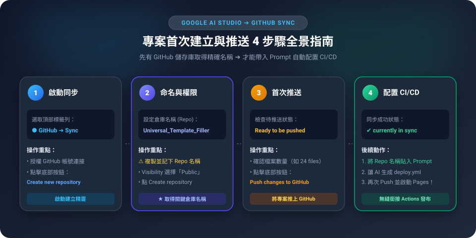
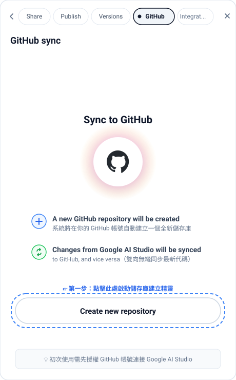
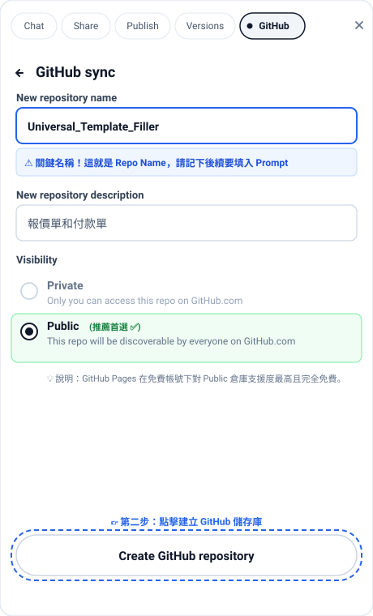
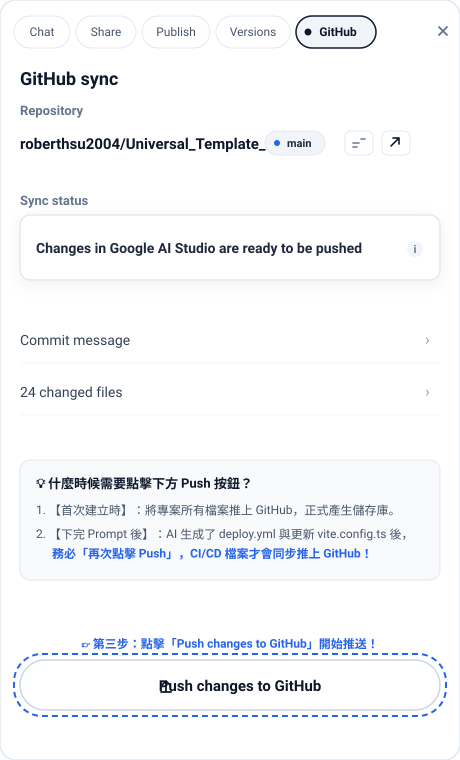
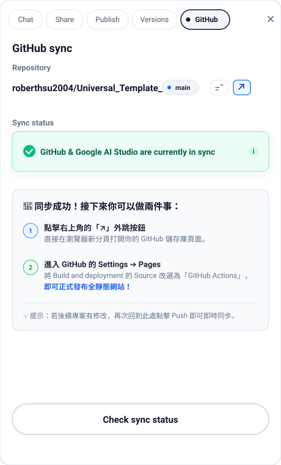

# 🐙 Google AI Studio 轉 GitHub Pages 靜態網頁部署指南（GitHub Actions 自動化 CI/CD）

> **30 秒核心導讀**：  
> 在 Google AI Studio 產出的專案通常是基於 **Vite + React + TypeScript** 的現代前端專案。  
> ⚠️ **新手最常踩的大坑**：直接把原始碼 Push 到 GitHub 後開啟 GitHub Pages，打開網址往往**只看到空白畫面或 404 錯誤**！  
> 因為現代專案必須經過 `npm run build` 編譯打包為純靜態檔案（HTML/CSS/JS）。本單元教你**如何直接在 Google AI Studio 中下精準提示詞（避免舊版 Actions 報錯，並帶入自己的 GitHub 網址）**，一鍵生成最新的 CI/CD 工作流；更教你**萬一建置失敗時，如何把錯誤日誌精準回傳給 Google AI Studio 自動修復**！

---

## 🧭 一、 為什麼不能直接發布？（原理速懂）

傳統 GitHub Pages 只懂得直接讀取純 HTML 檔案；但現代 React 專案需要經過編譯工具（Vite）打包成 `dist` 資料夾。

```
【傳統錯誤方式】直接 Push 原始碼 ──► GitHub Pages 看不懂 TypeScript/JSX ──► 💥 網頁空白或報錯
                                      VS
【現代自動化】原始碼 Push ──► GitHub Actions 自動執行 npm run build ──► 🚀 發布全靜態網頁！
```

---

## 🤖 二、 核心操作流程：先 Push 建立倉庫 ➔ 取得名稱 ➔ 下 Prompt 自動配置

⚠️ **重要先後順序提醒**：  
很多新手會直接把 Prompt 複製給 AI Studio，卻不知道 `[倉庫名稱]` 該填什麼！  
👉 **正確順序是：必須「先將專案首次 Push 到 GitHub 建立儲存庫」，有了具體的倉庫名稱後，再把名稱填入 Prompt 讓 AI Studio 精準配置！**

### 📍 前置步驟：在 Google AI Studio 首次 Push 建立儲存庫（圖解 4 步驟）



#### 步驟 1：在 AI Studio 點選 GitHub 標籤啟動同步
- 在 Google AI Studio 頂部工具列，點選 **`GitHub`** 頁籤。
- 畫面會顯示 `Sync to GitHub` 說明（將自動建立儲存庫並雙向同步）。
- 點擊底部的 **`Create new repository`** 按鈕啟動儲存庫精靈。
- *(💡 初次使用需先授權 GitHub 帳號連接 Google AI Studio)*。



#### 步驟 2：輸入倉庫名稱（Repo Name）與選擇 Public 公開
- **New repository name**：輸入你的專案名稱（例如 `Universal_Template_Filler`）。
  - ⚠️ **極度重要**：請精確記下此名稱（包含大小寫與底線）！稍後的 Prompt 提示詞必須完全一致地填入。
- **New repository description**：輸入專案摘要（例如「報價單和付款單」）。
- **Visibility**：請務必勾選 **`Public`**（公開）。
  - 💡 **避坑原因**：GitHub Pages 對免費用戶的 Public 倉庫提供最完整的 Actions 自動部署支援，設定最單純且零阻礙。
- 點擊底部的 **`Create GitHub repository`** 按鈕。



#### 步驟 3：點擊 Push 按鈕將專案代碼推上 GitHub
- 儲存庫建立成功後，Sync status 狀態會提示 `Changes in Google AI Studio are ready to be pushed`。
- 確認待推送的檔案數量（例如 24 changed files），點擊底部的 **`↑ Push changes to GitHub`** 按鈕開始推送！



#### 步驟 4：確認同步成功（in sync）並取得儲存庫資訊
- 數秒後，Sync status 會轉為綠色卡片：`GitHub & Google AI Studio are currently in sync`，代表專案已 100% 成功推上 GitHub！
- 點擊右上角的 **`↗`** 按鈕，可以直接在新分頁開啟你的 GitHub 倉庫首頁。
- 此時你已正式擁有專案的專屬儲存庫資訊：
  - **GitHub 儲存庫網址**：`https://github.com/<你的 GitHub 帳號>/<你的倉庫名稱>`
  - **倉庫專案名稱 (Repo Name)**：`<你的倉庫名稱>`（即網址最後面的這段名稱）



---

### 📋 轉換為 GitHub Actions 專用 Prompt（請帶入剛建立的倉庫名稱）

現在你已經有了確切的倉庫名稱，複製下方這段**特別經過防錯加固（強制最新版 Actions ＋ 動態雙棲 base ＋ 帶入真實倉庫名稱）**的提示詞貼給 AI Studio：

```text
這份專案非常棒！現在我想將此專案部署到「GitHub Pages」作為永久全靜態網站。
我剛才已經在 GitHub 建立了此專案的儲存庫（Repository），資訊如下：
- GitHub 儲存庫網址：https://github.com/[請填入你的GitHub帳號]/[請填入剛建立的倉庫名稱]
- 倉庫專案名稱 (Repo Name)：[請填入剛建立的倉庫名稱]

請幫我在目前的專案架構中加入 GitHub Actions 自動化 CI/CD 發布設定，請嚴格遵守以下 3 點要求：

1. 新增 GitHub Actions 工作流設定檔 (.github/workflows/deploy.yml)：
   - ⚠️【嚴禁使用舊版】：GitHub 已廢棄舊版 runner，請務必採用 2026 最新官方 Action 版本：
     * actions/checkout@v4（嚴禁使用 v2/v3）
     * actions/setup-node@v4，並指定 node-version: 20（嚴禁使用已廢棄的 Node 16/18）
     * actions/configure-pages@v5
     * actions/upload-pages-artifact@v3
     * actions/deploy-pages@v4
   - 觸發條件：當 main 分支有 git push 時自動觸發。
   - 執行流程：安裝套件 (npm ci)、執行編譯 (npm run build)、將 dist 作為 Artifact 上傳並自動發布到 GitHub Pages。
   - 設定必要的 GITHUB_TOKEN 權限 (permissions: contents: read, pages: write, id-token: write)。

2. 修改 vite.config.ts（防 404 兼雙棲相容關鍵）：
   - 請將 base 路徑設定為動態環境變數判斷：
     base: process.env.GITHUB_ACTIONS ? '/[請填入剛建立的倉庫名稱]/' : '/'
   - 目的：確保在 GitHub Actions 編譯時自動套用倉庫子路徑（徹底防範 GitHub Pages 404）；同時在 Google AI Studio 介面重新發布 (Republish / Cloud Run) 或本機開發時維持根路徑 '/'，讓兩者完美共存不衝突。

3. 檢查 package.json：
   - 確保 scripts 中的 "build" 指令為 "tsc && vite build"，能正確輸出靜態檔案至 dist 目錄。

請提供新增與修改後的完整程式碼與檔案放置說明。
```

---

## 🛠️ 三、 產生的關鍵設定檔解析（AI 會為你產出什麼？）

### 1. `.github/workflows/deploy.yml`（鎖定 2026 最新官方版本）
AI 會在你的專案建立這個工作流檔案，這是 GitHub Actions 的核心大腦：

```yaml
name: Deploy to GitHub Pages

on:
  push:
    branches: ["main"] # 當 main 分支更新時自動執行

permissions:
  contents: read
  pages: write
  id-token: write

concurrency:
  group: "pages"
  cancel-in-progress: false

jobs:
  build-and-deploy:
    environment:
      name: github-pages
      url: ${{ steps.deployment.outputs.page_url }}
    runs-on: ubuntu-latest
    steps:
      # ⚠️ 必須使用 @v4 最新版，避免 Node 廢棄錯誤
      - name: Checkout 程式碼
        uses: actions/checkout@v4

      # ⚠️ 必須指定 Node.js 20+ 與 @v4
      - name: 設定 Node.js 環境
        uses: actions/setup-node@v4
        with:
          node-version: 20
          cache: 'npm'

      - name: 安裝相依套件
        run: npm ci

      - name: 編譯打包專案
        run: npm run build

      - name: 設定 GitHub Pages
        uses: actions/configure-pages@v5

      - name: 上傳打包成果 (dist 資料夾)
        uses: actions/upload-pages-artifact@v3
        with:
          path: './dist'

      - name: 部署至 GitHub Pages
        id: deployment
        uses: actions/deploy-pages@v4
```

### 2. `vite.config.ts` 中的 `base` 設定（雙棲相容關鍵）
```typescript
import { defineConfig } from 'vite'
import react from '@vitejs/plugin-react'

export default defineConfig({
  plugins: [react()],
  // 🌟 雙棲完美配置：
  // 1. 在 GitHub Actions (GitHub Pages) 編譯時套用倉庫子路徑，防 404
  // 2. 在 Google AI Studio (Cloud Run) 或本機執行時維持根路徑 '/'，避免 Republish 壞掉
  base: process.env.GITHUB_ACTIONS ? '/my-universal-template/' : '/', 
})
```

> 💡 **為什麼要用環境變數判斷？**  
> - **GitHub Pages** 的網址是子目錄（例如 `username.github.io/my-universal-template/`），需要設定倉庫前綴。  
> - **Google AI Studio (Cloud Run)** 的網址是專屬獨立根網域（例如 `my-app.ai.studio/`），必須設定為 `'/'`。  
> - 透過 `process.env.GITHUB_ACTIONS ? ... : ...`，GitHub Actions 執行時環境變數自動帶入 `GITHUB_ACTIONS=true`，就能達成**雙平台自動切換、互不干擾**！

---

## 🚀 四、 實戰發布：從 AI Studio 到 GitHub Pages（完整 4 步驟）

```
【步驟 1】在 AI Studio 首次 Push ──► 建立 GitHub 倉庫並取得 Repo 名稱
                                          ▼
【步驟 2】在 AI Studio 下 Prompt  ──► 自動生成 deploy.yml 與雙棲 vite.config.ts
                                          ▼
【步驟 3】再次點擊 GitHub Push   ──► 將 CI/CD 配置同步推送到 GitHub 倉庫
                                          ▼
【步驟 4】在 GitHub 倉庫 Settings ──► 將 Pages 來源改為「GitHub Actions」並上線！
```

### 步驟 1：首次推送程式碼至 GitHub（建立倉庫並取得名稱）
1. 在 Google AI Studio 頂部工具列，點擊 **GitHub** 圖示按鈕。
2. 授權並選取將目前專案建立為你的 GitHub 新儲存庫（Repository，例如命名為 `my-universal-template`），點擊 Push。
3. 前往 GitHub 確認倉庫已建立，並記下倉庫名稱（即 `my-universal-template`）。

### 步驟 2：下 Prompt 產生 CI/CD 設定並再次 Push
1. 回到 Google AI Studio，將帶有剛才倉庫名稱的「專用 Prompt」貼入對話框。
2. AI Studio 自動生成 `.github/workflows/deploy.yml` 並更新 `vite.config.ts`。
3. 產生完畢後，**再次點擊頂部的 GitHub 圖示進行 Push**，將剛產生的 CI/CD 檔案同步推送至 GitHub 倉庫！

### 步驟 3：開啟 GitHub 倉庫設定（最關鍵的一步！）
1. 前往你的 GitHub 該專案頁面。
2. 點擊頂部的 **⚙️ Settings（設定）**。
3. 在左側側邊選單中，點選 **Pages**。
4. 在 **Build and deployment** 下方的 **Source** 下拉選單中：
   - ⚠️ 將原本的 `Deploy from a branch` **改選為 `GitHub Actions`**！

```
[Build and deployment]
Source:
┌──────────────────────────────┐
│  GitHub Actions (選這個！🚀) │
└──────────────────────────────┘
```

### 步驟 4：查看部署進度與取得網址
1. 點擊頂部的 **Actions** 分頁，你會看到名為 `Deploy to GitHub Pages` 的工作流正在旋轉建置。
2. 約 40~60 秒後，出現**綠色勾勾（Success）**。
3. 點進該工作流，即可在右側看見正式的公開靜態網址：  
   👉 `https://<你的 GitHub 帳號>.github.io/<你的儲存庫名稱>/`！

---

## 🚨 五、 出錯了怎麼辦？如何把錯誤日誌回傳給 Google AI Studio 自動修復

在執行 GitHub Actions 時，如果看見**紅色叉叉 ❌（Failed）**，完全不要慌張！請依照以下 3 個步驟，讓 Google AI Studio 幫你一秒抓出錯誤並修復：

### 步驟 1：在 GitHub 找到真正的「出錯日誌 (Error Log)」
1. 在 GitHub 倉庫中，點擊頂部的 **Actions** 分頁。
2. 點進那筆失敗的工作流（顯示紅色 ❌ 的那筆記錄）。
3. 點擊左側紅色的 Job 名稱（例如 `build-and-deploy`）。
4. 展開**紅色打叉的步驟**（90% 的情況發生在 `Run npm run build`）。
5. 找到以紅色文字標示的具體報錯訊息，例如：
   ```text
   src/App.tsx:42:15 - error TS2322: Type 'string' is not assignable to type 'number'.
   npm ERR! code ELIFECYCLE
   npm ERR! failed at the build script.
   ```
6. 用滑鼠將這整段錯誤文字**完整複製**下來！

### 步驟 2：切回 Google AI Studio，貼上「錯誤修復專用 Prompt」
回到 Google AI Studio 對話視窗，直接貼上下方的除錯提示詞：

```text
我在 GitHub Actions 執行自動化建置 (npm run build) 時失敗了，出現了以下錯誤日誌：

----------------------------------------
[在此處貼上你剛才從 GitHub 複製的紅色錯誤日誌]
----------------------------------------

請幫我：
1. 深入分析導致這個錯誤的根本原因。
2. 修正相關的程式碼（例如修復 TypeScript 型別錯誤、缺少相依套件或路徑問題）。
3. 提供修正後的完整程式碼檔案，確保我重新 Push 後 GitHub Actions 能順利編譯通過！
```

### 步驟 3：讓 AI Studio 自動修復並重新 Push
- Google AI Studio 會立刻理解報錯原因（例如：TypeScript 嚴格檢查未過、漏了 import 圖示），並直接幫你修改程式碼。
- 修改完成後，再次點擊頂部的 **GitHub 圖示重新 Push**，GitHub Actions 就會自動重新跑一次，紅叉叉瞬間變綠色勾勾！

---

## 💡 六、 常見問題與避坑指南 (FAQ)

### Q1：開啟網址後畫面一片空白，按 F12 發現所有 `.js` 與 `.css` 都報 404？
- **原因**：`vite.config.ts` 中的 `base` 路徑沒有設定正確。
- **解法**：請確保 `vite.config.ts` 內有加上動態判斷（例如 `base: process.env.GITHUB_ACTIONS ? '/my-repo-name/' : '/'`，前後都要有斜線），再次 Commit Push，GitHub Actions 就會自動重新建置並恢復正常！

### Q2：GitHub Actions 執行失敗，提示「Permission to ... denied」？
- **原因**：GitHub 倉庫預設的工作流權限被鎖定。
- **解法**：進入倉庫的 **Settings ➔ Actions ➔ General**，向下滑動至 **Workflow permissions**，切換為 **Read and write permissions**，勾選並點擊 Save。

### Q3：這個全靜態網頁能放 Gemini API Key 嗎？
- 🚨 **絕對不行！** 請牢記上一節的資安防線：全靜態網頁（GitHub Pages）的程式碼會被訪客看光。若專案包含 Gemini API 或資料庫，**必須採用 Google AI Studio 的 Backend Proxy 一鍵發布至 Cloud Run**，切勿部署在 GitHub Pages！

### Q4：改成 GitHub Pages 的 Actions 後，是否無法再發布至 Google AI Studio (Cloud Run)？
- **解答**：**完全不會！兩者可以完美並存**，只要注意以下 3 點：
  1. **部署通道各自獨立**：GitHub Actions 是由 GitHub 雲端執行靜態網頁打包；而 Google AI Studio 是由 Google 後台直接打包部署到 Cloud Run，兩套系統互不衝突。
  2. **避免路徑衝突（已解決）**：透過前述的 `base: process.env.GITHUB_ACTIONS ? '/倉庫名稱/' : '/'`，在 Google AI Studio 點擊 `Republish` 時會自動採用根目錄 `'/'`，不會因為寫死子路徑而出現 404 破圖。
  3. **自動化觸發機制不同**：
     - `git push` 會**自動**觸發 GitHub Pages 更新。
     - Google AI Studio **不會自動監聽** GitHub 的 Push；若要更新 AI Studio 上的網頁，只要回到 AI Studio 介面手動點擊 **`Republish`** 即可。
