# 🌐 Google AI Studio 原生整合（Integrations）與 Google Workspace 全景指南

> 💡 **核心定位**：在現代企業 AI 開發中，模型本身的能力只是「大腦」，真正讓 AI 落地創造商業價值的關鍵在於**「連結企業資料與工作流的雙手」**。  
> 傳統開發者要串接 Google 服務，往往需要在 Google Cloud Console 繁瑣配置 OAuth 2.0 Client ID、處理 Redirect URI、管理 Refresh Token 與權限範圍（Scopes）。  
> 如今在 **Google AI Studio (Build Mode)** 中，官方推出革命性的 **「Integrations 面板」**，只需**「一鍵 Enable（啟用）」**，底層即自動透過安全的 **Backend Proxy 伺服器代理機制**完成認證授權，讓你的 Gemini AI 應用瞬間具備讀寫 Google Workspace 全套辦公套件與 Google Cloud 雲端資料庫的強大能力！

---

## 📸 Google AI Studio Integrations 面板全貌

在 Google AI Studio 右側側邊欄的 **Integrations** 標籤頁中，收錄了支援原生一鍵啟用的 Google Workspace 辦公生態系與雲端服務：

| 面板上半部（核心辦公套件） | 面板下半部（協作溝通與雲端擴充） |
| :---: | :---: |
| 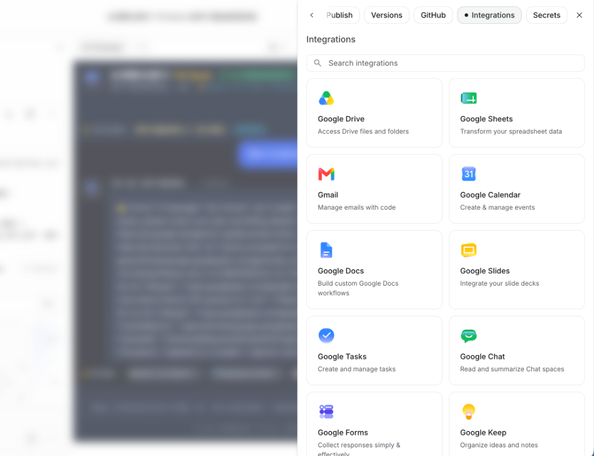 | 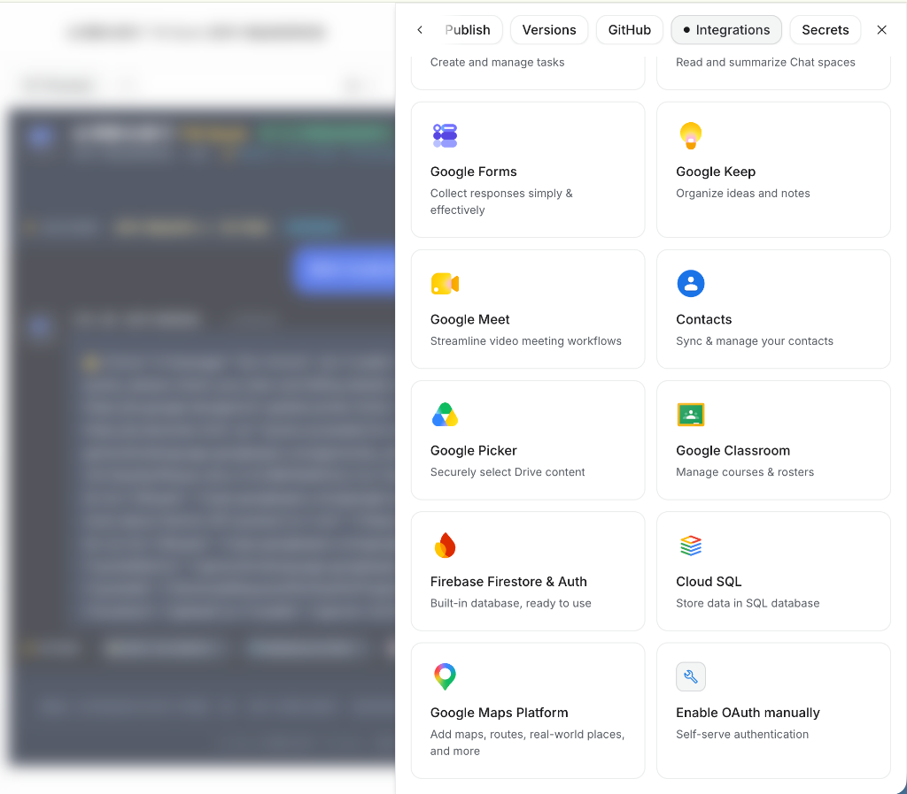 |

---

## ⚡ Google Workspace 支援項目速查總覽表

| 服務項目 | 官方標語 (Headline) | 截圖 | 核心能力 | 2026 最新 AI 落地應用 |
| :--- | :--- | :---: | :--- | :--- |
| **Google Drive** | Access Drive files and folders | 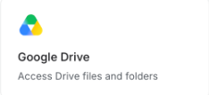 | 檔案瀏覽、搜尋、上傳下載與資料夾結構管理 | 企業私有知識庫 RAG 檢索、合約與規章智慧比對歸檔 |
| **Google Sheets** | Transform your spreadsheet data |  | 試算表儲存格讀寫、批次追加資料列、公式動態寫入 | 智慧單據報銷自動登記、即時 BI 銷售數據儀表板 |
| **Gmail** | Manage emails with code | 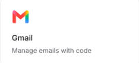 | 郵件讀取搜尋、智慧分流、草稿自動產生與自動回覆 | 客服緊急客訴分析與草擬回信、求職履歷自動審查 |
| **Google Calendar** | Create & manage events |  | 日曆事件新增、行程衝突檢測、會議邀請與提醒 | 會議紀錄 Action Items 自動轉排程、跨時區排會秘書 |
| **Google Docs** | Build custom Google Docs workflows | 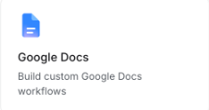 | 結構化文件產出、標題樣式排版、批註與修訂追蹤 | 會議逐字稿自動排版為正式公文、企劃案與報告自動生成 |
| **Google Slides** | Integrate your slide decks |  | 投影片母片套用、數據圖表動態嵌入、簡報自動產出 | 銷售報表一鍵轉高階商務簡報 Deck、課程投影片自動排版 |
| **Google Tasks** | Create and manage tasks | 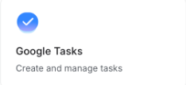 | 待辦清單管理、任務截止日指派、完成狀態同步 | 專案里程碑智能拆解、會議代辦清單個人化追蹤 |
| **Google Chat** | Read and summarize Chat spaces |  | Space 聊天室訊息讀取、群組討論摘要、聊天機器人 | 跨部門專案頻道每日重點摘要、內部 IT Helpdesk 機器人 |
| **Google Forms** | Collect responses simply & effectively | 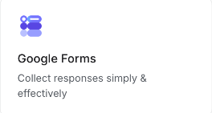 | 問卷動態生成、題目配置、表單回覆數據即時抓取 | 依活動主題動態產生報名表單、活動滿意度回饋情緒分析 |
| **Google Keep** | Organize ideas and notes | 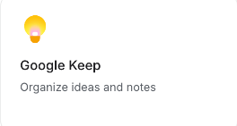 | 便利貼速記、標籤分類、顏色管理、核取清單同步 | 語音閃念靈感 AI 結構化整理、零碎購物與待辦卡片整理 |
| **Google Meet** | Streamline video meeting workflows | 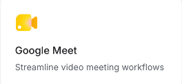 | 視訊會議排程、會議連結生成、開會權限自動指派 | 人資線上面試自動開房與邀請、客戶諮詢視訊一鍵直連 |
| **Contacts** | Sync & manage your contacts | 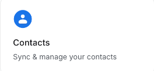 | 通訊錄聯絡人讀寫、標籤群組分類、CRM 資料同步 | 實體名片拍照 OCR 自動建檔、商務開發潛在名單智慧管理 |
| **Google Picker** | Securely select Drive content | 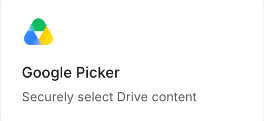 | 官方原生檔案選取器視窗、精確授權特定單一檔案 | 讓使用者安全挑選需要交給 Gemini 分析的特定文件 |
| **Google Classroom** | Manage courses & rosters | 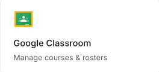 | 課程管理、學生名冊維護、作業與公告自動發布 | AI 輔助作業評分與個別化回饋、學生學習進度儀表板 |

---

## 🛠️ 各項目深度功能解析與最新 AI 應用實例

### 1. Google Drive（雲端硬碟整合）

- **官方標語**：`Access Drive files and folders`
- **核心機制**：允許 Web 應用在使用者授權後，列出、搜尋、上傳與讀取其個人或企業 Google Drive 內的檔案。
- **最新 AI 落地應用**：
  1. **企業私有知識庫（Drive RAG Agent）**：Gemini 透過 Drive API 自動抓取指定資料夾內的所有 PDF 產品手冊、Word 合約與簡報，作為即時檢索知識庫。
  2. **智慧文件分類歸檔機器人**：當使用者上傳收據或雜亂檔案，AI 自動辨識文件內容、重新命名為標準格式（如 `202610_松高門市發票.pdf`），並歸檔至對應月份資料夾。

---

### 2. Google Sheets（試算表自動化）

- **官方標語**：`Transform your spreadsheet data`
- **核心機制**：直接呼叫 Sheets API 進行特定試算表（Spreadsheet ID）的指定工作表（Sheet Name）讀寫，支援 `append`（追加新列）與儲存格範圍讀取。
- **最新 AI 落地應用**：
  1. **AI 報銷與記帳流水帳（本課程實戰項目）**：發票拍照後，Gemini 辨識統編與明細，點擊按鈕直接寫入使用者的 Google 雲端報銷試算表。
  2. **電商營運自動覆盤中心**：讀取歷史銷量數據，AI 自動計算成長率，並在備註欄寫入下週採購建議與庫存警戒提示。

---

### 3. Gmail（智慧郵件秘書）

- **官方標語**：`Manage emails with code`
- **核心機制**：在前端或後端透過授權直接搜尋指定主旨、標籤（Label）的郵件，並能代表使用者建立草稿或寄送通知信。
- **最新 AI 落地應用**：
  1. **客訴信件智慧分流與草稿擬定**：AI 自動監聽收件匣，過濾出「退款申請」或「產品異常」信件，自動起草客氣周延的回覆草稿供專人確認發送。
  2. **商務洽談自動追蹤助理**：自動檢查超過 3 天未回覆的業務信件，提醒業務員並自動生成「溫和跟進 (Follow-up)」郵件。

---

### 4. Google Calendar（日曆自動化排程）

- **官方標語**：`Create & manage events`
- **核心機制**：讀取行事曆空檔時間、新增會議行程、配置 Google Meet 視訊連結、設定通知提醒。
- **最新 AI 落地應用**：
  1. **會議紀錄關鍵時程一鍵排入（本課程實戰項目）**：將雜亂會議錄音或逐字稿交給 Gemini，AI 萃取出 Action Items 與截止日（Deadline），自動一鍵排入 Google 日曆。
  2. **自然語言排會秘書**：使用者輸入「幫我約下週三下午跟行銷部的腦力激盪」，AI 自動查詢雙方日曆空檔並預約會議。

---

### 5. Google Docs（智慧文件與公文排版）

- **官方標語**：`Build custom Google Docs workflows`
- **核心機制**：透過 Docs API 建立新文件、動態插入目錄、標題階層、粗體樣式、表格與圖片。
- **最新 AI 落地應用**：
  1. **公文與正式會議備忘錄 (MoM) 自動排版**：從會議摘要自動生成符合企業格式的 Google 文件，包含簽核欄、列席人員與決議事項。
  2. **法律合約智慧起草**：根據使用者填寫的交易條件，AI 自動產生標準法務條款文件，並在文件內加上修改建議註解。

---

### 6. Google Slides（簡報生成與母片套用）

- **官方標語**：`Integrate your slide decks`
- **核心機制**：自動建立投影片 Deck、指定版型母片、將文字、數據統計圖與視覺區塊動態填入特定 Slide。
- **最新 AI 落地應用**：
  1. **數據分析自動轉商務彙報 Deck**：將每月銷售 Excel 報表直接轉為 10 頁包含封面、關鍵發現、圖表與建議行動的 Google 簡報。
  2. **產品 Pitch Deck 產生器**：輸入一句話創業點子，AI 自動產生結構完整、具備痛點與商業模式的高質感簡報。

---

### 7. Google Tasks（個人與團隊待辦管理）

- **官方標語**：`Create and manage tasks`
- **核心機制**：存取 Google Tasks 清單，新增待辦項目、設定重要性與到期日，與 Gmail、Calendar 側邊欄無縫聯動。
- **最新 AI 落地應用**：
  1. **專案目標智慧拆解為 Task**：使用者輸入大目標（如「籌備 Q4 新品發表會」），AI 自動拆解為 15 個細項待辦並逐一同步至 Google Tasks。
  2. **跨管道待辦聚合**：從收到的郵件、聊天室訊息中提取代辦事項，一鍵匯整至個人任務看板。

---

### 8. Google Chat（聊天室通訊與 Space 整合）

- **官方標語**：`Read and summarize Chat spaces`
- **核心機制**：讀取團隊 Space（聊天室群組）的對話串，發送卡片訊息（Card Message），作為組織協作溝通中樞。
- **最新 AI 落地應用**：
  1. **跨部門討論每日晨報**：AI 每早定時讀取專案 Space 過去 24 小時的數百則訊息，生成 3 點式重點精華推播至主管信箱。
  2. **內部知識問答機器人（Chatbot）**：同仁在 Google Chat 標註 `@AI助理` 詢問休假規定或報帳流程，AI 引用企業規章精確回答。

---

### 9. Google Forms（智慧問卷與數據收集）

- **官方標語**：`Collect responses simply & effectively`
- **核心機制**：透過程式碼動態建立 Google 表單（支援單選、多選、文字、量表題），並可直接監聽並提取填答者數據。
- **最新 AI 落地應用**：
  1. **AI 動態問卷設計大師**：只需輸入「我想調查員工對遠距辦公政策的滿意度」，AI 自動生成包含 8 個專業維度的 Google 表單。
  2. **受訪者文字回饋即時洞察**：即時分析表單收集到的質性長文字評論，自動歸納讚賞點與改進訴求。

---

### 10. Google Keep（靈感速記與筆記同步）

- **官方標語**：`Organize ideas and notes`
- **核心機制**：管理使用者的便利貼式筆記卡片，支援文字、圖片、核取清單與標籤顏色。
- **最新 AI 落地應用**：
  1. **口語閃念轉結構化筆記**：開車或通勤時語音錄下靈感，AI 自動轉文字、提煉關鍵字、打上標籤並存入 Google Keep。
  2. **購物清單智慧分類**：隨性記下的購物項目，AI 自動依照超市動線（生鮮、日用品、冷凍食品）分類成核取方塊。

---

### 11. Google Meet（視訊會議協作）

- **官方標語**：`Streamline video meeting workflows`
- **核心機制**：建立 Meet 視訊空間、產生會議代碼、管理開會邀請人權限。
- **最新 AI 落地應用**：
  1. **客戶諮詢即時會議室**：客戶在官方網站點選「立即連線專人諮詢」，系統自動透過 Meet API 建立專屬加密會議房並發送簡訊通知。
  2. **面試流程自動化**：人資系統通過履歷篩選後，自動建立 Google Meet 會議並同步通知面試官。

---

### 12. Contacts（Google 聯絡人管理）

- **官方標語**：`Sync & manage your contacts`
- **核心機制**：存取通訊錄聯絡人清單、新增/更新聯絡人資訊（姓名、電話、Email、公司、部門職稱）。
- **最新 AI 落地應用**：
  1. **實體名片拍立得建檔**：拍照上傳名片，Gemini OCR 提取姓名、電話、統編與職稱，一鍵建立 Google 聯絡人並分類為「2026 商業參展客戶」。
  2. **CRM 聯絡人雙向同步**：自動比對信件往來對象，提醒使用者將常聯繫的外部重要合作夥伴加入通訊錄。

---

### 13. Google Picker（雲端硬碟安全挑選器）

- **官方標語**：`Securely select Drive content`
- **核心機制**：在網頁前端彈出 Google 官方的原生檔案選擇對話框，使用者可直覺瀏覽個人雲端硬碟並點選目標檔案。
- **最新 AI 落地應用**：
  1. **精準安全授權（Least Privilege）**：使用者無須對應用程式開放整個雲端硬碟的存取權限，只需透過 Picker 選取指定的一份 Excel 或 PDF，保障最高隱私。
  2. **無縫檔案載入**：企業內部工具讓員工點選 Picker 載入歷年財報，AI 立即在同一個畫面進行跨年度比對分析。

---

### 14. Google Classroom（雲端教室與教學管理）

- **官方標語**：`Manage courses & rosters`
- **核心機制**：存取課程列表、學生名冊、指派作業、公布課堂通知。
- **最新 AI 落地應用**：
  1. **AI 助教批改與個人化學習診斷**：自動讀取學生提交的作業程式碼或作文，提供細緻的改進建議並回傳至 Classroom 成績單。
  2. **智慧課綱與教學活動排程**：輸入教學科目與週數，AI 自動產生每週課堂主題、補充教材連結並建立 Classroom 作業。

---

## 🚀 同場加映：Google AI Studio 延伸雲端服務整合

除了 Workspace 辦公生態外，在面板底部還提供了專業級雲端開發擴充：

| 服務項目 | 官方標語 | 截圖 | 功能說明與適用情境 |
| :--- | :--- | :---: | :--- |
| **Firebase Firestore & Auth** | Built-in database, ready to use | 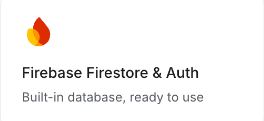 | 內建開箱即用的即時 NoSQL 資料庫與會員帳號認證（支援免費 Spark Plan，免綁信用卡）。本課程「辦公室設備借用」與「專案看板」專案即採用此項。 |
| **Cloud SQL** | Store data in SQL database | 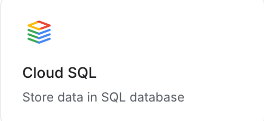 | 企業級關聯式 PostgreSQL / MySQL 資料庫整合，適合大規模 ERP、交易流水帳與嚴謹關聯資料架構。 |
| **Google Maps Platform** | Add maps, routes, real-world places, and more | 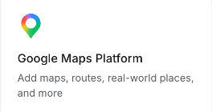 | 地圖視覺化、路徑距離計算、真實地標與地理資訊檢索，適用於物流路徑規劃、門市分店導覽應用。 |
| **Enable OAuth manually** | Self-serve authentication | 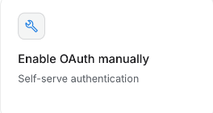 | 自行填入 GCP Client ID 與 Client Secret 的進階自訂授權模式，適合大型企業具備特定網域與安全政策之情境。 |

---

## 🎯 實戰教學：如何在 Google AI Studio 中啟用與呼叫？

要在你的 Web 應用中串接這些 Workspace 整合，請遵循「先建專案、再至專案右側啟用 Integrations」的標準兩階段流程：

```
【步驟 1】在 AI Studio 首頁貼入提示詞生成專案（進入 App 工作區）
                    ▼
【步驟 2】切換至專案右側「Integrations」面板，在欲串接服務點擊「Enable」完成授權
                    ▼
【步驟 3】在預覽畫面測試（或於右側對話中請 AI 完善串接），最後點擊「Publish」發布！
```

> 🚨 **極重要提醒：初始檔案格式支援限制**  
> Google AI Studio 首頁輸入框的「Upload Files」功能**只支援純文字檔案（如 `.txt`、`.md`、`.csv`、代碼檔）與圖片檔案（如 `.jpg`、`.png`、`.webp`、`.svg`）**，**無法直接上傳 Word (`.docx`)、Excel (`.xlsx`)、PowerPoint (`.pptx`) 等 Office 二進位檔案**！  
> 若有相關文件或報表規格，請先轉存為純文字、Markdown、CSV 或截圖圖片，或者直接寫在 Prompt 提示詞中。

### 💡 實戰 Prompt 提示詞範例（以 Sheets + Calendar 為例）：

```markdown
# 角色 (Role)
你是一位精通 React、TypeScript 與 Google Workspace 原生整合的全端架構師。

## 背景情境 (Context)
- 開發環境：Google AI Studio (Build Mode)。
- 已在 Integrations 面板啟用：Google Sheets 與 Google Calendar。
- 安全架構：所有認證由 AI Studio Backend Proxy 自動處理，前端無須填入 Client Secret。

## 任務目標 (Task)
1. 建立一個會議排程與任務管理網頁。
2. 使用者在畫面上填寫任務與會議時間後，提供兩個操作按鈕：
   - 「📊 同步至 Google 試算表」：將待辦事項寫入使用者指定的 Google Sheets 新列。
   - 「📅 排入 Google 日曆」：呼叫 Calendar 服務自動建立新行程並附帶提醒。
```

---

## 📚 相關章節與實作專案推薦

本系列課程中，我們已為學員設計了完整的 Google Workspace 原生整合實戰專案：

- [⚡ Workspace 智慧單據報銷系統（發票辨識 ➜ Google Sheets 自動登錄）](../Workspace智慧單據報銷系統/README.md)
- [📅 AI 會議紀錄與行事曆整合（逐字稿整理 ➜ Sheets 待辦 ➜ Calendar 日曆排程）](../AI會議紀錄與行事曆整合/README.md)
- [🏢 辦公室設備借用系統（Firebase Firestore & Auth 整合）](../辦公室設備借用系統/README.md)
- [📋 部門專案即時協作看板（Firebase Realtime 多人同步看板）](../部門專案即時協作看板/README.md)
