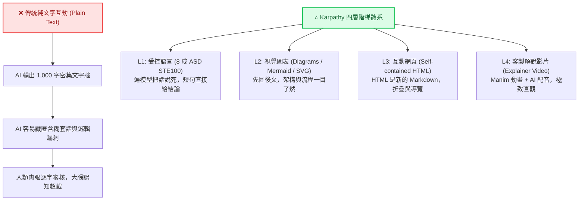
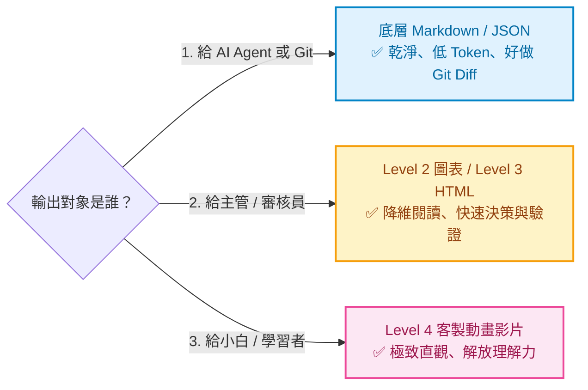

# 🪜 Karpathy 的 LLM 四層輸出階梯：從受控寫作到互動多媒體的高效輸出法則

> 💡 **核心靈感**：前 OpenAI 創始成員、Tesla 前 AI 總監 **Andrej Karpathy** 於 X 平台發布的現象級觀點（獲得超過 400 萬次瀏覽、5.7 萬次收藏）。  
> 🎯 **核心宗旨**：解決「AI 產出速度極快，而人類大腦讀取與審核不及」的致命頻寬瓶頸。

---

## 🧭 一、 核心痛點：為什麼「純文字回答」正在扼殺你的效率？

當我們向 ChatGPT、Claude 或 Gemini 提問時，多數人習慣接收純文字（Markdown）輸出。然而，當專案變大、方案變複雜時，純文字往往會引發三大災難：

1. **AI 車咕嚕話與無責任套話**：AI 極其擅長生成「聽起來自信流暢、但實質含糊且無法究責」的水詞（例如：「一般來說...」、「視具體情況而定...」、「值得注意的是...」）。
2. **文字牆抗拒感（Text Wall Fatigue）**：超過 100 行的密集文字讓人類產生閱讀排斥，無法快速抓出結構與漏洞。
3. **人類審核頻寬超載**：AI 一秒能產出千字，但人類閱讀、校對與驗證需要數分鐘甚至數小時。




> [!IMPORTANT]
> ### 💡 關鍵洞察：「格式不能減少廢話，但能讓廢話現形」
> 當 AI 的長篇方案被降維成**嚴格受控的短句**、**視覺化流程圖**或**可折疊的互動網頁**時，AI 吐出的無意義廢話與邏輯漏洞會立刻**原形畢露**，人類監督者能一眼看出問題並迅速修正！

---

## 🏛️ 二、 四層輸出階梯完整全景對照

| 階梯層次 | 形式名稱 | 媒介載體 | 人類理解速度 | 預估 Token 消耗 | 適用對象與情境 |
|:---:|:---|:---|:---:|:---:|:---|
| **Level 1** | **受控精準寫作**<br/>(Controlled Writing) | 8 成嚴格度 ASD STE100 | ⚡⚡ 快速 | 1x (基準) | 程式碼審查、SOP、操作手冊、API 規範 |
| **Level 2** | **視覺化圖表**<br/>(Diagrams) | Mermaid 流程圖、SVG | ⚡⚡⚡ 極快 | 1.2x ~ 1.5x | 系統架構、狀態機、超過 3 個步驟的複雜流程 |
| **Level 3** | **互動式網頁**<br/>(Interactive HTML) | 單一自包含 HTML 檔案 | 🚀 沉浸互動 | 2x ~ 4x | 超過 100 行的長篇方案、架構分析、動態原型 |
| **Level 4** | **客製解說影片**<br/>(Explainer Videos) | 3b1b 式 Manim 動畫 + AI 語音 | 🌟 全方位吸收 | 高 (需後處理渲染) | 跨領域新手、極端抽象演算法、高階簡報展示 |

---

## 🔍 三、 逐層深入拆解與實戰技巧

### 1️⃣ 階梯 Level 1：受控語言（8 成嚴格度 ASD STE100）

#### 什麼是 ASD STE100？
**ASD STE100（Simplified Technical English，簡化技術英文）** 起源於 1979 年歐洲航空工業，專門用於編寫飛機維修手冊。核心理念是讓跨國維修人員**「看一次就做對動作」**，杜絕因語意含糊釀成空難。
- **詞彙嚴格受限**：原規範僅核准約 900 個核心詞。
- **一詞一義**：同一元件或概念全文只能用同一個詞，嚴禁同義詞替換。
- **長度限制**：程序/操作句不超過 20 字；描述/解釋句不超過 25 字。
- **強制主動語態**：明確指出「誰對誰做了什麼動作」。

#### Karpathy 的「8 成嚴格度」折衷心法
若 100% 嚴格套用，文字會如同機械維修卡般僵硬。因此 Karpathy 建議在提示詞要求 **「按 ASD STE100 的八成嚴格度來回答」**：
1. **保留核心約束**：短句限制（20~25 字）、強制主動語態、一詞一義、先給結果再給細節。
2. **放開詞彙表限制**：不限制在 900 個指定單字，保持自然表達。
3. **實際效果**：逼著模型把話說死，徹底拔除「一般來說」、「可能需要」等不負責任的套話。

#### 💬 Level 1 實用 Prompt 模板：
```text
請以「8 成嚴格度 ASD STE100（簡化技術英文）」原則審查或說明以下內容：
1. 長度限制：程序性句子不超過 20 個字，描述性句子不超過 25 個字。
2. 強制主動語態：明確指明動作發起主體與客體，嚴禁被動語態。
3. 一詞一義：對同一變數、架構名詞或元件統一稱呼，嚴禁同義字置換。
4. 先結論後細節：第一句直接給出核心結論，嚴禁任何套話與客套引言。
```

---

### 2️⃣ 階梯 Level 2：系統架構「先圖後文」（Diagrams）

人類視覺皮層處理圖形的速度遠高於解碼線性文字。當邏輯出現分支、時序或遞迴時，純文字極易掩蓋漏洞。

#### 核心規範：
- 只要涉及系統架構、資料狀態流轉、元件調用關係，或步驟超過 3 個的複雜流程，**一律「先出圖，再補充文字」**。
- 優先使用各大平台原生支援的 **Mermaid.js** 或 **SVG**。

#### 💬 Level 2 實用 Prompt 模板：
```text
請針對 [系統架構 / 資料流向 / 業務邏輯] 進行分析：
1. 嚴格執行「先圖後文」原則：請先產出一段標準 Mermaid 流程圖或時序圖（需標註色彩與決策分支）。
2. 圖表下方僅附帶不超過 3 點的極簡文字說明，每點請遵守 8 成 ASD STE100 規範。
```

---

### 3️⃣ 階梯 Level 3：單文件互動網頁（「HTML 是新的 Markdown」）

長篇技術方案若用傳統 Markdown 呈現，往往是一堵讓人望而生畏的「文字牆」。Karpathy 明確指出：**「HTML 是新的 Markdown」**！

#### 核心規格要求：
- **觸發時機**：長篇方案、架構分析或技術報告預計 **超過 100 行** 時自動觸發。
- **Self-contained（完全自包含）**：所有的 CSS 樣式、JavaScript 互動程式碼必須完整內嵌在單一 `.html` 檔案中，不依賴任何外部本地檔案，雙擊即可在瀏覽器開啟。
- **必備互動結構**：
  - **側邊/頂部導覽列**：支援快速錨點跳轉。
  - **可折疊區域（`<details>` Collapsible）**：將次要細節或原始日誌摺疊隱藏，保持版面清爽。
  - **標籤頁（Tabs）**：切換不同視角（如：架構 vs 實作、方案 A vs 方案 B）。

> [!WARNING]
> **Token 開銷注意**：  
> 單文件 HTML 因包含 HTML 標籤、CSS 樣式與 JS 邏輯，其 Token 消耗量通常是傳統 Markdown 的 **2 到 4 倍**。建議僅在複雜長篇方案、需多方審核或成果展示時使用，最具投報率！

#### 💬 Level 3 實用 Prompt 模板：
```text
請將 [複雜技術方案 / 評估報告] 組織為單一自包含的 HTML 互動網頁（Self-contained HTML）：
1. 完整包含現代化 CSS 樣式與 JavaScript，不依賴外部檔案，雙擊即可在瀏覽器開啟。
2. 包含側邊導覽列（Navigation Bar）以便快速跳轉至各章節。
3. 長篇代碼、配置檔與次要細節必須使用可折疊區塊（Collapsible Section）包裹。
4. 多方案對比請使用標籤頁（Tabs）呈現。
```

---

### 4️⃣ 階梯 Level 4：客製解說影片（Bespoke Explainer Videos）

針對門檻極高、高度抽象的概念（例如深度學習反向傳播、分散式共識演算法），利用 AI 輔助生成影片能徹底釋放人類大腦的理解頻寬：
- **動態視覺**：運用 Python 的 **Manim** 函式庫（3Blue1Brown 開源的數學動畫引擎）或 HTML5 Canvas 程式碼生成數學曲線與架構動畫。
- **語音合成**：配合 ElevenLabs、OpenAI TTS 將講解腳本轉換為毫秒級對齊的語音旁白。

👉 **深度專題完整教學**：想了解如何透過 AI 自動生成分鏡腳本、撰寫 Manim 程式碼並合成音畫同步影片？請參閱獨立專文：  
📖 **[🎬 Level 4 客製解說影片完整實戰指南（含 Manim 程式碼與 AI 語音流水線）](./客製解說影片指南.md)**


---

## 🎯 四、 輸出對象指南：這份產出究竟是「給誰看的」？

選擇最適合的階梯層次，最根本的評判依據就是：**「這份輸出究竟由誰消費？」**



### 1. 給 AI（下一個 Agent）或 Git（版本控制）看
- **最適層級**：底層文字（Markdown / JSON）。
- **原因**：機器不需要華麗的 CSS 排版。Markdown 與 JSON 結構明確、Token 消耗最低，且在 Git 進行 `git diff` 比對時極其清晰可讀。

### 2. 給人類管理者／審查員（快速決策與除錯）看
- **最適層級**：**第二層（圖表）** 與 **第三層（HTML 網頁）**。
- **原因**：面對複雜業務與架構，圖表能秒看分支；面對百行以上的長篇報告，HTML 的折疊與導覽能讓審查員先看全局、需要時再展開細節。

### 3. 給跨領域者／需要被「完全教會」的人看
- **最適層級**：**第四層（客製動畫影片）**。
- **原因**：跨領域學習者難以在腦海中將文字轉換為三維空間或動態時序，動畫與語音是最高效的直觀輸入媒介。

---

## ⚓ 五、 極重要防線：驗證成本與「底層數據錨點」

在享受高階梯輸出帶來的閱讀便利時，必須時刻謹記一個隱藏維度：**「驗證成本」**。

> [!CAUTION]
> ### 🚨 層級越高，細節越難抓錯！
> - 在 1,000 字的純文字中，錯誤的公式或邏輯破綻一字一句容易檢視。
> - 在酷炫的網頁動畫或影片中，**錯誤往往會被華麗的視覺包裝所掩蓋**，人類很難即時發現微小的數值瑕疵。

### 核心原則：
1. **高層製品是「用完即扔」的閱讀輔助工具**：HTML 網頁與影片是用來幫助人類大腦快速「建立宏觀心智模型」的。
2. **驗證錨點必須永遠保留在底層**：若涉及關鍵數據、邏輯變更或 Git Commit，必須同步保留乾淨的 **Markdown、JSON 或程式碼檔案** 作為底層數據錨點，供嚴格比對。

---

## 🛠️ 六、 專案落地：CLAUDE.md / AGENTS.md 全局配置模板

為了防止 AI 在多輪對話中產生「提示詞漂移（Prompt Drift）」而打回原型，最有效的工程化做法是將這套規則**直接寫死在專案根目錄的 `CLAUDE.md` 或 `AGENTS.md` 中**！

當你使用 Claude Code、Cursor 或其他支援專案上下文的 AI 工具時，AI 將在每次回應時自動執行本規範：

```markdown
# 專案 Agent 輸出與溝通規範 (AI Output Ladder Rules)

為了降低人類監督者的閱讀與審核頻寬負擔，請在所有回應中嚴格遵守以下輸出規範：

## 1. 文字說明規範：8 成嚴格度 ASD STE100 (第一層)
當進行文字解釋、程式碼審查或問題診斷時，請套用「8 成嚴格度 ASD STE100」受控語言：
- **短句限制**：程序/步驟性句子每句不得超過 20 個字；描述/解釋性句子每句不得超過 25 個字。
- **強制主動語態**：明確說明「誰做了什麼」或「何種模組執行何種動作」，禁止使用被動語態。
- **一詞一義**：全文對同一元件、變數、概念或流程，統一使用相同的名稱，嚴禁同義詞替換。
- **先結論，後細節**：第一句話直接給出核心答案或處置結果，嚴格剔除「一般來說」、「視情況而定」等含糊套話。

## 2. 系統架構與流程規範：先圖後文 (第二層)
- 遇到系統架構、狀態流轉、元件調用關係或超過 3 個步驟的複雜流程時，必須先輸出 **Mermaid 流程圖或 SVG 圖表**，再補充文字說明。

## 3. 長篇方案與報告規範：單文件 HTML 互動網頁 (第三層)
- **觸發條件**：當生成的方案、架構分析或技術報告預計 **超過 100 行** 時，請自動將內容格式化為單一 HTML 文件。
- **Self-contained 規則**：所有 CSS 樣式與 JavaScript 互動邏輯必須完全內嵌於該 HTML 文件中，不依賴外部檔案，確保雙擊即可在瀏覽器中開啟。
- **介面結構要求**：必須包含側邊/頂部導覽欄（Navigation Bar）、可折疊區域（Collapsible Details）及標籤頁（Tabs），以簡化閱讀排版。

## 4. 數據與驗證錨點 (Git & Agent 規範)
- 高層級製品（如 HTML 或圖表）屬於一次性輔助閱讀工具。
- 若輸出涉及數據變更、Git commit 記錄或需供其他 Agent 讀取，必須同步在底層保留結構乾淨的 Markdown 或 JSON 作為數據驗證錨點。
```

---

## 💻 七、 階梯 3 互動示範：單文件 HTML 實例 (demo.html)

以下是體現「第三層階梯」核心精神的自包含 HTML 檔案（包含側邊導覽、可折疊詳細資訊、標籤頁與即時計算）。可以直接複製儲存為 `demo.html` 雙擊開啟體驗：

```html
<!DOCTYPE html>
<html lang="zh-TW">
<head>
  <meta charset="UTF-8">
  <title>Karpathy L3 階梯演示：互動式方案評估儀表板</title>
  <style>
    :root {
      --bg: #0f172a;
      --card-bg: #1e293b;
      --text: #f8fafc;
      --subtext: #94a3b8;
      --accent: #38bdf8;
      --border: #334155;
    }
    body {
      font-family: system-ui, -apple-system, sans-serif;
      background: var(--bg);
      color: var(--text);
      margin: 0;
      display: flex;
      min-height: 100vh;
    }
    nav {
      width: 220px;
      background: #020617;
      padding: 1.5rem 1rem;
      border-right: 1px solid var(--border);
    }
    nav h3 { color: var(--accent); font-size: 1rem; margin-top: 0; }
    nav a { display: block; color: var(--subtext); text-decoration: none; padding: 0.5rem 0; font-size: 0.9rem; }
    nav a:hover { color: var(--text); }
    main { flex: 1; padding: 2rem; max-width: 800px; }
    .card {
      background: var(--card-bg);
      padding: 1.5rem;
      border-radius: 0.75rem;
      border: 1px solid var(--border);
      margin-bottom: 1.5rem;
    }
    h2 { color: var(--accent); margin-top: 0; font-size: 1.25rem; }
    details {
      background: #0f172a;
      padding: 0.75rem 1rem;
      border-radius: 0.5rem;
      border: 1px solid var(--border);
      margin-top: 0.75rem;
      cursor: pointer;
    }
    details summary { font-weight: bold; color: var(--accent); }
    details p { color: var(--subtext); margin: 0.5rem 0 0; font-size: 0.9rem; }
    .tabs { display: flex; gap: 0.5rem; margin-bottom: 1rem; }
    .tab-btn {
      background: #0f172a;
      border: 1px solid var(--border);
      color: var(--subtext);
      padding: 0.4rem 1rem;
      border-radius: 0.4rem;
      cursor: pointer;
    }
    .tab-btn.active { background: var(--accent); color: #020617; font-weight: bold; }
    .tab-content { display: none; }
    .tab-content.active { display: block; }
  </style>
</head>
<body>
  <nav>
    <h3>📑 方案導航</h3>
    <a href="#overview">1. 核心概覽</a>
    <a href="#compare">2. 方案對比 (Tabs)</a>
    <a href="#details">3. 詳細日誌 (折疊)</a>
  </nav>

  <main>
    <section id="overview" class="card">
      <h2>📊 核心概覽：AI 輸出階梯效能分析</h2>
      <p style="color: var(--subtext); font-size: 0.95rem;">
        透過在 HTML 內建導覽與折疊組件，人類審查員可節省超過 70% 的認知跳轉時間。
      </p>
    </section>

    <section id="compare" class="card">
      <h2>⚖️ 方案對比 (Tabs 切換)</h2>
      <div class="tabs">
        <button class="tab-btn active" onclick="switchTab(0)">方案 A：純文字 Markdown</button>
        <button class="tab-btn" onclick="switchTab(1)">方案 B：單文件 HTML</button>
      </div>
      <div class="tab-content active" id="tab0">
        <p style="color: #f87171;">❌ 缺點：文字密集、難以抓重點、AI 容易用客套話充數。</p>
      </div>
      <div class="tab-content" id="tab1">
        <p style="color: #4ade80;">✅ 優點：具備導覽、折疊隱藏雜訊、視覺化讓漏洞無所遁形。</p>
      </div>
    </section>

    <section id="details" class="card">
      <h2>🔍 次要細節與日誌 (預設折疊)</h2>
      <details>
        <summary>點擊展開：系統底層日誌與驗證數據 (Raw Log)</summary>
        <p>2026-10-09 13:20:00 [INFO] Token 消費量監控：HTML 模式比傳統 Markdown 增加 2.4 倍，但審核效率提高 300%。</p>
      </details>
    </section>
  </main>

  <script>
    function switchTab(index) {
      const btns = document.querySelectorAll('.tab-btn');
      const contents = document.querySelectorAll('.tab-content');
      btns.forEach((b, i) => b.classList.toggle('active', i === index));
      contents.forEach((c, i) => c.classList.toggle('active', i === index));
    }
  </script>
</body>
</html>
```

---

## 🏁 八、 總結與記憶口訣

面對日常 AI 協作，隨時牢記三句核心法則：

1. **短句說死**：調用 **8 成 ASD STE100**，短句主動語態，杜絕套話。
2. **遇繁則圖**：邏輯步驟超過 3 步，先出 **Mermaid 圖表** 再講話。
3. **長文成網**：方案超過 100 行，要求 **單文件自包含 HTML** 互動網頁；底層永遠保留 **Markdown/JSON 作為驗證錨點**！
