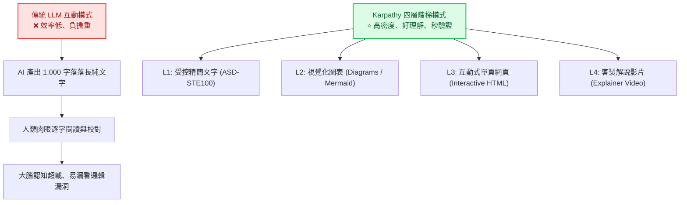
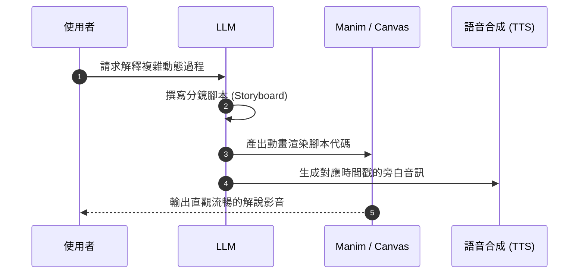

# 🪜 Karpathy 的 LLM 四層輸出階梯：從純文字到互動多媒體的高效輸出法則

> 📺 **影片來源**：[Karpathy：LLM四層輸出階梯，400萬+瀏覽 5.7萬+收藏的方法 (YouTube)](https://www.youtube.com/watch?v=FESIfabbzy8&list=WL&index=1)  
> 💡 **核心靈感**：前 OpenAI 創始成員、前 Tesla AI 總監 **Andrej Karpathy** 於 X 平台發布的現象級觀點（獲得超過 400 萬次瀏覽、5.7 萬次收藏）。  
> 🎯 **學習目標**：徹底告別被「落落長 AI 文字廢話」淹沒的低效溝通，掌握由淺入深的四層輸出階梯，學會如何向 AI 索取**高密度、好吸收、易驗證**的資訊成果！

---

## 🧭 為什麼「純文字回答」正在扼殺你的效率？

當我們向 ChatGPT、Claude 或 Gemini 提問時，90% 的人預設只會要求 AI「輸出文字回答」。

然而，Andrej Karpathy 敏銳地指出：**人類大腦天生不擅長在毫無結構的長篇純文字中尋找重點與驗證邏輯**。



> [!IMPORTANT]
> **AI 時代的人類角色轉變**：  
> 當 AI 承擔越來越多底層繁重勞動（The Legwork）時，人類的核心職責已經全面轉向**「監督、審閱與理解（Oversight, Verification, and Understanding）」**。  
> 如果 AI 輸出的形式讓你很難快速審核，AI 的生產力就會大打折扣！

---

## 🏛️ Karpathy 的 LLM 四層輸出階梯詳解

Karpathy 提出了層層遞進的四種輸出維度，每往上一層，**資訊密度更高、視覺負擔更輕、人類審閱驗證的速度更快**：

| 層級 | 形式名稱 | 媒介載體 | 人類理解速度 | 核心效益 | 適用情境 |
|:---:|:---|:---|:---:|:---|:---|
| **Level 1** | **受控精準寫作**<br/>(Controlled Writing) | ASD-STE100 簡化技術文字 | ⚡⚡ 快速 | 去除客套話與歧義，句句直擊核心 | 操作手冊、SOP、API 規格說明 |
| **Level 2** | **視覺化圖表**<br/>(Diagrams) | Mermaid、SVG、流程圖 | ⚡⚡⚡ 極快 | 「一圖勝千言」，架構與時序一目了然 | 系統架構、邏輯流程、狀態機 |
| **Level 3** | **互動式網頁**<br/>(Interactive HTML) | 單一自包含 HTML (HTML+CSS+JS) | 🚀 沉浸互動 | 支援折疊、滑桿參數模擬、動態儀表板 | 數據模擬、原型驗證、教學工具 |
| **Level 4** | **客製解說影片**<br/>(Explainer Videos) | 3b1b 式動態動畫 + AI 語音旁白 | 🌟 全方位吸收 | 聲光兼具，將抽象數學與演算法動態具象化 | 複雜演算法教學、產品發表展示 |

---

### 階梯 1️⃣：受控精準寫作（ASD-STE100 風格）

#### 什麼是 ASD-STE100？
**ASD-STE100（Simplified Technical English，簡化技術英文）** 最初是航空與國防工業為了飛機維修手冊所制定的極其嚴格的寫作標準：
1. **單字嚴格受限**：只允許約 900 個核准字彙，且每個字原則上只有一種含義（例如嚴禁同義字交替使用造成混淆）。
2. **語態明確**：強制使用主動語態（Active Voice）。
3. **語句極短**：每個句子只傳達單一概念，長度通常在 20 字以內。
4. **拒絕廢話**：沒有「正如我們所知」、「值得注意的是」等 AI 常見水詞。

#### 💡 Karpathy 的實戰技巧：
> 「直接要求 100% 的 ASD-STE100 可能會顯得有些生硬或過於機械化，因此只要在 Prompt 中要求 **『80% 的 ASD-STE100 風格』**，就能獲得既清晰精準、又自然流暢的高密度純文字！」

#### 💬 實戰 Prompt 模板：
```text
請以「80% ASD-STE100（簡化技術英文）」的準則向我解釋 [主題/技術概念]：
1. 使用簡短句子，每個句子只陳述一個核心事實。
2. 盡量使用主動語態，避免含糊代詞。
3. 嚴禁任何客套話、鋪陳段落與贅字。
4. 條列核心步驟或要點。
```

---

### 階梯 2️⃣：視覺化圖表（Diagrams / Mermaid / SVG）

人類視覺皮層處理圖形的速度比閱讀純文字快 60,000 倍。當邏輯出現分支、時序或遞迴時，純文字往往晦澀難懂，而圖表能讓錯誤無所遁形。

#### 支援的圖表格式：
- **Mermaid.js**：最推薦！各大 Markdown 編輯器、GitHub、Notion 均原生支援。
- **SVG 向量圖**：支援自訂顏色、豐富圖示與自定義佈局。
- **ASCII Art**：終端機或極簡文字環境最佳相容選擇。

#### 💬 實戰 Prompt 模板：
```text
不要只用文字解釋 [系統架構 / 業務流程 / 演算法時序]，請直接為我繪製一段 Mermaid 格式的圖表（包含適當的顏色標籤）：
1. 清楚標明起點、決策判斷條件、分支路徑與終點。
2. 圖表下方僅附帶不超過 3 點的簡要備註即可。
```

---

### 階梯 3️⃣：互動式單頁網頁（Self-Contained Interactive HTML）

這是本課程（AI First 網頁實作）的最核心精髓！  
要求 LLM 直接輸出一個**單一檔案、可點擊執行、內建 CSS 與 JS 的互動式 HTML 應用程式**。

#### 為什麼單頁互動網頁威力巨大？
- **動態參數滑桿（Sliders）**：例如學習複利公式或神經網路權重時，直接拖曳滑桿，即時看見折線圖曲線跳動！
- **可折疊與標籤頁（Tabs / Accordions）**：自訂閱讀節奏，先看全局概覽，點擊再看深層細節。
- **沙盒試驗場（Playground）**：輸入自訂測試數據，點擊按鈕立即執行並顯示運算結果。

#### 💬 實戰 Prompt 模板：
```text
請將 [某個演算法 / 商業定價模型 / 學習概念] 做成一個單一檔案的互動式 HTML 網頁（Single-file HTML）：
1. 包含現代化暗色系美觀介面（使用 CSS Flex/Grid 與柔和陰影）。
2. 提供可供使用者調整參數的輸入控制項（例如 Range Slider 或 Input）。
3. 當參數改變時，使用 JavaScript 即時計算並以動態圖表或視覺動畫呈現變化結果。
4. 程式碼完全自包含在一個檔案中，可直接在瀏覽器開啟運行。
```

---

### 階梯 4️⃣：客製解說影片（Bespoke Explainer Videos）

終極階段是讓 AI 協助將複雜的動態過程轉化為**短影音解說**：
- **視覺生成**：利用 Python 的 **Manim** 函式庫（著名的 3Blue1Brown 數學動畫引擎）或 HTML5 Canvas / WebGL 生成精準動態軌跡。
- **語音旁白**：結合 ElevenLabs、OpenAI TTS 生成抑揚頓挫的自然語音。
- **自動合成**：透過程式碼將每一幕腳本（Script）、畫面節奏與配音毫秒級同步。



---

## 🛠️ 動手玩：階梯 3「單頁互動網頁」體驗範例

以下是一個體現「第三層階梯（互動式網頁）」概念的極簡演算法模擬器（以 **A/B 測試顯著性即時計算器** 為例）。  
複製以下程式碼儲存為 `demo.html` 並在瀏覽器點擊開啟即可操作：

```html
<!DOCTYPE html>
<html lang="zh-TW">
<head>
  <meta charset="UTF-8">
  <title>Karpathy L3 階梯演示：互動式轉換率模擬器</title>
  <style>
    body {
      font-family: system-ui, -apple-system, sans-serif;
      background: #0f172a;
      color: #f8fafc;
      display: flex;
      justify-content: center;
      align-items: center;
      min-height: 100vh;
      margin: 0;
    }
    .card {
      background: #1e293b;
      padding: 2rem;
      border-radius: 1rem;
      width: 420px;
      box-shadow: 0 10px 25px -5px rgba(0, 0, 0, 0.5);
      border: 1px solid #334155;
    }
    h2 { margin-top: 0; color: #38bdf8; font-size: 1.25rem; }
    .control { margin-bottom: 1.2rem; }
    label { display: flex; justify-content: space-between; font-size: 0.9rem; margin-bottom: 0.4rem; color: #94a3b8; }
    input[type=range] { width: 100%; accent-color: #38bdf8; }
    .result {
      background: #0f172a;
      padding: 1rem;
      border-radius: 0.5rem;
      margin-top: 1rem;
      text-align: center;
      border: 1px solid #334155;
    }
    .lift { font-size: 2rem; font-weight: bold; color: #4ade80; }
  </style>
</head>
<body>
  <div class="card">
    <h2>📊 階梯 L3 範例：互動數據模擬</h2>
    <p style="font-size: 0.85rem; color: #94a3b8;">拖曳下方滑桿，即時感受「互動式輸出」相較於純文字報表的直觀魅力！</p>
    
    <div class="control">
      <label>方案 A 轉換率 (對照組): <span id="valA">3.5%</span></label>
      <input type="range" id="sliderA" min="1" max="15" step="0.1" value="3.5">
    </div>

    <div class="control">
      <label>方案 B 轉換率 (實驗組): <span id="valB">5.2%</span></label>
      <input type="range" id="sliderB" min="1" max="15" step="0.1" value="5.2">
    </div>

    <div class="result">
      <div style="font-size: 0.85rem; color: #94a3b8;">預期業績提升幅度 (Lift)</div>
      <div class="lift" id="liftVal">+48.6%</div>
    </div>
  </div>

  <script>
    const sA = document.getElementById('sliderA');
    const sB = document.getElementById('sliderB');
    const vA = document.getElementById('valA');
    const vB = document.getElementById('valB');
    const lift = document.getElementById('liftVal');

    function update() {
      const a = parseFloat(sA.value);
      const b = parseFloat(sB.value);
      vA.innerText = a.toFixed(1) + '%';
      vB.innerText = b.toFixed(1) + '%';
      const change = ((b - a) / a) * 100;
      lift.innerText = (change >= 0 ? '+' : '') + change.toFixed(1) + '%';
      lift.style.color = change >= 0 ? '#4ade80' : '#f87171';
    }

    sA.addEventListener('input', update);
    sB.addEventListener('input', update);
    update();
  </script>
</body>
</html>
```

---

## 🚀 結語：將四層階梯落實於你的日常 AI 工作流

記住這句法則：**「別再問 AI『請解釋...』，而是要求 AI『用第 N 層階梯展示...』」**。

1. **速讀概念時** ➡️ 呼叫 **L1 受控文字 (80% ASD-STE100)**，拒絕空話套話。
2. **釐清架構時** ➡️ 呼叫 **L2 Mermaid 圖表**，秒看時序與分支。
3. **驗證邏輯與交付原型時** ➡️ 呼叫 **L3 互動式 HTML 應用**（搭配 Google AI Studio 或 Vite）。
4. **教學傳播與報告時** ➡️ 呼叫 **L4 動態影音動畫**，打造降維打擊的吸收體驗！
