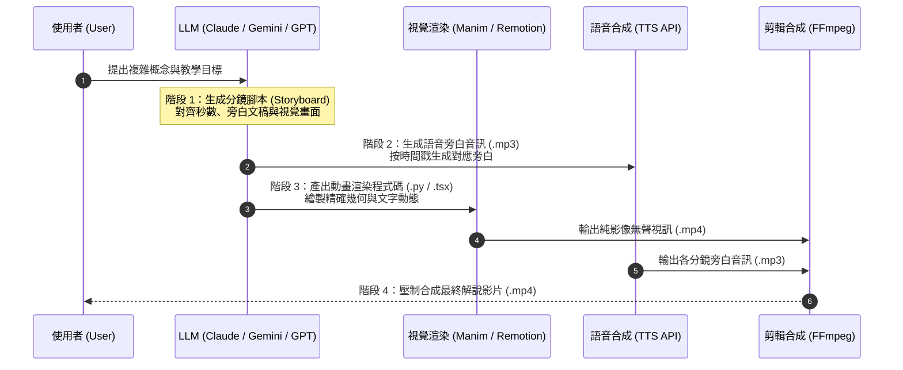

# 🎬 階梯 Level 4 專題指南：AI 客製解說影片（Bespoke Explainer Videos）

> 💡 **核心精神**：將極度抽象的數學演算法、分散式系統或底層架構，透過「3Blue1Brown 式動態動畫 + AI 擬真語音旁白」，轉化為直觀易懂的視聽解說短片，徹底解放人類大腦的理解頻寬！

---

## 🧭 一、 為什麼需要「客製解說影片」？

在 Andrej Karpathy 提出的四層輸出階梯中，第四層代表了**資訊傳遞的終極維度**。


### 適用情境：
1. **極度抽象的數學與幾何演算法**：例如反向傳播梯度下降（Backpropagation）、注意力機制矩陣乘法（Self-Attention）、傅立葉轉換。
2. **複雜空間與時間狀態演變**：例如 Paxos / Raft 分散式共識協議、TCP 三向交握與滑動視窗、資料庫 B+ Tree 節點分裂。
3. **對外發布與跨領域溝通**：向完全不懂技術的非技術人員、投資人或跨部門主管展示技術原理。

---

## ⚙️ 二、 AI 生成解說影片的標準流水線架構

AI 生成影片並非隨機抽卡，而是具備嚴格的**工程化四階段流水線**：



---

## 🛠️ 三、 動態視覺技術棧選型

要將文字變成程式碼動畫，目前業界有三大主流技術路線：

| 技術方案 | 核心工具 | 優勢 | 劣勢 | 最適合情境 |
|:---|:---|:---|:---|:---|
| **數學動態渲染** | **Manim** (Python) | 3Blue1Brown 官方開源，數學公式、座標軸、曲線演變極致絲滑 | 需安裝 Python 與 LaTeX 環境 | 演算法、機器學習、數學物理 |
| **網頁元件影片** | **Remotion** (React) | 使用熟悉的 React + CSS + Tailwind 寫影格，支援現代 Web UI | 複雜數學幾何計算較繁瑣 | 軟體操作展示、UI 元件動態、商業儀表板 |
| **前端輕量畫布** | **Canvas + WebM** | 瀏覽器原生運行，免裝外部環境，純前端錄製 | 算力受限於瀏覽器效能 | 簡易邏輯示範、單頁原型影片錄製 |

---

## 🐍 四、 實戰演示：使用 Manim 製作神經網路權重更新動畫

### 1. 什麼是 Manim？
**Manim（Mathematical Animation Engine）** 是 YouTube 知名科普頻道 3Blue1Brown 創辦人 Grant Sanderson 為了製作高品質數學影片所開發的 Python 動畫庫。

### 2. 環境安裝（快速設定）：
```bash
# 使用 pip 安裝社群維護版 (Manim Community)
pip install manim

# 系統必須具備 FFmpeg (Mac 使用者可透過 Homebrew 安裝)
brew install ffmpeg
```

### 3. 可直接執行的 Manim 程式碼範例 (`gradient_descent.py`)：
以下是由 AI 自動生成的「梯度下降法直觀示範」動畫腳本：

```python
from manim import *

class GradientDescentScene(Scene):
    def construct(self):
        # 1. 標題文字
        title = Text("梯度下降法 (Gradient Descent) 動態直觀", font_size=36, color=BLUE)
        self.play(Write(title))
        self.play(title.animate.to_edge(UP))

        # 2. 建立座標軸
        axes = Axes(
            x_range=[-3, 3, 1],
            y_range=[0, 9, 2],
            axis_config={"color": GREY_A},
        ).scale(0.8).shift(DOWN * 0.5)
        
        # 損失函數曲線 y = x^2
        curve = axes.plot(lambda x: x**2, color=YELLOW)
        curve_label = axes.get_graph_label(curve, label="Loss(w) = w^2", x_val=2.2, direction=UR)

        self.play(Create(axes), Create(curve), Write(curve_label))

        # 3. 初始權重點 (w = 2.5)
        init_x = 2.5
        dot = Dot(axes.c2p(init_x, init_x**2), color=RED, radius=0.12)
        dot_label = Text("初始權重 w_0", font_size=20, color=RED).next_to(dot, RIGHT)
        self.play(FadeIn(dot), Write(dot_label))
        self.wait(1)

        # 4. 沿著負梯度方向滾動更新 (學習率 step)
        steps = [1.5, 0.8, 0.3, 0.0]
        self.remove(dot_label)
        
        for next_x in steps:
            target_coord = axes.c2p(next_x, next_x**2)
            self.play(
                dot.animate.move_to(target_coord),
                run_time=1.2,
                rate_func=ease_out_sine
            )
            self.wait(0.3)

        # 5. 到達全域最低點
        success_text = Text("收斂至最佳權重 w*", font_size=24, color=GREEN).next_to(dot, DOWN)
        self.play(Write(success_text))
        self.wait(2)
```

### 4. 渲染指令：
```bash
# -p 渲染完成後自動播放，-ql 代表低畫質快速預覽 (480p)
manim -pql gradient_descent.py GradientDescentScene

# 欲輸出 1080p 高畫質正式影片時改用 -qh
manim -qh gradient_descent.py GradientDescentScene
```

---

## 🎙️ 五、 語音合成（TTS）與音畫對齊技術

影片的核心在於「音畫同步」。透過 AI 語音 API，可將劇本文稿轉為精準音訊：

### 推薦語音 API：
1. **OpenAI Audio API (TTS-1)**：
   - 費用極低，呼叫簡便，提供 `alloy`, `echo`, `fable`, `onyx`, `nova`, `shimmer` 等多種音色。
   - 支援直接透過 Python SDK 批次生成音檔。
2. **ElevenLabs**：
   - 目前業界擬真度與情緒起伏最高的語音合成引擎，支援精準的情感控制與語速調節。
3. **Edge-TTS (開源免費)**：
   - 使用微軟 Edge 免費神經語音（如台灣微軟語音 `zh-TW-HsiaoChenNeural`），免 API Key 即可產生高音質中文旁白。

### 音畫同步小技巧：
- 在分鏡腳本中，為每一幕標註預計秒數（例如 `Scene 1: 0~4.5秒`）。
- 讓 LLM 在 Manim 程式碼中使用 `self.wait(duration)` 精準預留語音說完的空白時間。

---

## 💬 六、 實用 Prompt 模板：讓 AI 自動輸出完整分鏡與動畫代碼

當你需要解釋複雜概念時，可直接使用以下結構化 Prompt：

```text
你現在是一位頂級科普影片導演兼 Manim 程式設計專家。
請幫我針對 [想說明的核心主題，例如：Transformer 的 Self-Attention 計算流程]，設計一支 60 秒的動畫解說短片。

請依照以下規格輸出：
1. 【分鏡腳本 (Storyboard)】：
   - 拆解為 3~4 個關鍵場景（Scene）。
   - 每個場景標註預計秒數、畫面動態描述、以及對應的中文配音旁白文稿。

2. 【Manim Community 程式碼】：
   - 提供一份完整的 Python Manim 程式碼（繼承自 Scene）。
   - 包含文字標題、動態形狀、公式變換與色彩標註。
   - 程式碼必須完整可執行，不要省略核心動畫細節。
   - 動畫節奏與各段 self.wait() 需嚴格吻合分鏡旁白的秒數。
```

---

## 🚨 七、 Level 4 的關鍵防線：警惕「視聽包裝掩蓋邏輯錯誤」

> [!CAUTION]
> ### 視覺越炫，Bug 越深！
> 人類在觀看流暢的動畫與聆聽悅耳的配音時，大腦會本能地產生「這段內容肯定沒問題」的心理偏誤。然而：
> - 影片中的公式角標可能抄錯。
> - 箭頭流向可能顛倒。
> - 數值算式可能出現幻覺。

### 審查防呆三步法：
1. **先審文字與公式（底層錨點）**：不要直接看影片，先檢查 AI 給出的分鏡腳本與數學公式文字。
2. **公式無誤才執行渲染**：確認底層邏輯正確後，再執行 Manim 渲染指令。
3. **保留原始腳本作為 Git 追蹤**：將 Python 程式碼與 Markdown 分鏡稿納入 Git 版本控制，而非僅保存肥大的 `.mp4` 視訊檔。
