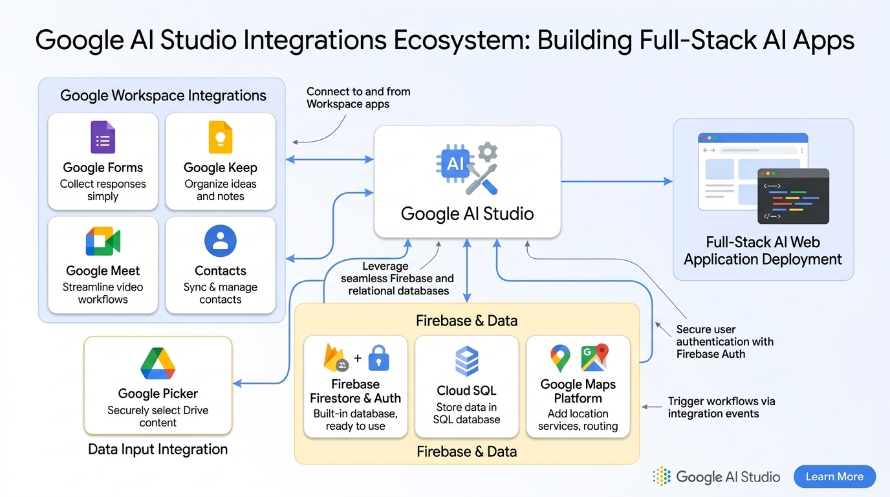
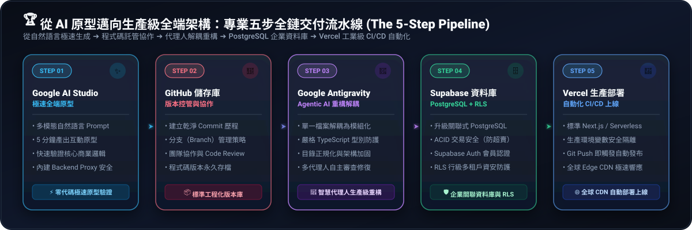

# 🤖 AI First 實作課程

> 從零開始，用 AI 工具打造屬於你的網頁應用程式

---

## 📚 基本觀念

| 主題 | 說明 |
|------|------|
| [🔍 認識 Google AI Studio](./認識GoogleAIStudio/) | 了解 Google AI Studio 的功能與使用方式 |
| [🌐 前端 / 後端 / 全端 / 網頁設計介紹](./前端_後端_全端_網頁設計介紹/README.md) | 釐清各類開發角色的差異與職責 |

---

## 🖥️ 前端網頁範例

> 💡 **新手友善**：在 Google AI Studio 開發與一鍵部署至 Google Cloud Run **不需先申請 GitHub 帳號**！只有需要部署至 GitHub Pages 時才需申請。

| 專案 | 說明 | 備註 |
|------|------|------|
| [📊 建立線上簡報網頁](./建立線上簡報網頁/README.md) | 打造現代化線上互動簡報（從單頁簡報出發，逐步解鎖 SVG 動畫、Chart 動態圖表與 3D 視覺互動） | 上班族神器 ⭐ |
| [🖼️ 加入圖片和音樂](./加入圖片和音樂/README.md) | 豐富網頁的多媒體內容（學習靜態資源放置、圖片載入與音訊控制） | 多媒體核心 🎵 |
| [🎮 建立小遊戲](./建立小遊戲/) | 用 AI 協助設計互動小遊戲（整合狀態機、動畫與多輪迭代） | 綜合應用 🕹️ |

### 💼 辦公室自動化進階實戰（難度較高 ⭐⭐⭐）

| 專案 | 說明 | 備註 |
|------|------|------|
| [📑 Excel 佔位符單據產生器](./Excel佔位符單據產生器/README.md) | 通用型單據產生器：動態解析 `{{變數 \| 預設值}}` 佔位符、支援上傳自訂範本與純前端保留樣式下載 | 純前端 ExcelJS 模板引擎 |

### ☁️ 部署教學

> 💡 **教學順序與路徑說明**：Google AI Studio 現已支援直接一鍵部署至 **Google Cloud Run（每個免費帳號提供 2 個免費專案額度）**，因此課堂會優先教學 Google Cloud Run 發布，學生**完全不需先申請 GitHub 帳號**即可立刻擁有公開網址分享成果；後續若需要將專案託管於 GitHub，才需進一步申請 GitHub 帳號。

#### 1️⃣ 第一階段：Google Cloud Run 一鍵部署（首選推薦・免 GitHub 帳號）

- **適用情境**：在 Google AI Studio 完成專案後，一鍵生成對外公開網址分享給主管與同事。
- **免費額度**：每個帳號可同時擁有 **2 個免費版** 的 Cloud Run 部署。
- **教學連結**：[Google AI Studio 主動部署完全指南（發布、自訂網址、更新與一鍵下架釋放額度）](./CloudRun部署與專案管理/README.md)

#### 2️⃣ 第二階段：GitHub Pages 靜態網站部署（進階託管・需 GitHub 帳號）

- **適用情境**：僅適用於無 API Key 的純靜態網頁（如：簡報、多媒體、Excel 佔位符單據產生器）。
- **帳號需求**：⚠️ 此階段才需要申請 [GitHub 帳號](https://github.com)。
- **教學連結**：[Google AI Studio 轉 GitHub Pages 靜態網頁部署指南（Prompt 轉換 GitHub Actions CI/CD）](./GitHubPages與Actions自動部署/README.md)

---

### 🛡️ 資安關鍵防線：API Key 洩漏風險與安全邊界（必讀 ⚠️）

> 🚨 **極重要紅線警示：靜態網頁（GitHub Pages）絕對嚴禁存放 API Key！**  
> - **為什麼會洩漏？** 靜態網頁的所有 JavaScript 在瀏覽器中都是完全公開的，任何訪客按 `F12` 就能複製你的 API Key；若上傳至 GitHub 公開儲存庫，30 秒內就會被全球掃描爬蟲機器人盜用刷爆。  
> - **安全唯一解**：凡是涉及 Gemini API Key、Google 服務授權或資料庫的應用，**一律嚴禁部署至 GitHub Pages**，必須全面採用 **Google AI Studio 的 Backend Proxy（伺服器代理）技術**，一鍵部署至 **Google Cloud Run** 安全運行！  
> 
> 👉 深入閱讀：[為什麼靜態網頁會洩露 API Key 實例解析](./為什麼靜態網頁會洩露api_key/README.md)

---

## 🚀 全端網頁應用實戰（Google AI Studio Backend Proxy 安全架構）

> 🛡️ **安全無憂・全新全端架構**：本系列專案全面採用 **Google AI Studio 原生的 Backend Proxy（伺服器代理）技術**！
> - **零金鑰外洩風險**：所有 Gemini API Key、OAuth 授權碼與資料庫憑證均由伺服器端環境變數保護，**完全不會暴露給前端瀏覽器**，學員無須自行架設 Vercel Serverless 或外部伺服器。
> - **一鍵雲端部署**：完成專案後，直接透過頂部 **Publish 按鈕一鍵部署至 Google Cloud Run**，立即擁有專屬的正式上線網址！

### 🤖 Gemini AI 核心應用實戰（Backend Proxy 安全代理）

| 專案 | 說明 | 備註 |
|------|------|------|
| [🎙️ 商務會議智慧總結與翻譯](./商務會議智慧總結與翻譯/README.md) | 多格式商務會議（影音/文件）自動摘要、關鍵行動清單提取與多國語言翻譯 | 多模態輸入與翻譯 🎙️ |
| [📊 智能數據分析與動態報表](./智能數據分析與動態報表/README.md) | 上傳 CSV/Excel 提供智慧分析建議，生成動態視覺化圖表與試算表報表 | 結構化數據與圖表 📊 |
| [💳 信用卡權益智慧客服](./信用卡權益智慧客服/README.md) | 掛載銀行官方規章知識庫（In-Context RAG），打造精準防幻覺的客服對話機器人 | 知識庫檢索與對話 💳 |

### ⚡ Google Workspace 原生整合（試算表與日曆自動化）

> 💡 **官方最新功能推薦**：Google AI Studio 現已推出強大的 **「Integrations 原生整合面板」**，免去繁瑣的 GCP OAuth 設定，一鍵即可安全串接 14 款 Google Workspace 辦公套件與雲端資料庫！  
> 👉 **[【專題推薦】點我查看：Google Workspace 原生整合清單與 14 大服務最新 AI 應用指南](./GoogleWorkspace原生整合說明/README.md)**

| 專案 | 說明 | 備註 |
|------|------|------|
| [🌐 Google Workspace 原生整合全景指南](./GoogleWorkspace原生整合說明/README.md) | 深入解析 Google AI Studio 支援的 14 款 Workspace 服務（Drive、Sheets、Gmail、Calendar 等）及 2026 最新 AI 落地應用 | 必讀全景指南 🌐 |
| [⚡ Workspace 智慧單據報銷系統](./Workspace智慧單據報銷系統/README.md) | 發票收據照片辨識、動態解析明細，一鍵寫入雲端 Google Sheets 試算表並生成請款單 | Google Workspace 整合 ⚡ |
| [📅 AI 會議紀錄與行事曆整合](./AI會議紀錄與行事曆整合/README.md) | 貼上雜亂會議紀錄，AI 自動萃取待辦寫入試算表，並將關鍵 Deadline 同步排入 Google 日曆 | Sheets + Calendar 雙整合 🗓️ |

### 🔥 整合 Firebase — 即時雲端資料庫與使用者認證（免綁卡・免費首選）

> 💡 **初學者友善**：採用 Firebase Spark 免費方案，**完全不需要輸入信用卡**，即可享有每日 5 萬次免費資料庫讀寫配額，安全無扣款風險！

| 專案 | 說明 | 備註 |
|------|------|------|
| [🏢 辦公室設備借用系統](./辦公室設備借用系統/README.md) | 投影機、展示筆電等公用資產登記，支援即時借用狀態更新與借用人追蹤 | Firebase Auth + Firestore 🏢 |
| [📋 部門專案即時協作看板](./部門專案即時協作看板/README.md) | 跨部門任務看板（Kanban），支援多人即時同步拖曳狀態與逾期提醒 | Firebase Auth + Firestore 📋 |

---

## 🏆 進階旗艦工程：從 AI 原型邁向生產級全端架構

> 🚀 **全鏈條現代軟體工程體系（End-to-End Modern Engineering Pipeline）**：  
> 本階段是為深度實戰規劃的專業升級路線！學員將脫離純自然語言原型的玩具階段，掌握業界頂尖的標準全端軟體交付流程：  
> 

### 🛠️ 專業五步全鏈交付流水線 (The 5-Step Pipeline)

1. **第 1 步：Google AI Studio 極速原型**：利用多模態與自然語言 Prompt，在 5 分鐘內快速產出具備基本功能與 UI 的全端原型。
2. **第 2 步：GitHub 託管與版本控管**：將 AI Studio 產出的專案推送到 GitHub，建立乾淨的 Commit 歷程與分支管理。
3. **第 3 步：Google Antigravity 代理人架構重構**：
   - 匯入 **Google Antigravity（次世代多代理人 AI 開發平台）**。
   - 讓 Agentic AI 接管代碼，進行目錄結構正規化、模組化解耦、嚴格 TypeScript 型別檢查與資安加固。
4. **第 4 步：Supabase 企業級關聯資料庫遷移**：
   - 將輕量存儲升級為真正具備 ACID 交易安全的 **PostgreSQL 關聯式資料庫**。
   - 實作 **Supabase Auth** 會員驗證系統與 **RLS (Row Level Security，行級安全規則)**，確保多租戶資料嚴格隔離。
5. **第 5 步：Vercel 生產環境自動化部署 (CI/CD)**：
   - 轉為標準 Next.js / Vite + Serverless 專案架構。
   - 在 Vercel 配置生產環境變數（安全隔離 Supabase 與 Gemini Key），實現「Git Push 即自動觸發測試與全球 CDN 上線」。

---

### 🗄️ 企業級核心系統實戰（Supabase + Antigravity + Vercel）

| 專案 | 核心技術與說明 | 備註 |
|------|------|------|
| [🔐 企業員工與管理者登入系統](./管理者登入/README.md) | Supabase Auth 會員認證、RBAC 角色權限控管、RLS 安全隔離規則實戰 | 企業權限基石 🔐 |
| [💰 企業收支記帳與財務儀表板](./記帳網頁/README.md) | PostgreSQL 複雜關聯查詢、多維度收支報表分析、資料庫交易一致性 | 財務數據核心 💰 |
| 🛒 雲端 POS 門市銷售與即時庫存 | 商品型錄、購物車即時結帳、資料庫 Transaction 扣減庫存防超賣 | 旗艦全端實戰 🛒 |

---

### 💬 智慧通訊機器人與事件驅動（Vercel Serverless Webhook + Supabase）

| 專案 / 平台 | 核心技術與說明 | 備註 |
|------|------|------|
| [🟢 LINE Bot 訂單與智慧通知助理](./線上訂飲料系統/README.md) | 整合線上訂單系統，透過 Vercel Serverless Webhook 即時推播 LINE Flex 訊息通知 | 雙向互動 🟢 |
| 🤖 Telegram Bot 運營監控與警報機器人 | 監聽 Supabase 資料庫事件，庫存不足或高額收支時主動向群組發送預警廣播 | 即時監控 🤖 |
| [⚙️ 傳統 Google Sheets GAS 庫存管理備援](./庫存管理/README.md) | 針對無外部資料庫權限情境，示範 Google Apps Script (GAS) 輕量後端整合 | 備援技巧 ⚙️ |

