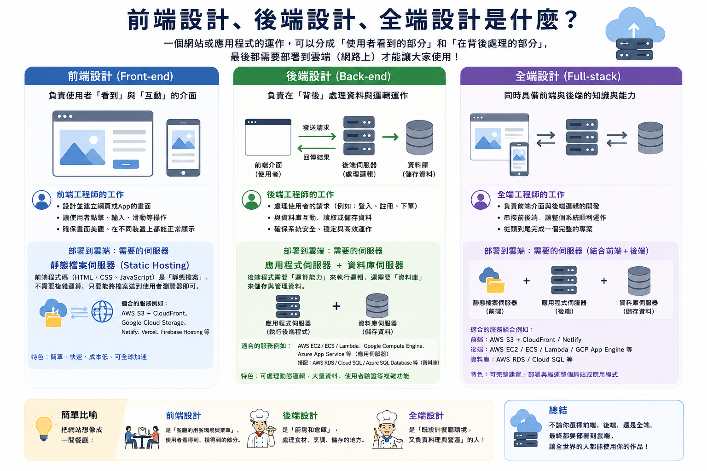
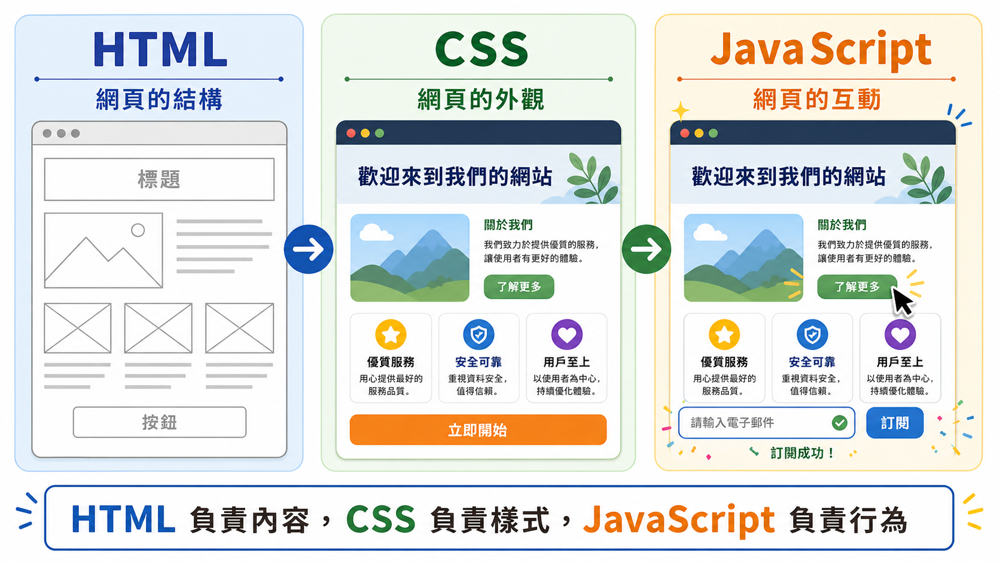
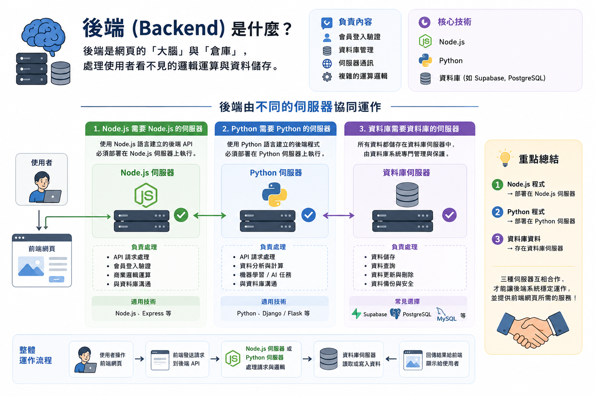

# 前端_後端_全端_網頁設計介紹

## 前端 (Frontend)
前端是網頁的「面子」，也就是使用者直接在瀏覽器中看到並互動的部分。
- **負責內容**：介面設計、排版、按鈕點擊反應、動畫效果等。
- **核心技術**：HTML (結構)、CSS (樣式)、JavaScript (互動)。
- **AI 時代的角色**：我們可以透過自然語言描述理想的畫面，讓 AI 快速生成基礎代碼，開發者則專注於調整美感與使用者體驗。
- **部署建議 (Where to Deploy)**：前端程式碼通常是靜態檔案（HTML/CSS/JS），適合部署在「靜態網站代管平台」。
    - **推薦工具**：Vercel (最推薦)、GitHub Pages、Netlify。

## 後端 (Backend)
後端是網頁的「大腦」與「倉庫」，處理使用者看不見的邏輯運算與資料儲存。
- **負責內容**：會員登入驗證、資料庫管理、伺服器通訊、複雜的運算邏輯。
- **核心技術**：Node.js、Python、資料庫 (如 Supabase, PostgreSQL)。
- **AI 時代的角色**：AI 可以協助設計資料庫結構 (Schema) 與撰寫 API 介面，縮短從想法到功能的開發週期。
- **部署建議 (Where to Deploy)**：後端需要運行程式邏輯與儲存資料，通常部署在「雲端應用程式平台 (PaaS)」或「資料庫代管服務」。
    - **推薦工具**：Supabase (BaaS 首選，包含資料庫與驗證)、Railway、Render。

## 全端 (Fullstack)
全端開發者具備同時處理前端與後端的能力，能夠獨立完成一個完整的網頁應用程式。
- **核心優勢**：能夠理解整個系統的運作流程，從介面設計到資料傳輸都能一手包辦。
- **AI First 的意義**：在 AI 的輔助下，開發者不再需要精通每一行程式碼的語法，而是更專注於「產品邏輯」與「架構設計」，使得開發完整應用的門檻大幅降低。
- **部署建議 (Where to Deploy)**：全端應用通常結合了前端框架與後端服務，最現代的做法是使用「整合型雲端平台」。
    - **推薦組合**：Vercel (負責前端與 Serverless Functions) + Supabase (負責資料庫與後端邏輯)。
