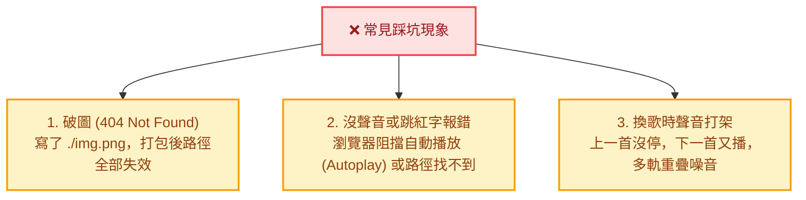
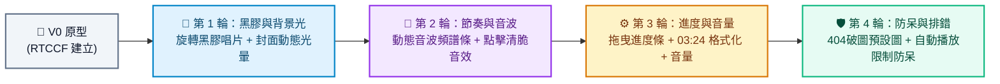

# 🖼️ 加入圖片和音樂：AuraStream 沉浸式音樂播放器

> **開發工具建議**：本專案推薦使用 **Google AI Studio** 進行開發，技術棧採用 Vite、React、TypeScript、Tailwind CSS 與 HTML5 Audio API。
> 
> 🎯 **學習目標**：徹底搞懂前端網頁如何**正確放置、引用與控制圖片和音訊檔案**，告別「破圖」與「播不出聲音」的新手惡夢，並透過 AI 打造出如 Spotify / Apple Music 般聲光兼具的沉浸式音樂播放器！

---

## 🧭 為什麼初學者常卡在「破圖」與「沒聲音」？

在前端開發（尤其是 Vite / React 專案）中，初學者最常遇到的三個痛點：



為了解決這些問題，我們必須先掌握現代前端**最關鍵的靜態資源放置觀念**！

---

## 💡 關鍵核心：靜態檔案應該放哪裡？

在 Vite + React 專案中，檔案主要有兩種放置方式，本課程**強烈推薦使用方式 A**：

### 🅰️ 方式 A：放在 `public/` 資料夾（⭐ 課程最推薦！簡單直覺、不踩坑）
**放在 `public/` 目錄下的所有檔案，Vite 打包時「不會修改檔名」，會原封不動複製到伺服器最根目錄。**

- **目錄結構範例**：
  ```text
  my-music-app/
  ├── public/              <-- 將下載的圖片和音樂直接放這裡！
  │   ├── 音樂1.png
  │   ├── 音樂1.mp3
  │   ├── 音樂2.png
  │   ├── 音樂2.mp3
  │   ├── 音樂3.png
  │   └── 音樂3.wav
  ├── src/
  │   ├── App.tsx
  │   └── ...
  ├── index.html
  └── package.json
  ```
- **代碼中如何使用**：一律以絕對路徑斜線 `/` 開頭即可讀取：
  ```jsx
  // 引用圖片
  

  // 引用音訊
  <audio src="/音樂1.mp3" controls />
  // 或在 JavaScript 中建立
  const audio = new Audio('/音樂1.mp3');
  ```
- **優點**：路徑最乾淨、支援動態字串拼接（例如 `/音樂${id}.mp3`），大檔案（如音樂、影片）不會拖慢編譯速度！

---

### 🅱️ 方式 B：放在 `src/assets/` 資料夾（進階方式）
**放在 `src/assets/` 的檔案會被打包工具編譯、壓縮，並加上防快取雜湊碼（例如 `logo.a3f8b9.png`）。**
- **代碼中如何使用**：必須使用 `import` 引入：
  ```jsx
  import coverImg from './assets/音樂1.png';
  import bgmAudio from './assets/音樂1.mp3';

  
  ```
- **適用時機**：小型 SVG 圖標、介面專用小圖。如果歌單有很多曲目，每首都要寫 `import` 會非常繁瑣，因此**音樂與動態封面請一律使用方式 A**！

---

## 📦 本單元實作素材下載

請先下載專案所需的三首歌曲與封面圖片，並將解壓縮後的檔案直接放到專案的 `public/` 目錄中：

- 📥 **[點此直接下載打包壓縮檔 (source.zip)](./source.zip)**（推薦：單鍵下載完整素材包）
- 📁 [瀏覽素材原始資料夾 (source/)](./source/)
  - 🖼️ `音樂1.png`、🎵 `音樂1.mp3`（歌曲：**晨曦律動** / 輕快晨曦節奏 / 創作者：AURA AI）
  - 🖼️ `音樂2.png`、🎵 `音樂2.mp3`（歌曲：**霓虹地平線** / 賽博流行電音 / 創作者：AURA AI）
  - 🖼️ `音樂3.png`、🎵 `音樂3.wav`（歌曲：**三稜鏡理論** / 空靈夢幻旋律 / 創作者：AURA AI）

---

## 一、 專案建立階段：V0 原型建立

在初次建立專案原型時，請一律使用 **RTCCF 結構化框架**，明確指定圖片與音樂的路徑對應，讓 Google AI Studio 產出的第一版程式碼就能**直接出圖且發出聲音**！

### 💡 如何用別的 AI 產生 RTCCF 格式？
若想自行發想不同風格（如復古收音機、賽博朋克電台），可複製下方折疊區內的**自然語言指令**，貼給 ChatGPT、Claude 或 Gemini 產出專屬的 RTCCF 規格書：

<details>
<summary>👉 點擊展開：請其他 AI 協助產生 RTCCF 的自然語言指令（可直接複製）</summary>

```text
我想在 Google AI Studio 開發一個兼具現代極簡美感與真實播放功能的網頁版音樂播放器（AuraStream），使用 Vite + React + TypeScript + Tailwind CSS 與 Lucide 圖標庫。
核心目標是學習如何在 React 中正確引入並控制圖片與音訊：
1. 圖片與音樂檔案統一放在 public/ 目錄下，代碼中使用絕對路徑（如 /音樂1.png、/音樂1.mp3）讀取。
2. 包含歌單清單（顯示專輯封面、歌名、作者）、點擊切換曲目、以及底部固定迷你播放器（真實切換播放/暫停）。
請扮演資深前端音訊架構師，使用標準 RTCCF 框架（包含：# 角色 Role、## 任務目標 Task、## 背景情境 Context、## 核心規則與限制 Constraints、## 輸出規格與風格 Format）為我撰寫一份結構完整的軟體需求規格 Prompt，讓我可以直接複製貼入 Google AI Studio 生成可運行的程式碼。
```

</details>

<br>

### 📋 專案建立 RTCCF Prompt（複製貼入 Google AI Studio）

請複製以下整段規格，貼入 **Google AI Studio** 對話框：

```markdown
# 角色 (Role)
你是一位精通 React 狀態管理、HTML5 Audio API 與現代質感介面設計的資深前端架構師。

## 任務目標 (Task)
請幫我開發一個極簡現代、兼具視聽雙重享受的「AuraStream 網頁音樂播放器」（V0 原型版本）。

## 背景情境 (Context)
- 開發環境與技術棧：Google AI Studio、Vite、React 18+、TypeScript、Tailwind CSS、Lucide React 圖標。
- 靜態資源規範：所有音訊與封面圖片皆已放置於專案的 `public/` 資料夾下，代碼中一律使用絕對路徑引用。

## 核心規則與限制 (Constraints)
1. 歌曲清單資料（請在常數陣列中定義）：
   - 曲目 1：名稱「晨曦律動」，作者「AURA AI」，封面 `/音樂1.png`，音訊 `/音樂1.mp3`
   - 曲目 2：名稱「霓虹地平線」，作者「AURA AI」，封面 `/音樂2.png`，音訊 `/音樂2.mp3`
   - 曲目 3：名稱「三稜鏡理論」，作者「AURA AI」，封面 `/音樂3.png`，音訊 `/音樂3.wav`
2. 介面三大核心元件：
   - 頂部導覽列：AuraStream Logo、耳機圖示與使用者頭像。
   - 歌曲列表區：
     - 卡片式排列 3 首歌曲。
     - 每個曲目顯示圓角封面圖片 (``)、歌曲名稱、作者、以及播放狀態按鈕。
     - 點擊列表任一項目，立即將該曲目設定為當前播放歌曲並開始播放。
   - 底部常駐播放器 (Sticky Bottom Player)：
     - 固定於視窗底部，具備毛玻璃半透明背景與陰影。
     - 顯示當前播放曲目的縮圖封面、歌名、作者。
     - 中央配置「上一首」、「播放 / 暫停（圓形高亮大按鈕）」、「下一首」按鈕。
     - 右側顯示播放狀態文字（「播放中 🎵」或「已暫停 ⏸️」）。
3. 音訊控制核心邏輯：
   - 使用 React `useRef` 綁定單一原生 `Audio` 物件，確保切換歌曲時不會有多重聲音重疊。
   - 點擊播放按鈕切換音訊 `play()` 與 `pause()`，圖示同步於「播放」與「暫停」間動態切換。

## 輸出規格與風格 (Format)
- UI/UX 風格：現代極簡淺色或純黑極致風格，卡片具備精緻微光與 Hover 縮放微動效，支援手機直式 RWD。
- 程式碼規範：
  - 清楚的 TypeScript 型別定義（Song 介面、播放狀態）。
  - 詳細繁體中文註解說明。
  - 提供完整且可獨立運行的完整程式碼。
```

---

## 二、 作品迭代階段：自然語言多輪進化

原型成功發出聲音並正確顯示封面後，請依循 **[作品迭代與修改技巧](../../作品迭代與修改技巧/README.md)**，在 Google AI Studio 中使用**自然語言對話**，循序加入震撼的聲光動態：



### 🔹 第 1 輪迭代：黑膠唱片旋轉動效與全螢幕封面動態光暈
- **改動重點**：讓圖片「活起來」！打造如實體黑膠唱片的擬真旋轉感，並提取封面顏色渲染全頁背景。
- 💬 **自然語言 Prompt（直接複製貼給 Google AI Studio）**：
  ```text
  目前歌曲播放與圖片顯示都很正常！
  現在我想將視覺感官全面升級，讓圖片展示更有質感：
  1. 點擊底部播放器時，可以展開為「全螢幕沉浸播放面板」：
     - 將當前播放的封面圖片渲染為「擬真圓形黑膠唱片」（帶有唱片溝槽紋理與中心圓孔標籤）。
     - 音樂播放時，黑膠唱片持續進行 360 度平滑旋轉動畫；音樂暫停時，旋轉動態平滑停頓。
  2. 動態封面光暈背景：將當前播放曲目的封面圖片放大作為全螢幕底圖，套用高強度高斯模糊（blur-3xl）與深色半透明遮罩，營造如同 Apple Music 般的環境動態光暈。
  請保持既有播放邏輯，並提供修改後的完整程式碼。
  ```

---

### 🔹 第 2 輪迭代：動態音波視覺頻譜與點擊互動音效
- **改動重點**：讓音樂看得見！加入律動頻譜與切歌音效反饋。
- 💬 **自然語言 Prompt（直接複製貼給 Google AI Studio）**：
  ```text
  黑膠旋轉與光暈背景效果太震撼了！接下來我想增加聲音視覺化與操作反饋：
  1. 動態音波頻譜條 (Equalizer Waves)：
     - 在播放中的歌曲卡片與底部播放器旁，加入由 4~5 根小豎條組成的音波頻譜動畫。
     - 當音樂播放時，音波條以不同高度上下規律跳動（呈現正在發聲的律動感）；當音樂暫停時，音波條整齊降為最低平線。
  2. 操作音效：每次點擊播放鍵或切換曲目時，利用 Web Audio API 合成一聲極簡清脆的「啵（Pop）」點擊反饋音。
  請提供更新後的完整程式碼。
  ```

---

### 🔹 第 3 輪迭代：播放時間進度條（可拖曳快轉）與音量滑桿
- **改動重點**：強化對音訊播放進程的掌控度。
- 💬 **自然語言 Prompt（直接複製貼給 Google AI Studio）**：
  ```text
  聲光效果非常棒！現在我想完善音樂播放器的核心控制功能：
  1. 加入「時間進度條 (Progress Bar)」：
     - 隨著音樂播放，進度條平滑向右增長。
     - 左側即時顯示已播放時間（例如 01:23），右側顯示曲目總時長（例如 03:45）。
     - 支援滑鼠點擊或拖曳進度條，音訊立即即時跳轉（Seek）到指定時間點播放。
  2. 加入音量調整滑桿（0% ~ 100%）與快速靜音按鈕，點擊喇叭圖示可在靜音與前次音量間切換。
  請提供修改後的完整程式碼。
  ```

---

### 🔹 第 4 輪迭代：破圖防呆備援圖 (Fallback) 與自動播放限制除錯
- **改動重點**：解決多媒體開發最致命的邊界錯誤，確保程式碼健壯無死角。
- 💬 **自然語言 Prompt（直接複製貼給 Google AI Studio）**：
  ```text
  我測試時發現了兩個前端多媒體的經典問題，請幫我加入防呆處理：
  1. 圖片載入失敗防呆 (Image Fallback)：
     - 如果某張圖片路徑失效（例如檔案被更名或 404），請使用 `onError` 事件自動替換為一個以 CSS 幾何漸層繪製的唱片圖示，防止畫面出現醜陋的破圖圖標。
  2. 解決音軌重疊與瀏覽器限制：
     - 在切換下一首曲目前，先執行 `audio.pause()` 並清空舊音訊，徹底杜絕快速切歌時兩首歌重疊播放的現象。
     - 現代瀏覽器常因使用者尚未互動而阻擋自動播放，並在 Console 噴出 `NotAllowedError`。請在 `audio.play()` 加上 Promise catch 異常捕獲，並在畫面上顯示溫馨提示「點擊頁面開始聆聽」。
  請提供修復與優化後的完整程式碼。
  ```

---

## 三、 除錯心法：遇到圖片或音樂 Bug 怎麼問？

在開發圖片與音訊功能時，瀏覽器 **Console** 與 **Network** 面板是你的最佳助手：

### 🔍 常見情境 1：圖片破圖（顯示破碎圖示或空白）
- **原因**：路徑寫錯（例如寫成 `./音樂1.png` 但檔案在 `public/`），或者檔名大小寫不符合。
- **檢查方式**：按 `F12` 切換到 **Network（網路）** 分頁，重新整理網頁，尋找紅色的 `404 Not Found` 請求。
- **向 Google AI Studio 提問**：
  ```text
  我的網頁封面圖無法顯示，瀏覽器 Network 面板顯示請求「http://localhost:5173/音樂1.png」出現 404 Not Found。
  我的檔案實際放在專案的 public/音樂1.png。請幫我檢查 React 元件中的 img src 寫法是否正確，並提供修正代碼。
  ```

### 🔍 常見情境 2：點播放沒有聲音，Console 出現紅色錯誤
- **原因**：音訊副檔名不支援、檔案損壞、或是瀏覽器自動播放政策阻擋。
- **向 Google AI Studio 提問**：
  ```text
  我在 Google AI Studio 點擊播放按鈕時沒有發出聲音，Console 出現了以下錯誤訊息：
  [在此處貼上 Console 報錯，例如：Uncaught (in promise) NotAllowedError: play() failed because the user didn't interact with the document first]
  請幫我分析原因，並加入適當的 Audio 生命週期防呆處理，提供修改後的完整程式碼。
  ```