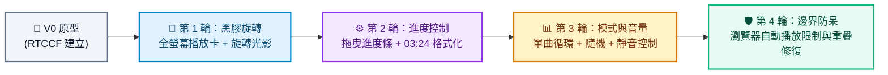

# 加入圖片和音樂：AuraStream 音樂播放器 - Prompt 指南

> **開發工具建議**：本專案推薦使用 **Google AI Studio** 進行開發，技術棧採用 Vite、React、TypeScript、Tailwind CSS 與 HTML5 Audio API。產出程式碼後可於本地環境執行，或透過 StackBlitz、CodeSandbox 即時預覽多媒體效果。

---

## 專案簡介與資源

本單元將帶領學員在 **Google AI Studio** 中從零打造一款名為 **「AuraStream」** 的現代化音樂串流播放器，並實戰掌握如何在前端應用中正確組織、載入與控制靜態圖片和音訊檔案。

### 📦 專案素材檔案
- 📁 [本機圖片與音樂素材目錄](./source/)
  - 🖼️ `音樂1.png`、🎵 `音樂1.mp3`（歌曲：晨曦律動 / 創作者：AURA AI）
  - 🖼️ `音樂2.png`、🎵 `音樂2.mp3`（歌曲：霓虹地平線 / 創作者：AURA AI）
  - 🖼️ `音樂3.png`、🎵 `音樂3.wav`（歌曲：三稜鏡理論 / 創作者：AURA AI）

---

## 💡 關鍵觀念：靜態檔案放置與載入規則

在 React（特別是 Vite 專案）中引入圖片與音樂，主要有以下兩種方式，依使用情境選擇：

### 1. `public/` 目錄 (靜態公開資源 Static Assets) —— **課程推薦！**
**放在此目錄的檔案不會被 Vite 打包工具編譯重命名，會直接複製到伺服器根目錄。**
- **適用情境**：大型音樂檔案、影片、或透過變數動態拼接檔名的圖片。
- **放置路徑**：例如將素材直接放入專案的 `public/` 目錄下（如 `public/音樂1.png`、`public/音樂1.mp3`）。
- **代碼中引用方式**：直接使用絕對路徑 `/`：
  ```jsx
  
  <audio src="/音樂1.mp3" controls />
  ```

### 2. `src/assets/` 目錄 (原始碼資源 Source Assets)
**放在此目錄的檔案會被 Vite 處理，打包時會被壓縮並附帶 Hash 雜湊碼以利快取。**
- **適用情境**：小型 UI 圖標 (SVG/PNG)、固定按鈕圖片。
- **代碼中引用方式**：必須透過 `import` 引入：
  ```jsx
  import logoImg from './assets/logo.png';
  
  ```

---

## 一、 專案建立階段：V0 原型建立

在初次建立專案原型時，請一律使用 **RTCCF 結構化框架**，明確定義 UI 結構、曲目清單資料與音訊控制器，讓 Google AI Studio 能精準產出完整的可運行專案。

### 💡 如何用別的 AI 產生 RTCCF 格式？
若想自行發想其他風格的音樂播放器（如復古黑膠唱片或暗色電音風格），可複製下方折疊區內的**自然語言指令**，貼給 ChatGPT、Claude 或 Gemini 產出專屬的 RTCCF 規格書：

<details>
<summary>👉 點擊展開：請其他 AI 協助產生 RTCCF 的自然語言指令（可直接複製）</summary>

```text
我想在 Google AI Studio 開發一個現代極簡質感的網頁版音樂播放器介面（AuraStream），使用 Vite + React + TypeScript + Tailwind CSS 與 Lucide 圖標庫。
需要整合 public/ 底下的本地圖片與音樂檔案，包含歌曲清單列表、歌曲項目資訊以及底部常駐的迷你播放器（支援播放與暫停）。
請扮演資深前端音訊架構師，使用標準 RTCCF 框架（包含：# 角色 Role、## 任務目標 Task、## 背景情境 Context、## 核心規則與限制 Constraints、## 輸出規格與風格 Format）為我撰寫一份結構完整的軟體需求規格 Prompt，讓我可以直接複製貼入 Google AI Studio 生成可運行的程式碼。
```

</details>

<br>

### 📋 專案建立 RTCCF Prompt（複製貼入 Google AI Studio）

請複製以下整段規格，貼入 **Google AI Studio** 對話框：

```markdown
# 角色 (Role)
你是一位精通 React 狀態管理、HTML5 Audio API 與 Tailwind CSS 介面設計的資深前端架構師。

## 任務目標 (Task)
請幫我開發一個極簡現代風的音樂串流播放器「AuraStream」（V0 原型版本），並串接本地圖片與音訊資源。

## 背景情境 (Context)
- 開發環境與技術棧：Google AI Studio、Vite、React 18+、TypeScript、Tailwind CSS、Lucide React 圖標庫。
- 靜態資源規範：音樂與圖片檔案均放置於專案的 `public/` 目錄中，代碼中一律使用絕對路徑引用。

## 核心規則與限制 (Constraints)
1. 歌曲清單資料（寫入常數陣列）：
   - 曲目 1：名稱「晨曦律動」，作者「AURA AI」，封面 `/音樂1.png`，音訊 `/音樂1.mp3`
   - 曲目 2：名稱「霓虹地平線」，作者「AURA AI」，封面 `/音樂2.png`，音訊 `/音樂2.mp3`
   - 曲目 3：名稱「三稜鏡理論」，作者「AURA AI」，封面 `/音樂3.png`，音訊 `/音樂3.wav`
2. 畫面佈局元件：
   - 頂部導覽列：左側選單圖示、中央標題「AuraStream」、右側使用者頭像。
   - 主體歌曲列表：標題「您的創作」，垂直排列 3 首歌曲。每個項目包含圓角封面圖、歌曲名稱、作者、以及播放按鈕。點擊曲目項目即選定為當前播放歌曲。
   - 底部常駐迷你播放器 (Sticky Bottom Player)：
     - 左側顯示當前播放曲目的微型封面與歌名。
     - 中央為「播放 / 暫停」切換按鈕以及「下一首」按鈕。
     - 右側顯示播放狀態（「播放中」或「已暫停」）。
3. 音訊播放邏輯：
   - 使用 React `useRef` 綁定 HTML5 `new Audio()` 或 `<audio>` 標籤。
   - 點擊列表項目或底部播放鍵時，需有真實的音訊播放/暫停功能，並同步更新圖示狀態。

## 輸出規格與風格 (Format)
- UI/UX 風格：純白俐落背景、精緻微陰影 (Soft Shadow)、圓角卡片與現代字體，支援手機直式響應式佈局。
- 程式碼規範：
  - 嚴謹的 TypeScript 型別定義（Song 介面、PlayerState 等）。
  - 詳細繁體中文註解說明。
  - 提供完整且可獨立運行的完整程式碼。
```

---

## 二、 作品迭代階段：自然語言多輪進化

原型成功運行後，請依循 **[作品迭代與修改技巧](../../作品迭代與修改技巧/README.md)**，在 Google AI Studio 中使用**自然語言對話**循序漸進調教：



### 🔹 第 1 輪迭代：黑膠唱片旋轉動效與全螢幕展開模式
- **改動重點**：強化音樂播放時的視覺沉浸感與儀式感。
- 💬 **自然語言 Prompt（直接複製貼給 Google AI Studio）**：
  ```text
  目前歌曲列表與基本播放功能都很順暢！
  現在我想升級視覺動效與播放介面：
  1. 點擊底部迷你播放器時，可以向上平滑滑動展開為「全螢幕播放介面 (Full Screen Player)」，右上角有關閉縮小按鈕。
  2. 在全螢幕播放介面中央，將當前歌曲封面渲染為精緻的「圓形黑膠唱片」樣式。當音樂正在播放時，黑膠唱片持續平滑旋轉（CSS rotate 旋轉動畫）；音樂暫停時旋轉停頓。
  請保持既有播放狀態不變，並提供修改後的完整程式碼。
  ```

---

### 🔹 第 2 輪迭代：播放進度條即時拖曳與時間格式化
- **改動重點**：讓使用者精準掌握曲目進度，支援快轉與倒退。
- 💬 **自然語言 Prompt（直接複製貼給 Google AI Studio）**：
  ```text
  黑膠旋轉效果非常驚艷！接下來我想增加完整的進度條控制：
  1. 在全螢幕播放器與底部迷你播放器上方加入「時間進度條」：
     - 隨著音樂播放，進度條平滑前進。
     - 左右兩側即時顯示「當前播放時間（例如 01:25）」與「歌曲總長度（例如 03:48）」。
  2. 允許使用者點擊或拖曳進度條，即時跳轉（Seek）到指定的播放時間點。
  請提供更新後的完整程式碼。
  ```

---

### 🔹 第 3 輪迭代：循環模式切換、隨機播放與音量控制
- **改動重點**：豐富音樂播放器的核心控制維度。
- 💬 **自然語言 Prompt（直接複製貼給 Google AI Studio）**：
  ```text
  進度條功能運作良好！現在我想擴充專業播放器功能：
  1. 加入「曲目循環模式」按鈕：支援「全部列表循環」、「單曲循環」、「隨機播放 (Shuffle)」，每點擊一次循環圖示即切換模式。
  2. 當一首歌曲播放完畢 (onEnded) 時，根據當前模式自動播放下一首曲目，不中斷體驗。
  3. 加入音量調整滑桿 (Volume Slider) 與靜音切換按鈕，可調整 0%～100% 音量。
  請提供修改後的完整程式碼。
  ```

---

### 🔹 第 4 輪迭代：邊界防呆與瀏覽器自動播放限制處理
- **改動重點**：解決現代瀏覽器對 Audio 的限制，避免程式碼拋出未捕獲錯誤。
- 💬 **自然語言 Prompt（直接複製貼給 Google AI Studio）**：
  ```text
  我測試時發現了兩個常見的音訊控制問題：
  1. 快速連續切換歌曲時，前一首歌曲的聲音有時會重疊播放一秒才停止。
  2. 瀏覽器有自動播放限制（Autoplay Policy），有時切換曲目會拋出 `play() request was interrupted by a new load request` 或 `NotAllowedError` 錯誤。
  請幫我優化音訊控制邏輯：
  - 在載入新曲目前，先強制暫停 (`pause()`) 並重置舊音訊的時間，確保同時只有一首曲目發聲。
  - 對 `audio.play()` 加入 Promise 異常捕獲 (`catch`)，優雅處理自動播放被瀏覽器阻擋的情境，避免程式崩潰。
  請提供修復與優化後的完整程式碼。
  ```

---

## 三、 除錯心法：遇到 Bug 時怎麼問？

在處理圖片或音訊時，最常見的問題是「404 找不到檔案」或「聲音沒有播放」：
1. 按 `F12` 開啟開發者工具，點擊 **Console（主控台）** 與 **Network（網路）** 分頁。
2. 檢查是否有出現紅色 404（例如 `GET http://localhost:5173/音樂1.mp3 404 (Not Found)`）。
3. 自然語言提問範例：
   ```text
   我在 Google AI Studio 執行播放器時，點擊播放按鈕沒有聲音，瀏覽器 Console 出現了這行錯誤：
   [在此處貼上 Console 錯誤訊息]
   請問是 public 目錄的路徑引用方式有誤，還是 Audio 實例的事件監聽出問題？請幫我分析原因並提供修正後的完整程式碼。
   ```