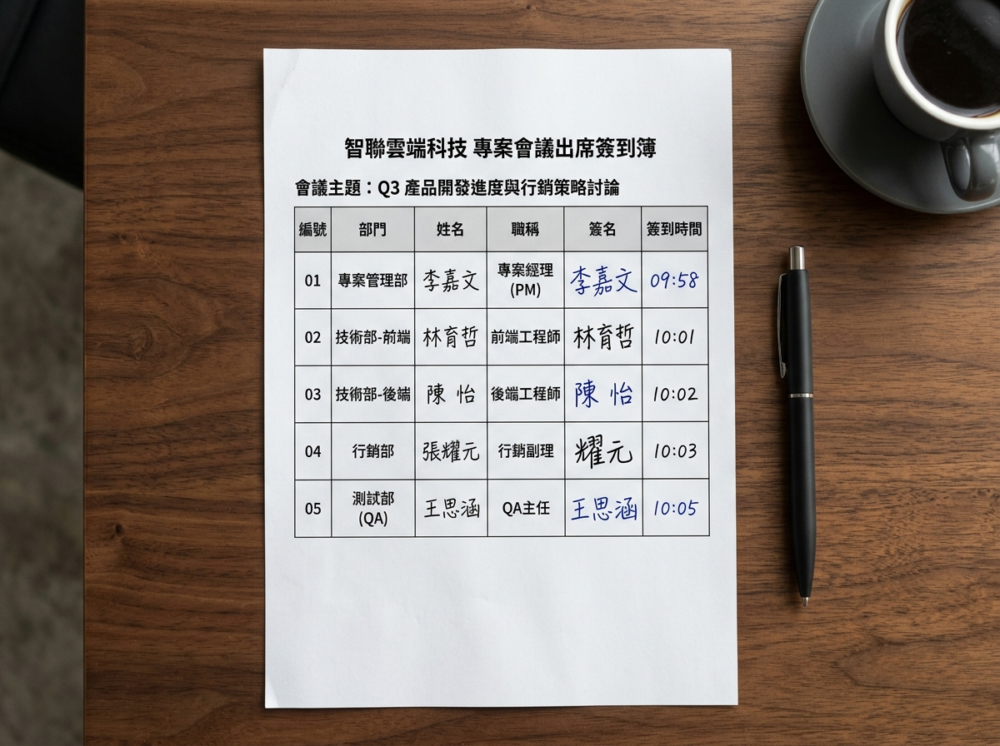
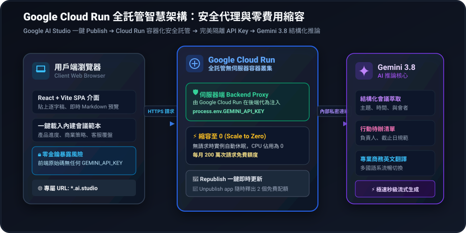
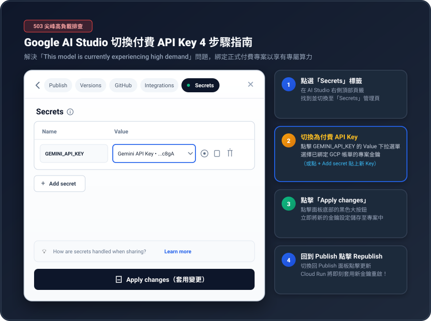

# 📑 AI First 實戰進階：標準商務會議 AI 總結與翻譯助理（Google Cloud Run 全託管版）

> **30 秒專案介紹**：  
> 這是一個針對**標準商務會議**設計的企業級 AI 工具，結合 **Google 最新世代 Gemini 3 系列（`gemini-3.8-flash`）** 與 **Google Cloud Run**。  
> 只要將專案發布上線，網頁便會**自動讀取預設商務會議逐字稿**，一鍵秒級生成會議摘要、責任明確的待辦清單（Action Items）與專業商務英文翻譯。  
> 支援**多檔案批次拖曳上傳（文字、簽到簿照片、開會語音）**，且具備**「更新即清空」**防呆機制。透過 Google AI Studio 一鍵部署至 **Google Cloud Run**，享有 **Backend Proxy 伺服器端金鑰保護** 與 **縮容至 0 (Scale to Zero) 免費待機**！

---

## 📥 第一步：下載課程素材檔案

請點擊下方按鈕**一鍵下載完整素材包**，解壓縮後稍後會放入專案中使用：

> 🎁 **[👉 【推薦】點我一鍵下載「標準商務會議素材包.zip」](./標準商務會議素材包.zip)**  
> *(內含以下所有逐字稿、簽到簿照片、開會語音檔與 Logo)*

### 📂 素材清單與單獨下載

| 檔案名稱 | 格式 | 說明與用途 | 單獨下載 |
| :--- | :---: | :--- | :---: |
| **標準商務會議逐字稿.txt** | `TXT` | 預設會議逐字稿（專案同步、跨部門分工與時程，**網頁啟動預設自動載入**） | [📥 下載](./標準商務會議逐字稿.txt) |
| **會議出席簽到簿.jpg** | `JPG` | 實體紙本簽名表照片（含部門、姓名、真實筆跡與時間，**測試 Gemini 圖片 OCR**） | [🖼️ 下載](./會議出席簽到簿.jpg) |
| **標準商務會議錄音.m4a** | `M4A` | 真人多角色會議開場錄音（含 PM、工程師、行銷多人對話，**測試 Gemini 語音摘要**） | [🎙️ 下載](./標準商務會議錄音.m4a) |
| **logo.svg** | `SVG` | 現代商務科技風格企業會議助理標誌圖片（已適配響應式排版） | [🖼️ 下載](./logo.svg) |

<details>
<summary>📷 點擊展開預覽：實體會議簽到簿照片（測試多模態 OCR）</summary>



</details>

---

## 🚀 第二步：Google AI Studio 實作 3 步驟（SOP）

請依照以下簡單三步驟完成專案建置與 Google Cloud Run 雲端發布：

```
【步驟 1】複製第三步提示詞 ──► 貼至 Google AI Studio 對話框生成專案
                                 ▼
【步驟 2】將素材解壓縮 ─────► 放至專案的 public/ 資料夾內
                                 ▼
【步驟 3】網頁立即測試 ─────► 自動載入預設素材、填寫即清除更新，一鍵 Publish 發布！
```

### 1. 建立專案
- 開啟 [Google AI Studio](https://aistudio.google.com/)，點擊右上角建立新 Web 專案。
- 複製下方**「第三步」**的完整提示詞，貼入 AI Studio 對話框發送生成。

### 2. 放置素材檔案
- 專案建立完成後，將剛才下載的 `標準商務會議素材包.zip` 解壓縮。
- 將解壓後的 4 個檔案（`標準商務會議逐字稿.txt`、`會議出席簽到簿.jpg`、`標準商務會議錄音.m4a`、`logo.svg`）**手動放至專案根目錄的 `public/` 資料夾內**。

### 3. 測試與雲端發布
- **預設自動載入**：網頁啟動時會自動抓取 `public/標準商務會議逐字稿.txt`，點擊「✨ 生成會議總結與翻譯」即可秒級取得 Markdown 報告。
- **更新即自動清除**：在文字框編輯任何字元，舊結果**立即清空**，避免新舊內容混淆。
- **批次多檔上傳**：可直接拖曳或多選載入自訂的逐字稿、簽到簿照片或錄音檔，AI 將自動多模態融合總結。
- **一鍵發布至 Cloud Run**：
  - 點擊右側工具列的 **`Publish`** 按鈕。
  - 自訂 App URL（例如 `smart-meeting-assistant`），最終網址即為：  
    👉 **`https://smart-meeting-assistant.ai.studio`**
  - 點擊 **`Publish your app`**，底層自動建立 **Google Cloud Run** 全託管容器，30~60 秒內發布上線！

---

## 💡 如何用別的 AI 將「你日常商務會議記錄」轉成 RTCCF？

如果你未來想客製化自己公司的商務會議流程（例如：新增會議出席統計、追蹤跨部門決策、自訂英文翻譯風格），只要把你的會議規範或逐字稿需求整理好，貼入下方指令，讓其他 AI（如 ChatGPT、Claude 或 Gemini）協助你轉換成標準 RTCCF 規格書：

<details>
<summary>👉 點擊展開：請其他 AI 協助客製商務會議總結助理的自然語言指令（可直接複製）</summary>

```text
我已經完成了一份我們公司內部例行商務會議的格式規範與紀錄文字。
我想在 Google AI Studio 開發一個專為商務團隊設計的「標準商務會議 AI 總結與翻譯助理 SPA」，技術棧使用 Vite + React + TypeScript + Tailwind CSS，串接 Google Gen AI SDK（@google/genai）與 gemini-3.8-flash 模型，並部署於 Google Cloud Run。
功能需求：
1. 預設自動透過 fetch 載入 public/ 目錄下的會議逐字稿。
2. 支援通用多檔案上傳（逐字稿 .txt、簽到簿照片 .jpg、會議錄音 .m4a），具備即時清除舊結果的防呆機制。
3. 一鍵生成具備核心摘要、責任到人的 Action Items 待辦清單，以及專業商務英文翻譯。
4. 採用現代商務深藍 Slate 風格，支援 Markdown 渲染與一鍵複製。
請扮演資深全端架構師，使用標準 RTCCF 框架（包含：# 角色 Role、## 任務目標 Task、## 背景情境 Context、## 核心規則與限制 Constraints、## 輸出規格與風格 Format），將我自訂的會議需求與格式融入規格中：

[在此處貼上你公司自訂的商務會議紀錄格式、需求或範例文字]
```

</details>

<br>

---

## 🤖 第三步：專案生成提示詞（點擊代碼框右上角一鍵複製）

請將以下整段提示詞複製，貼到 **Google AI Studio**：

```markdown
# Role（角色）
你是一位精通 React、TypeScript、Tailwind CSS 與現代 UI/UX 設計的資深前端工程師，專精於 Google Gen AI SDK（@google/genai）、最新世代 Gemini 3 模型（gemini-3.8-flash）、提示詞工程以及 Google Cloud Run 雲端全託管架構。

# Context（背景情境）
這是一個針對「標準商務會議」場景打造的企業級智慧辦公應用。
專案直接運行於 Google AI Studio，並透過右側「Publish」面板主動部署至 Google Cloud Run。
系統後端具備 Cloud Run Backend Proxy 自動代理機制，可透過 `process.env.GEMINI_API_KEY` 安全呼叫 Gemini 模型，API Key 絕不外洩至瀏覽器前端。

# Task（任務目標）
請使用 `vite-react-typescript` 與 Tailwind CSS 建立單一頁面應用程式（SPA）：

1. **安裝與串接最新相依套件**：
   - 使用 `@google/genai` 調用最新世代模型：`gemini-3.8-flash`（支援 1M Token 上下文視窗、極致低延遲、`thinking_level: "low"` 秒級響應）。
   - 使用 `lucide-react` 提供商務風格圖示。
   - 使用 `canvas-confetti` 提供生成完成時的微慶祝動效。

2. **預設自動載入 public 素材與「多檔通用上傳＋更新即清除」互動機制**：
   - **網頁初始化自動讀取**：
     - 應用程式啟動時，自動透過 `fetch('/標準商務會議逐字稿.txt')` 讀取內容並自動填入輸入文字框中，讓使用者一進網頁就能立即預覽並點擊測試。
   - **只要更新就清除（Auto-Clear on Edit/Update）**：
     - 當使用者在輸入框中修改任何文字、清空文字，或上傳/移除任何檔案時，**系統必須立即自動清除舊有的 AI 總結與翻譯輸出結果**，避免呈現過期或不匹配的舊資訊。
   - **單一通用多檔案上傳區（Universal Multi-file Uploader）**：
     - 介面上提供一個支援一次多選與拖曳多檔的上傳區域（`<input type="file" multiple accept=".txt,.md,.jpg,.jpeg,.png,.webp,.m4a,.mp3,.wav" />`），**使用者可一次框選或拖入多個不同類型的檔案**：
       - 📄 **逐字稿文字檔（.txt / .md）**：多個文字檔自動按檔名標題合併顯示於編輯框。
       - 🖼️ **簽到簿/白板圖片檔（.jpg / .png / .webp）**：卡片展示縮圖預覽與個別刪除按鈕，點擊生成時作為視覺部件傳給 Gemini 進行 OCR 辨識。
       - 🎙️ **開會錄音檔（.m4a / .mp3 / .wav）**：卡片展示檔名、音訊播放控制條與個別刪除按鈕，點擊生成時作為音訊部件傳給 Gemini 進行語意分析。
     - **已上傳檔案清單與管理**：上傳區域下方以標籤（File Badges）清晰列出目前已掛載的所有檔案，每個檔案皆可點擊「`×`」單獨移除，亦提供「清空所有已載入檔案」按鈕。
     - **跨模態綜合推論**：當使用者同時上傳逐字稿、簽到簿圖片與會議錄音時，Gemini 3.8 Flash 將同時融合三者資訊，產出最精確且與出席名單完全吻合的總結報告！
     - 提供「🔄 重設為預設商務會議範本」按鈕，隨時一鍵清空自訂檔案並重新載入 `public/標準商務會議逐字稿.txt`。

3. **標準商務會議結構化 System Instructions**：
   在呼叫 Gemini 3.8 Flash API 時，帶入嚴謹系統指令，要求 AI 嚴格依照以下繁體中文 Markdown 規格輸出：
   - **### 1. 會議摘要 (Executive Summary)**：3~5 句話精準提煉會議核心目的、重要決議與進度結論。
   - **### 2. 重點討論事項 (Key Discussions)**：以項目符號條列各成員（如 PM、前端、後端、行銷、QA）的討論重點與技術方案。
   - **### 3. 待辦事項清單 (Action Items)**：嚴格使用 Markdown 核取方塊（`- [ ]`），格式為 `- [ ] 任務內容 - 負責人: [姓名], 截止時間: [日期]`。
   - **### 4. 專業商務英文翻譯 (Business English Translation)**：將會議摘要與 Action Items 翻譯為專業流暢的商務英文。

4. **精美輸出檢視與一鍵操作**：
   - 頂部導航欄展示 `public/logo.svg` 與應用程式名稱。
   - 右側或下方採用獨立卡片展示 AI 生成結果，支援即時 Markdown 結構化排版（標題高亮、加粗重點、待辦勾選框）。
   - 頂部操作列提供：
     - `[📋 一鍵複製全文]`：複製乾淨的 Markdown 格式，並跳出 Toast 成功提示。
     - `[📥 匯出 Markdown 檔案]`：觸發瀏覽器下載 `標準商務會議紀錄_[日期].md`。
     - `[🗑️ 清空所有內容]`：一鍵清空輸入框與輸出卡片。
   - 生成中顯示精美 Loading 骨架屏動畫與進度狀態文字。

# Constraints（限制與規格要求）
1. 【Google Cloud Run 原生相容】：全面相容 Google AI Studio 主動部署機制，透過後端代理讀取金鑰，嚴禁在客戶端程式碼硬編碼任何 API Key。
2. 【現代商務美學】：
   - 配色以 Slate 深灰藍（`#0F172A`、`#1E293B`）與質感淺灰（`#F8FAFC`、`#F1F5F9`）為主，搭配高雅電藍（`#2563EB`）與紫羅蘭（`#7C3AED`）微光強調色。
   - 圓角卡片設計、柔和陰影、流暢按鈕懸停動畫與清楚的邊框層級。
3. 【全繁體中文介面】：所有 UI 標籤、按鈕、提示訊息與錯誤回饋皆使用標準繁體中文。
4. 【容錯防呆】：若 public 檔案尚未放置，顯示友善提示引導使用者上傳自訂檔案，不可崩潰。

# Format（交付格式）
1. 列出相依套件安裝指令（`npm i @google/genai lucide-react canvas-confetti && npm i -D @types/canvas-confetti`）。
2. 提供完整、具備完整 TypeScript 型別定義的單一程式碼檔案（如 `src/App.tsx`）。
3. 簡短執行與 Google Cloud Run 發布步驟。
```

---

## 🏛️ 第四步：Google Cloud Run 部署架構與安全機制剖析

本專案全面相容 Google AI Studio 主動發布機制，直接將容器託管於 **Google Cloud Run**：



### 🔍 為什麼採用 Google Cloud Run 架構？

| 比較維度 | 🚀 Google Cloud Run（本專案標準架構） | ⚠️ 傳統純前端直連 API |
| :--- | :--- | :--- |
| **金鑰安全性** | **極高**。由 Cloud Run 後端代理注入 `GEMINI_API_KEY`，前端完全看不到金鑰 | **極度危險**。金鑰直接暴露在瀏覽器 Network 與原始碼中，易遭盜刷 |
| **部署門檻** | **一鍵發布**。在 AI Studio 點擊 `Publish` 即自動容器化並配發正式網址 | 需自行設定 Docker、網域名稱與伺服器伺服程式 |
| **維運成本** | **縮容至 0 (Scale to Zero)**。無人造訪時不耗算力，每月 200 萬次請求免費 | 需持續租用虛擬主機 (VPS)，即便無人使用每月仍需付費 |
| **即時同步** | 修改提示詞後點擊 **`Republish`**，30 秒內更新雲端，網址永不變更 | 需重新建置 Bundle 並手動上傳伺服器 |

---

## 🛠️ 第五步：常見問題排查：遇到 503 錯誤？如何切換為付費 API Key？

當專案使用 Google 提供的預設免費額度（Free Tier）時，若適逢全球尖峰用量時段，畫面可能會跳出以下警示：

```json
會議分析處理失敗: {
  "error": {
    "code": 503,
    "message": "This model is currently experiencing high demand. Spikes in demand are usually temporary. Please try again later.",
    "status": "UNAVAILABLE"
  }
}
```

### 💡 為什麼會出現 503 錯誤？
- **免費層共用算力限制**：免費版 API 屬於共享資源池，當尖峰時段需求劇增時，系統會暫時進行流量限制。
- **最佳解法：切換為 Pay-as-you-go（綁定 GCP 帳單的專屬 API Key）**：
  在 [Google AI Studio Get API Key](https://aistudio.google.com/apikey) 建立綁定 Google Cloud 帳單帳戶的金鑰，即可享有**企業級專屬保障算力**（收費極低，分析一場會議通常僅需不到 $0.001 美元），徹底擺脫 503 尖峰擁擠！

### 🖼️ Google AI Studio 切換 API Key 4 步驟圖解指南



### 📋 換 Key 4 步驟 SOP：

1. **切換至「Secrets」頁籤**：
   在 Google AI Studio 右側頂部導航列中，找到並點選 **`Secrets`** 標籤。
2. **切換為已綁定帳單的 API Key**：
   在 `Name: GEMINI_API_KEY` 右側的 `Value` 下拉選單中，點擊並選擇您已綁定 GCP 帳單的付費金鑰（或點選 `+ Add secret` 貼上新申請的 Key）。
3. **點擊「Apply changes」儲存**：
   點擊面板最下方的黑色大按鈕 **`[💾 Apply changes]`**，系統立即將新金鑰寫入專案環境。
4. **回到 Publish 面板點擊「Republish」**：
   切換回 **`Publish`** 面板，點擊 **`[🔄 Republish]`**。Google Cloud Run 容器將在 30 秒內自動代入全新金鑰重新載入，503 錯誤立即迎刃而解！
