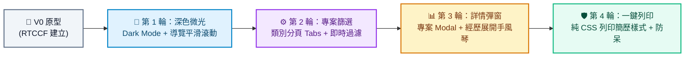

# 建立個人作品集網頁 (Personal Portfolio) - Prompt 指南

> **開發工具建議**：本專案推薦使用 **Google AI Studio** 進行開發，技術棧採用 Vite、React、TypeScript 與 Tailwind CSS（或現代 CSS）。
> 
> ✨ **零素材門檻・入門首選**：本專案**完全不需準備外部圖片與聲音檔案**！所有大頭貼、背景與專案卡片皆透過「純 CSS 漸層色塊」、「SVG 幾何向量」與「現代字體排版」實現。初學者只需複製 Prompt 貼入 Google AI Studio，即可一秒產出高質感的個人品牌網站！

---

## 專案簡介與核心觀念

打造個人作品集網頁是前端開發者踏入實戰的必經之路。在本單元中，你將學到：
1. **資料與介面分離（Data-Driven UI）**：將個人履歷、技能、作品清單抽離至獨立的資料檔案（`portfolioData.ts`），未來只需修改文字資料即可自動更新整站內容。
2. **現代純 CSS 視覺設計**：在不依賴外部圖檔的情況下，運用漸層微光（Gradients）、毛玻璃質感（Glassmorphism）與精緻陰影展現專業度。
3. **完全自適應佈局（RWD）**：確保在手機、平板與桌機上均能流暢閱讀。

---

## 一、 專案建立階段：V0 原型建立

在初次建立專案原型時，請一律使用 **RTCCF 結構化框架**，明確定義資料介面、區塊劃分與無圖排版策略，讓 Google AI Studio 能一次性精準產出完整的可運行專案。

### 💡 如何用別的 AI 產生 RTCCF 格式？
若想根據你自己的專業背景（如 UI 設計師、後端工程師、資料分析師）調整個人自傳，可複製下方折疊區內的**自然語言指令**，貼給 ChatGPT、Claude 或 Gemini 產出專屬的 RTCCF 規格書：

<details>
<summary>👉 點擊展開：請其他 AI 協助產生 RTCCF 的自然語言指令（可直接複製）</summary>

```text
我想在 Google AI Studio 開發一個現代極簡、高質感的「個人作品集單頁網頁 (Portfolio SPA)」，使用 Vite + React + TypeScript + Tailwind CSS。
特別要求：本專案完全不需要加入外部圖片與聲音檔案，所有頭像與專案展示請使用純 CSS 漸層色塊或 SVG 向量圖案呈現。
資料必須嚴格抽離為獨立的 TypeScript 資料檔案與介面（包含基本自傳、技能標籤、工作經歷時間軸、專案卡片清單）。
請扮演資深前端工程師與 UI/UX 設計師，使用標準 RTCCF 框架（包含：# 角色 Role、## 任務目標 Task、## 背景情境 Context、## 核心規則與限制 Constraints、## 輸出規格與風格 Format）為我撰寫一份結構完整的軟體需求規格 Prompt，讓我可以直接複製貼入 Google AI Studio 生成可運行的程式碼。
```

</details>

<br>

### 📋 專案建立 RTCCF Prompt（複製貼入 Google AI Studio）

請複製以下整段規格，貼入 **Google AI Studio** 對話框：

```markdown
# 角色 (Role)
你是一位精通 React 18+、TypeScript、現代 CSS 排版與 UI/UX 設計的資深前端架構師。

## 任務目標 (Task)
請幫我開發一個現代、專業且具備科技質感的「個人作品集單頁網站」（V0 原型版本）。

## 背景情境 (Context)
- 開發環境與技術棧：Google AI Studio、Vite、React 18+、TypeScript、Tailwind CSS。
- 素材限制：**完全不使用任何外部圖片與聲音檔案**。頭像請使用「純 CSS 雙色漸層圓形 + 姓名英文字母縮寫」或精美 SVG 向量呈現；專案封面使用高質感的純 CSS 幾何漸層色塊與技術 Badge 代替截圖。

## 核心規則與限制 (Constraints)
1. 資料抽離與型別定義 (Data-Driven Architecture)：
   - 建立獨立的資料結構，包含嚴謹的 TypeScript 介面：
     - `PersonalInfo`：姓名、職稱、一句話引言、個人自傳、聯絡信箱、GitHub/LinkedIn 連結。
     - `SkillCategory`：技能分類（如前端、工具、軟實力）與各項技能標籤名稱及熟悉度。
     - `Experience`：時間區間、公司名稱、擔任職稱、核心成就與貢獻條列。
     - `Project`：專案名稱、簡介、使用技術標籤陣列、亮點功能、純 CSS 漸層主題色。
   - 所有畫面顯示內容必須從此資料集引入渲染，嚴禁將文字寫死在 UI 元件中。
2. 頁面四大核心區塊：
   - 🌟 **Hero 區**：醒目的自我介紹、動態職稱、純 CSS 字母漸層頭像、下載簡歷按鈕與社交連結。
   - 🛠️ **Skills 區**：分類卡片展示技能樹與現代膠囊標籤（Badges）。
   - ⏳ **Experience 區**：精緻的垂直時間軸（Timeline），清晰呈現職涯歷程。
   - 💻 **Projects 區**：卡片式專案展示，包含漸層主題色區塊、專案簡介與技術標籤。
3. 響應式佈局 (RWD)：
   - 手機直式單欄排列、桌機多欄自適應，間距與排版符合人因工程。

## 輸出規格與風格 (Format)
- UI/UX 風格：現代極簡淺色或深灰系背景、卡片帶有柔和陰影（Soft Shadow）與微妙的 Hover 浮起互動動效。
- 程式碼規範：
  - 清楚的 TypeScript 型別定義與繁體中文註解。
  - 資料與 UI 徹底解耦。
  - 提供完整且可獨立運行的完整程式碼。
```

---

## 二、 作品迭代階段：自然語言多輪進化

原型成功運行後，請依循 **[作品迭代與修改技巧](../../作品迭代與修改技巧/README.md)**，在 Google AI Studio 中使用**自然語言對話**循序漸進調教：



### 🔹 第 1 輪迭代：深色模式切換與頂部導覽列平滑滾動
- **改動重點**：提升產品質感，支援深淺色切換與快速錨點跳轉。
- 💬 **自然語言 Prompt（直接複製貼給 Google AI Studio）**：
  ```text
  作品集的基礎排版與資料渲染非常清晰美觀！
  現在我想升級全站的視覺與導覽體驗：
  1. 在頂部加入一個「毛玻璃半透明固定導覽列 (Sticky Navbar)」，包含 Hero、Skills、Experience、Projects 的錨點連結，點擊時平滑滾動 (Smooth Scroll) 至對應區塊。
  2. 導覽列右側加入「深色模式 (Dark Mode) / 淺色模式」切換開關，切換時全站背景、文字與卡片陰影具有平滑的過渡色彩，並記住使用者喜好。
  請保持既有資料架構不變，並提供修改後的完整程式碼。
  ```

---

### 🔹 第 2 輪迭代：專案類別標籤篩選器 (Filter Tabs)
- **改動重點**：當專案作品增多時，提供即時動態過濾能力。
- 💬 **自然語言 Prompt（直接複製貼給 Google AI Studio）**：
  ```text
  深色模式切換運作非常滑順！接下來我想優化「Projects（作品集）」區塊：
  1. 在專案列表上方加入分類標籤按鈕（例如：「全部 (All)」、「網頁應用 (Web Apps)」、「工具庫 (Tools)」、「UI 設計 (UI/UX)」）。
  2. 點擊不同標籤時，專案卡片即時過濾顯示對應分類，切換時帶有淡入淡出的平滑過渡動畫。
  請在資料結構中為專案補充 category 欄位，並提供更新後的完整程式碼。
  ```

---

### 🔹 第 3 輪迭代：專案詳情彈窗與經歷手風琴折疊
- **改動重點**：讓有興趣的訪客能深入檢視專案架構細節，而不破壞主頁排版。
- 💬 **自然語言 Prompt（直接複製貼給 Google AI Studio）**：
  ```text
  篩選功能體驗很好！現在我想增加更豐富的互動細節：
  1. 點擊任一專案卡片時，彈出一個高質感的「專案詳情 Modal（彈窗）」，詳細展示：專案痛點、核心技術亮點、架構考量以及模擬代碼片段（以程式碼區塊樣式排版），右上角附關閉按鈕。
  2. 在「Experience（工作經歷）」區塊，每筆經歷預設只顯示摘要，點擊可像手風琴 (Accordion) 展開更多成就細節。
  請提供修改後的完整程式碼。
  ```

---

### 🔹 第 4 輪迭代：一鍵列印簡歷優化 (Print CSS) 與行動端防呆
- **改動重點**：將作品集無縫轉化為求職時可直接列印或另存 PDF 的實體履歷。
- 💬 **自然語言 Prompt（直接複製貼給 Google AI Studio）**：
  ```text
  我希望這個作品集在求職時能發揮更大作用：
  1. 在 Hero 區塊的「下載簡歷」按鈕加入 `window.print()` 列印功能，並撰寫 `@media print` 專屬列印樣式：
     - 列印時自動隱藏導覽列、模式切換鈕與無關按鈕。
     - 自動調整為白底黑字、移除大面積背景色與陰影，保證 A4 列印或另存 PDF 時版面整齊、無截斷。
  2. 行動版手機畫面上，確保頂部導覽列收攏為乾淨的漢堡選單 (Mobile Menu)，點擊選單項目跳轉後自動收合。
  請提供修復與優化後的完整程式碼。
  ```

---

## 三、 除錯心法：遇到 Bug 時怎麼問？

若遇到點擊錨點無反應、或資料型別對不上：
1. 按 `F12` 打開開發者工具的 **Console（主控台）**。
2. 複製出現的警告或錯誤訊息（例如 `Property 'category' does not exist on type 'Project'`）。
3. 自然語言提問範例：
   ```text
   我在 Google AI Studio 執行個人作品集時，加入了專案分類篩選後，Console 出現了以下 TypeScript 報錯：
   [在此處貼上 Console 錯誤訊息]
   看起來是 portfolioData.ts 中的專案物件缺少了新擴充的屬性定義。請幫我修正型別介面並提供修改後的完整程式碼。
   ```
