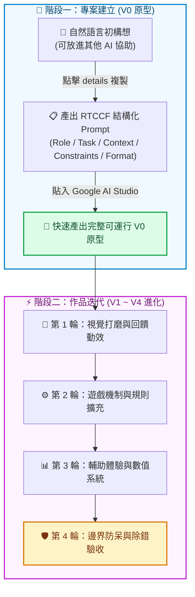

# 🎮 AI First 遊戲開發實作：從原型建立到多輪迭代

本單元包含 **7 款精選網頁小遊戲** 的完整 Prompt 開發指南。所有小遊戲均專為 **Google AI Studio**（亦相容於 Cursor、ChatGPT 等工具）量身打造，並全面落實 **[作品迭代與修改技巧](../../作品迭代與修改技巧/README.md)** 的開發心法。

---

## 💡 核心開發心法：兩階段工作流

在現代 AI 輔助程式開發（Vibe Coding）中，最有效率的模式是**「結構化建立原型，自然語言循序迭代」**：

### 1. 專案建立時：一律使用 RTCCF 結構化提示詞
初次生成遊戲原型時，AI 需要完整的「軟體需求規格書」。我們採用 **RTCCF 框架**（Role 角色、Task 任務、Context 背景、Constraints 限制、Format 格式），讓 Google AI Studio 一次就輸出架構正確、元件清晰、可運行的程式碼。
> 💡 **小撇步**：若你想自己構思新的遊戲規格，每個遊戲文件內皆提供了 `
` 摺疊區塊，你可以直接複製裡面的**自然語言指令**貼給其他 AI（如 ChatGPT、Gemini），讓它幫你量身產生一份完美的 RTCCF 提示詞！

### 2. 作品迭代時：一律使用自然語言「小步快跑」
原型跑起來後，**切忌一次叫 AI 改一大堆功能**！請嚴格遵守《作品迭代與修改技巧》的四大黃金法則：
1. **一次只做一件事（單點突破）**：一輪對話只改一個特定功能，改完立刻在瀏覽器驗收。
2. **精準描述「現狀 vs 期望」**：清楚告知 AI 目前畫面或邏輯是什麼，你希望改成什麼。
3. **遇到 Bug 抓取 Console 錯誤**：按 `F12` 複製紅字錯誤訊息直接貼給 AI 修復。
4. **明確要求交付完整代碼**：避免手動拼接片段造成語法損毀。

---

## 🕹️ 小遊戲實作清單

### 🟢 經典入門小遊戲（邏輯與狀態機基礎）
適合初學者練習狀態控制、迴圈與 Canvas/DOM 繪圖基礎：

1. **[猜數字遊戲 (Number Guessing)](./猜數字遊戲/README.md)**
   - 經典邏輯推理遊戲，電腦隨機產生 1～100 數字，玩家依「太大 / 太小」提示猜出答案。
   - 核心練習：狀態管理、二分搜尋邏輯、輸入防呆驗證。

2. **[貪食蛇遊戲 (Snake Game)](./貪食蛇遊戲/README.md)**
   - 經典街機遊戲，控制蛇移動進食並持續成長，撞牆或撞身體則挑戰結束。
   - 核心練習：Canvas/網格座標系統、鍵盤事件監聽、遊戲迴圈 (Game Loop)。

3. **[反應力測試 (Reaction Time Test)](./反應力測試/README.md)**
   - 測試玩家神經反應速度的互動小工具，畫面變色瞬間快速點擊。
   - 核心練習：狀態機 (Idle / Waiting / Ready / Result) 切換、毫秒級時間運算、防搶按防呆。

4. **[打磚塊遊戲 (Breakout Game)](./打磚塊遊戲/README.md)**
   - 經典彈珠台遊戲，操控底部滑塊反彈球體擊破頂部磚塊。
   - 核心練習：Canvas 2D 物理碰撞反彈、粒子特效、多關卡磚塊配置。

---

### 🟣 多媒體與稅務情境小遊戲（多素材、動畫與進階機制）
包含豐富圖像、音效、動畫與知識問答的完整商業級應用：

1. **[發票接物挑戰 (Invoice Catching Challenge)](./發票接物挑戰/README.md)**
   - 在限時 40 秒內控制籃子接住掉落的雲端發票 (+3)、電子發票 (+2)、收據 (+1)，避開地雷炸彈 (-5)。
   - 核心練習：Tailwind CSS + 動畫庫、掉落物物理計算、觸控滑動支援。

2. **[使用牌照稅迷宮大冒險 (License Tax Maze)](./使用牌照稅迷宮大冒險/README.md)**
   - 操控汽車在帶有「探照燈視野遮罩」的迷宮中尋找 4 道租稅問答題，全部解答後尋找木門出口逃脫。
   - 核心練習：視野限制演算法、彈窗狀態切換、手機虛擬搖桿支援。

3. **[娛樂稅VS納保法記憶翻牌 (Memory Challenge)](./娛樂稅VS納保法記憶翻牌/README.md)**
   - 16 張卡牌（8對娛樂稅與納保法項目），限時 45 秒與 15 次翻牌機會，成功配對增加 15 秒。
   - 核心練習：3D 卡牌翻轉 CSS 動畫、計時器連動、手機直式強制與橫向防呆遮罩。

---

## 🚀 推薦學習路徑

1. 先在 **Google AI Studio** 開啟一個新對話，確認 System Prompt 已設定完成。
2. 挑選一款小遊戲，複製該遊戲文件的 **RTCCF 提示詞**，貼給 Google AI Studio 產出第一版程式碼（V0 原型）。
3. 在瀏覽器預覽確認基本功能可動。
4. 依序複製各輪的 **自然語言迭代 Prompt**，體驗如何像專業工程師一樣一步步把遊戲打磨成精緻作品！