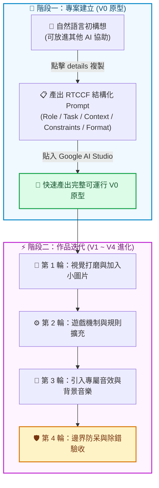

# 🎮 AI First 遊戲開發實作：從原型建立到多輪迭代

本單元包含 **7 款精選網頁小遊戲** 的完整 Prompt 開發指南。所有小遊戲均專為 **Google AI Studio**（亦相容於 Cursor、ChatGPT 等工具）量身打造，並全面落實 **[作品迭代與修改技巧](../../作品迭代與修改技巧/README.md)** 的開發心法。

> 🎁 **全系列專屬素材支援**：所有小遊戲皆已備齊高質感、輕量級且無版權問題的**專屬小圖片與遊戲音效包（assets.zip）**！學生在進行多輪迭代時，可一鍵下載並放入專案的 `public/` 目錄中，輕鬆為遊戲加入豐富的視聽體驗！

---

## 💡 核心開發心法：兩階段工作流

在現代 AI 輔助程式開發（Vibe Coding）中，最有效率的模式是**「結構化建立原型，自然語言循序迭代」**：

### 1. 專案建立時：一律使用 RTCCF 結構化提示詞
初次生成遊戲原型時，AI 需要完整的「軟體需求規格書」。我們採用 **RTCCF 框架**（Role 角色、Task 任務、Context 背景、Constraints 限制、Format 格式），讓 Google AI Studio 一次就輸出架構正確、元件清晰、可運行的程式碼。
> 💡 **小撇步**：若你想自己構思新的遊戲規格，每個遊戲文件內皆提供了 `
` 摺疊區塊，你可以直接複製裡面的**自然語言指令**貼給其他 AI（如 ChatGPT、Gemini），讓它幫你量身產生一份完美的 RTCCF 提示詞！

### 2. 作品迭代時：自然語言對話 + 融入專屬素材
原型跑起來後，請依循四大黃金法則進行小步快跑。在多輪迭代過程中，可適時將各遊戲提供的專屬圖片與聲音包下載解壓至 `public/assets/`，並用自然語言引導 AI：
> 💬 *「我已經將圖片與音效放入專案的 `public/assets/` 資料夾。請幫我在接住物品時播放 `/assets/catch.wav`，並使用 `/assets/cloud-invoice.png` 作為雲端發票的圖片。」*

---

## 🕹️ 小遊戲實作清單

### 🟢 經典入門小遊戲（邏輯、狀態機與素材初體驗）
適合初學者練習狀態控制、迴圈與 Canvas/DOM 繪圖基礎：

1. **[猜數字遊戲 (Number Guessing)](./猜數字遊戲/README.md)**
   - 經典邏輯推理遊戲，電腦隨機產生 1～100 數字，玩家依「太大 / 太小」提示猜出答案。
   - 附帶素材：金牌獎盃圖標、猜對叮咚音、猜錯提示音、通關大和弦音效。

2. **[貪食蛇遊戲 (Snake Game)](./貪食蛇遊戲/README.md)**
   - 經典街機遊戲，控制蛇移動進食並持續成長，撞牆或撞身體則挑戰結束。
   - 附帶素材：紅蘋果圖標、金色幸運蘋果、吃食物清脆音、撞牆死亡音、輕快 BGM。

3. **[反應力測試 (Reaction Time Test)](./反應力測試/README.md)**
   - 測試玩家神經反應速度的互動小工具，畫面變色瞬間快速點擊。
   - 附帶素材：閃電圖標、金牌評級徽章、信號嗶聲、點擊音效、搶按錯誤音。

4. **[打磚塊遊戲 (Breakout Game)](./打磚塊遊戲/README.md)**
   - 經典彈珠台遊戲，操控底部滑塊反彈球體擊破頂部磚塊。
   - 附帶素材：發光球體、紫色滑塊、彈跳反彈音、擊碎磚塊音、獲勝通關音。

---

### 🟣 多媒體與稅務情境小遊戲（多素材、動畫與進階機制）
包含豐富圖像、音效、動畫與知識問答的完整商業級應用：

1. **[發票接物挑戰 (Invoice Catching Challenge)](./發票接物挑戰/README.md)**
   - 在限時 40 秒內控制籃子接住掉落的雲端發票 (+3)、電子發票 (+2)、收據 (+1)，避開地雷炸彈 (-5)。
   - 附帶素材：雲端發票圖、電子發票圖、紙本收據、炸彈、編織籃、接物得分音、爆炸扣分音、狂暴雙倍音、背景音樂。

2. **[使用牌照稅迷宮大冒險 (License Tax Maze)](./使用牌照稅迷宮大冒險/README.md)**
   - 操控汽車在帶有「探照燈視野遮罩」的迷宮中尋找 4 道租稅問答題，全部解答後尋找木門出口逃脫。
   - 附帶素材：綠色小汽車、金問號標記、木門出口、暗光鳥吉祥物、答對音效、出口開啟音、勝利音效、探險 BGM。

3. **[娛樂稅VS納保法記憶翻牌 (Memory Challenge)](./娛樂稅VS納保法記憶翻牌/README.md)**
   - 16 張卡牌（8對娛樂稅與納保法項目），限時 45 秒與 15 次翻牌機會，成功配對增加 15 秒。
   - 附帶素材：專屬卡背、8 款娛樂稅與納保項目圖標、翻牌音效、配對音效、失敗音效、通關音效、高品質 BGM。

---

## 🚀 推薦學習路徑

1. 先在 **Google AI Studio** 開啟一個新對話，確認 System Prompt 已設定完成。
2. 挑選一款小遊戲，複製該遊戲文件的 **RTCCF 提示詞**，貼給 Google AI Studio 產出第一版程式碼（V0 原型）。
3. 預覽確認基礎邏輯運作正常。
4. 點擊下載該遊戲的 **專屬素材包 (assets.zip)**，解壓縮後放到專案的 `public/assets/` 目錄。
5. 依序複製各輪的 **自然語言迭代 Prompt**，引導 AI 一步步替換圖片、加入音效與動畫，完成聲光俱佳的高水準作品！