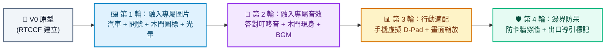

# 使用牌照稅迷宮大冒險 (License Tax Maze) - Prompt 指南

這是一款寓教於樂的 Web 租稅探索小遊戲！玩家將開著小汽車深入帶有視野限制的神秘迷宮，在黑暗中尋找 4 道使用牌照稅相關的知識謎題，成功解答所有謎題後尋找秘密木門出口，幫助暗光鳥順利逃脫回家！

---

## 遊戲簡介與資源

### 🎮 玩法說明
1. 迷宮內共有 4 道租稅謎題（Q 標記），全部答對後通往自由的木門出口就會現身。
2. 視野限制：迷宮自帶「車燈探照燈」效果，唯有車輛周圍可見，其餘路徑隱蔽於迷霧中。
3. 跨平台操控：桌機支援鍵盤方向鍵，手機支援螢幕虛擬按鈕與觸控。

### 📦 專案資源與素材下載
- 🌐 [線上立即試玩 Demo](https://roberthsu2003.github.io/__license_tax_maze__/)
- 💾 [Google AI Studio 完成範例 ZIP 下載](./google_ai_studio_完成範例/使用牌照稅迷宮大冒險(license-tax-maze).zip)
- 📂 [GitHub 原始碼庫](https://github.com/roberthsu2003/__license_tax_maze__)
- 🎁 **[專屬圖片與音效素材包下載 (assets.zip)](./assets/assets.zip)**（解壓後請放入專案 `public/assets/`）：
  - 🖼️ **圖片**：`car.png`（綠色小汽車）、`question.png`（金問號牌）、`door.png`（木門出口）、`owl.png`（暗光鳥吉祥物）
  - 🎵 **音效**：`move.wav`（移動微音效）、`correct.wav`（答對叮咚音）、`door-open.wav`（木門現身音）、`victory.wav`（通關勝利音）、`bgm.mp3`（探險音樂）

---

## 一、 專案建立階段：V0 原型建立

在初次建立專案原型時，請一律使用 **RTCCF 結構化框架**，明確定義迷宮地圖、視野遮罩、題庫資料與 Modal 狀態，讓 Google AI Studio 能精準建構遊戲骨架。

### 💡 如何用別的 AI 產生 RTCCF 格式？
若想自行修改租稅題目或自訂迷宮地圖，可複製下方折疊區內的**自然語言指令**，貼給 ChatGPT、Claude 或 Gemini 產出專屬的 RTCCF 規格書：

<details>
<summary>👉 點擊展開：請其他 AI 協助產生 RTCCF 的自然語言指令（可直接複製）</summary>

```text
我想在 Google AI Studio 開發一款名為「使用牌照稅迷宮大冒險」的 React + TypeScript 小遊戲。
核心機制是玩家開車在帶有探照燈視野遮罩的迷宮中尋找 4 道問答題（Q 標記），答對所有題目後在迷宮邊緣生成出口木門，玩家到達木門即通關。
請扮演資深前端遊戲工程師，使用標準 RTCCF 框架（包含：# 角色 Role、## 任務目標 Task、## 背景情境 Context、## 核心規則與限制 Constraints、## 輸出規格與風格 Format）為我撰寫一份結構完整的軟體需求規格 Prompt，包含元件劃分、題庫常數與響應式操作，讓我可以直接複製貼入 Google AI Studio 生成可運行的程式碼。
```

</details>

<br>

### 📋 專案建立 RTCCF Prompt（複製貼入 Google AI Studio）

請複製以下整段規格，貼入 **Google AI Studio** 對話框：

```markdown
# 角色 (Role)
你是一位專業的 React 前端開發工程師，精通 TypeScript、Vite 與 HTML5 Canvas / CSS 迷宮運算。

## 任務目標 (Task)
請幫我開發一款名為「使用牌照稅迷宮大冒險」的 Web 互動小遊戲（V0 原型版本）。

## 背景情境 (Context)
- 開發環境：Google AI Studio、Vite、React 18+、TypeScript。
- 樣式與響應式：純 CSS 或 CSS Modules，確保電腦與手機螢幕皆能自適應不破版。

## 核心規則與限制 (Constraints)
1. 迷宮探索與探照燈機制：
   - 迷宮地圖由二維陣列構建，玩家控制一台車輛在走道中移動（撞牆阻擋）。
   - 迷宮帶有「探照燈（視野限制）」效果，只有車輛周圍半徑是亮的，其餘區域隱藏於黑暗迷霧中（可透過 Canvas 或 CSS 遮罩實作）。
2. 解謎觸發與出口機制：
   - 迷宮內散佈 4 個「Q」字樣謎題標記。車輛接觸到 Q 標記時切換至問答 Modal。
   - 答對所有 4 道題目後，彈出提示「您已解開所有謎題！出口已出現於某處。快去尋找吧！」，並在迷宮邊緣生成出口木門。
   - 車輛抵達出口木門時，進入勝利通關畫面。
3. 跨平台操控：
   - 桌機版：監聽鍵盤方向鍵 (`keydown`) 移動車輛，滑鼠點擊題目選項。
   - 手機版：提供螢幕虛擬方向鍵（或搖桿）按鈕，支援觸控。
4. 內建題庫資料（請寫入常數陣列）：
   - 題目 1：請問自用車輛的使用牌照稅要在每年幾月繳納？
     - 選項：A. 4月、B. 5月、C. 7月 (正解: A)
     - 答對提示：恭喜答對！提醒您：自用車輛的使用牌照稅要在每年4月時繳納哦！
   - 題目 2：請問申請使用牌照稅繳款書歸戶，最多可將幾筆車號歸至一張稅單？
     - 選項：A. 3筆、B. 5筆、C. 10筆 (正解: B)
     - 答對提示：恭喜答對！提醒您：申請「使用牌照稅繳款書歸戶」：1.同一直轄市或縣(市)內車輛開立1張繳款書 2.每張繳款書以5筆車號為限 3.開徵兩個月前申請，逾期申請次期適用。
   - 題目 3：若您持有的機車排氣量大於多少cc，須繳納使用牌照稅？
     - 選項：A. 50cc、B. 100cc、C. 150cc (正解: C)
     - 答對提示：恭喜答對！提醒您：若您持有的機車排氣量大於150cc (即151cc以上)，須於每年4月繳納使用牌照稅！
   - 題目 4：供身障者使用車輛免徵牌照稅，請問免徵以多少排氣量為限？
     - 選項：A. 1800cc、B. 2000cc、C. 2400cc (正解: C)
     - 答對提示：答對了！供身障者使用之車輛，免徵金額以汽缸總排氣量 2400cc 之稅額為限！

## 輸出規格與風格 (Format)
- UI/UX 風格：
  - 標題畫面 (`TitleScreen`)：童趣冒險風，包含遊戲說明與「開始挑戰」按鈕。
  - 問答視窗 (`QuestionModal`)：綠色黑板風格介面，標示「新北租稅小教室」，右上角有關閉按鈕。
  - 勝利畫面 (`VictoryScreen`)：通關慶祝畫面。
- 程式碼規範：
  - 清楚的 TypeScript 型別定義與繁體中文註解。
  - 提供完整且可獨立運行的完整程式碼。
```

---

## 二、 作品迭代階段：自然語言多輪進化

原型成功運行後，請先下載 **[assets.zip](./assets/assets.zip)** 並將解壓後的檔案放入專案 `public/assets/` 目錄中，接著依循 **[作品迭代與修改技巧](../../作品迭代與修改技巧/README.md)**，在 Google AI Studio 中使用**自然語言對話**循序精修：



### 🔹 第 1 輪迭代：替換專屬小圖片與車燈動態光暈
- **改動重點**：將迷宮中抽象方塊替換為可愛專屬小圖，並升級探照燈光影。
- 💬 **自然語言 Prompt（直接複製貼給 Google AI Studio）**：
  ```text
  迷宮的基本移動與探照燈遮罩運作良好！
  我已經把專屬圖片放入 public/assets/ 資料夾中了。
  現在我想將畫面升級為精緻的圖標呈現：
  1. 請替換迷宮元素為真實圖片：
     - 玩家車輛使用 `/assets/car.png`
     - 迷宮中的謎題 Q 標記使用 `/assets/question.png`
     - 通關出口木門使用 `/assets/door.png`
     - 勝利畫面加入暗光鳥吉祥物圖標 `/assets/owl.png`
  2. 將探照燈效果優化為「平滑徑向漸層 (Radial Gradient)」：中心明亮，外圍柔和過渡至全黑。當車輛轉向上下左右時，車輛圖片對應旋轉 90、180、270 度。
  請保持既有碰撞與題目觸發邏輯，並提供修改後的完整程式碼。
  ```

---

### 🔹 第 2 輪迭代：加入專屬遊戲音效與背景音樂
- **改動重點**：讓租稅解謎更有成就感與聲光儀式感。
- 💬 **自然語言 Prompt（直接複製貼給 Google AI Studio）**：
  ```text
  圖片與光影效果非常漂亮！我已經將音效準備在 public/assets/ 中，請幫我加入聲音反饋：
  1. 背景音樂：循環播放 `/assets/bgm.mp3`（音量 0.35），右上角提供聲音開關。
  2. 答對題目時：播放清脆叮咚音效 `/assets/correct.wav`。
  3. 解完全部 4 題、木門出口現身時：播放震撼的開啟音效 `/assets/door-open.wav`。
  4. 車輛抵達出口通關勝利時：播放勝利歡呼音效 `/assets/victory.wav`。
  請提供更新後的完整程式碼。
  ```

---

### 🔹 第 3 輪迭代：手機虛擬 D-Pad 按鈕與畫布自適應
- **改動重點**：確保在不同尺寸手機上皆可順暢單手遊玩。
- 💬 **自然語言 Prompt（直接複製貼給 Google AI Studio）**：
  ```text
  現在桌機版操作很棒，我想進一步優化手機端體驗：
  1. 在手機畫面下方增加四向虛擬方向鍵（十字 D-Pad 按鈕組），支援觸控按壓連續移動。
  2. 迷宮畫布在直式手機上自動等比例縮放以適應螢幕寬度，確保不會超出螢幕或產生水平捲軸。
  請提供修改後的完整程式碼。
  ```

---

### 🔹 第 4 輪迭代：迷宮防卡牆與出口動態指引防呆
- **改動重點**：避免玩家在迷宮死角卡住，並確保出口開啟時指引清晰。
- 💬 **自然語言 Prompt（直接複製貼給 Google AI Studio）**：
  ```text
  我測試時發現兩個小問題：
  1. 有時候車輛在轉彎處若剛好貼近牆壁角落，容易卡住動彈不得。
  2. 玩家解答完 4 道謎題後，出口出現在迷宮某一處，但在黑暗視野限制下很難找到出口位置，玩家容易迷航。
  請幫我優化：
  - 修正轉角邊界的碰撞容差（Bounding Box 寬容度），避免車輛被角落卡死。
  - 當出口木門生成時，在畫面邊緣加入一個「閃爍的微型指南針箭頭」，指向出口的相對方向，引導玩家前進。
  請提供修復與優化後的完整程式碼。
  ```

---

## 三、 除錯心法：遇到 Bug 時怎麼問？

若遇到 Modal 開啟後無法關閉、或碰撞判定失靈：
1. 按 `F12` 打開開發者工具的 **Console（主控台）**。
2. 複製出現的錯誤訊息。
3. 自然語言提問範例：
   ```text
   我在 Google AI Studio 測試牌照稅迷宮時，解完第 4 題後木門沒有如預期生成，Console 出現了這行錯誤：
   [在此處貼上 Console 錯誤訊息]
   看起來是 solvedQuestions 狀態在計算全部完成時觸發了條件未滿足的判定。請幫我修正並提供修改後的完整程式碼。
   ```