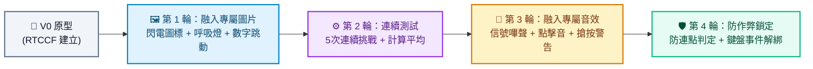

# 反應力測試遊戲 (Reaction Time Test) - Prompt 指南

> **開發工具建議**：本專案推薦使用 **Google AI Studio** 進行開發，技術棧採用 Vite、React 與 TypeScript。可於本地環境執行，或透過 StackBlitz、CodeSandbox 即時預覽與測試。

---

## 遊戲簡介與資源
反應力測試遊戲是一個精確測量玩家神經反應速度的互動工具。系統會讓玩家進入準備狀態並隨機倒數，在畫面顏色瞬間轉變為綠色時，玩家必須以最快速度點擊螢幕，系統將精確測量並顯示毫秒（ms）等級的反應時間。

### 📦 專案資源與素材下載
- 🎁 **[專屬圖片與音效素材包下載 (assets.zip)](./assets/assets.zip)**（解壓後請放入專案 `public/assets/`）：
  - 🖼️ **圖片**：`lightning.png`（閃電標誌）、`trophy.png`（金牌獎盃）
  - 🎵 **音效**：`signal.wav`（綠燈反應嗶聲）、`click.wav`（點擊音效）、`error.wav`（搶按犯規音）

---

## 一、 專案建立階段：V0 原型建立

在初次建立專案原型時，請一律使用 **RTCCF 結構化框架**，明確定義有限狀態機 (State Machine) 與高精度計時邏輯，讓 Google AI Studio 產出完整可運行的專案架構。

### 💡 如何用別的 AI 產生 RTCCF 格式？
若想發想其他測試模式（如聽覺測試或顏色辨別），可複製下方折疊區內的**自然語言指令**，貼給 ChatGPT、Claude 或 Gemini 產出專屬的 RTCCF 規格書：

<details>
<summary>👉 點擊展開：請其他 AI 協助產生 RTCCF 的自然語言指令（可直接複製）</summary>

```text
我想在 Google AI Studio 開發一個測量點擊反應速度的「人體反應力測試」網頁小遊戲，使用 Vite + React + TypeScript。
請扮演資深前端架構師，使用標準 RTCCF 框架（包含：# 角色 Role、## 任務目標 Task、## 背景情境 Context、## 核心規則與限制 Constraints、## 輸出規格與風格 Format）為我撰寫一份結構完整、清楚定義狀態機（等待、準備、點擊、結算）的軟體需求規格 Prompt，讓我可以直接複製貼入 Google AI Studio 生成可運行的程式碼。
```

</details>

<br>

### 📋 專案建立 RTCCF Prompt（複製貼入 Google AI Studio）

請複製以下整段規格，貼入 **Google AI Studio** 對話框：

```markdown
# 角色 (Role)
你是一位精通 React 狀態管理與前端高精度時間測量的資深全端工程師。

## 任務目標 (Task)
請幫我建立一個具備現代視覺、回饋即時的「人體反應力測試網頁小遊戲」（V0 原型版本）。

## 背景情境 (Context)
- 開發環境與技術棧：Google AI Studio、Vite、React 18+、TypeScript、Vanilla CSS。
- 時間測量精確度：使用瀏覽器原生 `performance.now()` 進行高精度毫秒計算。

## 核心規則與限制 (Constraints)
1. 有限狀態機 (State Machine)：
   - `'idle'` (未開始)：顯示歡迎標題與「點擊任意處開始」按鈕，背景為沉穩深藍色。
   - `'waiting'` (等待中)：進入倒數隨機等待（1～4 秒之間隨機觸發），背景變為深紅色，文字提示「等待綠色出現…」。
   - `'ready'` (立即點擊！)：等待結束瞬間，背景瞬間變為亮綠色，文字提示「按！點擊！」，並立即記錄起始時間點。
   - `'result'` (結果展示)：點擊後立即記錄結束時間，計算並顯示毫秒數（例如：`245 ms`），背景變為深紫色，提供「再測一次」按鈕。
2. 防搶按（作弊）機制：
   - 若玩家在 `'waiting'`（紅色背景）時提早點擊，狀態立即切換為 `'early'`（藍色或橙色警告），顯示「太早按了！請等待綠色出現再點擊」，不計算成績並提供重新開始按鈕。
3. 互動支援：
   - 支援滑鼠點擊任意區域或按下鍵盤「空白鍵 (Space)」觸發反應。

## 輸出規格與風格 (Format)
- UI/UX 風格：全螢幕滿版互動卡片，極簡現代字體，狀態切換色彩對比鮮明。
- 程式碼規範：
  - 使用嚴謹的 TypeScript `type GameState = 'idle' | 'waiting' | 'ready' | 'result' | 'early'`。
  - 清晰的繁體中文註解說明。
  - 提供完整且可獨立運行的完整程式碼。
```

---

## 二、 作品迭代階段：自然語言多輪進化

原型在 Google AI Studio 產出並成功運行後，請先下載 **[assets.zip](./assets/assets.zip)** 並將解壓後的檔案放入專案 `public/assets/` 目錄中，接著依循 **[作品迭代與修改技巧](../../作品迭代與修改技巧/README.md)**，每一輪對話**使用自然語言**循序漸進調教：



### 🔹 第 1 輪迭代：替換為專屬小圖片與視覺動態升級
- **改動重點**：加入專屬閃電與獎盃圖標，強化視覺衝擊力。
- 💬 **自然語言 Prompt（直接複製貼給 Google AI Studio）**：
  ```text
  基礎狀態切換運作非常順暢！
  我已經把專屬圖片放入 public/assets/ 資料夾中了。
  現在我想提升視覺反饋與動態質感：
  1. 請在各個狀態加入對應圖標：
     - 在首頁與點擊狀態上方加入金色閃電圖標 `/assets/lightning.png`。
     - 在結算畫面（result）成績數字上方加入獎盃圖標 `/assets/trophy.png`。
  2. 在「等待中 (waiting)」狀態時，文字加入微妙的呼吸燈脈衝動態。
  3. 在「結算 (result)」畫面，測得的反應時間數字（如 230 ms）請加入從 0 快速向上滾動到目標數值的跳動動畫。
  請保持既有狀態機邏輯，提供修改後的完整程式碼。
  ```

---

### 🔹 第 2 輪迭代：連續 5 次挑戰模式與平均值計算
- **改動重點**：單次測試容易受偶然性影響，增加標準的「五輪挑戰機制」。
- 💬 **自然語言 Prompt（直接複製貼給 Google AI Studio）**：
  ```text
  動畫效果非常棒！單次測量容易有誤差，我想改進為標準的「5 次挑戰模式」：
  1. 玩家點擊開始後，將連續進行 5 輪測試。上方顯示進度（例如：第 2 / 5 次）。
  2. 每一輪完成後顯示該次成績，並自動在 1 秒後進入下一輪「等待中」。
  3. 5 輪全部完成後，進入最終結算面板：
     - 列出 5 次的詳細成績。
     - 計算並顯示「最佳成績（最快）」與「5 次平均反應時間」。
     - 提供「重新挑戰 5 輪」按鈕。
  請提供更新後的完整程式碼。
  ```

---

### 🔹 第 3 輪迭代：融入專屬遊戲音效
- **改動重點**：加入聽覺反饋，串接 `public/assets/` 下的音效。
- 💬 **自然語言 Prompt（直接複製貼給 Google AI Studio）**：
  ```text
  5 輪挑戰模式體驗很好！我已經在 public/assets/ 準備好了音效檔案，現在請幫我加入聲音支援：
  1. 當畫面轉為綠色「立即點擊」瞬間：即時播放信號嗶聲 `/assets/signal.wav`。
  2. 玩家成功點擊時：播放清脆點擊音效 `/assets/click.wav`。
  3. 玩家提早搶按違規時：播放警告錯誤音效 `/assets/error.wav`。
  4. 畫面上方提供靜音切換按鈕。
  請提供修改後的完整程式碼。
  ```

---

### 🔹 第 4 輪迭代：連點作弊防呆與鍵盤事件防抖
- **改動重點**：避免玩家使用滑鼠巨集連點作弊或誤觸多次觸發結算。
- 💬 **自然語言 Prompt（直接複製貼給 Google AI Studio）**：
  ```text
  我測試時發現一個漏洞：如果玩家在等待時瘋狂連點滑鼠，可能會剛好在切換成綠色那一毫秒矇中極低分數（例如 10 ms），甚至造成狀態重複觸發。
  請幫我加入防作弊與事件防呆：
  1. 如果系統檢測到點擊時狀態仍為 waiting，除了立即判定違規重新計時外，必須凍結點擊 0.5 秒，避免連點。
  2. 每次完成點擊進入 result 狀態時，自動解綁或忽略多餘的空白鍵與滑鼠事件，確保每次成績唯一且可信。
  請提供修復後的完整程式碼。
  ```

---

## 三、 除錯心法：遇到 Bug 時怎麼問？

若遇到計時器未清除導致背景瘋狂閃爍、或按鍵沒反應：
1. 按 `F12` 打開開發者工具的 **Console（主控台）**。
2. 複製出現的警告或錯誤訊息。
3. 自然語言提問範例：
   ```text
   我在測試反應力遊戲時，如果太早按下，Console 會跳出以下錯誤：
   [在此處貼上 Console 錯誤訊息]
   看起來是 setTimeout 未正確被 clearTimeout 清除引發的狀態衝突。請幫我排查並提供修改後的完整程式碼。
   ```
