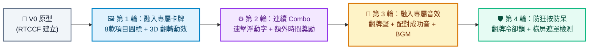

# 娛樂稅VS納保法記憶翻牌 (Memory Challenge) - Prompt 指南

這是一款結合生活租稅知識（娛樂稅課稅項目與納稅者權利保護法）的翻牌記憶小遊戲！玩家必須在有限的 15 次機會與倒數時間內，翻開 16 張暗光鳥卡牌進行 8 對相同項目的配對，每次成功配對即可獲得額外時間獎勵！

---

## 遊戲簡介與資源

### 🎮 玩法說明
1. **共 16 張卡牌（8 對）**：代表娛樂稅項目（游泳、高爾夫、電影票、娃娃機、卡拉OK、電動彈珠台、電影院）與納保法概念（納保官）。
2. **每次翻開 2 張**：若圖案相同則配對成功並**增加 15 秒**；若不同則 1 秒後蓋回。
3. **過關與失敗條件**：共有 15 次翻牌機會，必須在時間歸零與機會耗盡前完成全部 8 對配對！
4. **專屬直式設計**：支援桌機與手機直式遊玩，橫式手機將自動顯示旋轉提示遮罩。

### 📦 專案資源與素材下載
- 🌐 [線上立即試玩 Demo](https://roberthsu2003.github.io/__Memory_Challenge__/)
- 💾 [Google AI Studio 完成範例 ZIP 下載](./google_ai_studio_完成範例/娛樂稅-vs-納保法-記憶翻牌遊戲.zip)
- 📂 [GitHub 原始碼庫](https://github.com/roberthsu2003/__Memory_Challenge__)
- 🎁 **[專屬圖片與音效素材包下載 (assets.zip)](./assets/assets.zip)**（解壓後請放入專案 `public/assets/`）：
  - 🖼️ **圖片**：`card-back.png`（專屬卡背）、`swimming.png`（游泳）、`golf.png`（高爾夫）、`ticket.png`（電影票）、`claw-machine.png`（娃娃機）、`karaoke.png`（卡拉OK）、`pinball.png`（彈珠台）、`cinema.png`（電影院）、`tax-officer.png`（納保官）
  - 🎵 **音效**：`flip.wav`（翻牌卡嗒音）、`match.wav`（配對成功音）、`mismatch.wav`（失敗提示音）、`win.wav`（通關勝利音）、`bgm.mp3`（輕快背景音樂）

---

## 一、 專案建立階段：V0 原型建立

在初次建立專案原型時，請一律使用 **RTCCF 結構化框架**，明確定義卡牌資料陣列、翻牌狀態機、機會扣除與計時器，讓 Google AI Studio 能一次產出高完整度程式碼。

### 💡 如何用別的 AI 產生 RTCCF 格式？
若想發想其他翻牌主題或調整卡牌數量，可複製下方折疊區內的**自然語言指令**，貼給 ChatGPT、Claude 或 Gemini 產出專屬的 RTCCF 規格書：

<details>
<summary>👉 點擊展開：請其他 AI 協助產生 RTCCF 的自然語言指令（可直接複製）</summary>

```text
我想在 Google AI Studio 開發一個結合「娛樂稅 VS 納保法」租稅宣導主題的 16 張（8對）記憶翻牌小遊戲，使用 Vite + React + TypeScript。
規則包含 45 秒倒數、限 15 次翻牌機會、配對成功增加 15 秒、卡牌 3D 翻轉動畫以及支援手機直式螢幕。
請扮演資深前端工程師，使用標準 RTCCF 框架（包含：# 角色 Role、## 任務目標 Task、## 背景情境 Context、## 核心規則與限制 Constraints、## 輸出規格與風格 Format）為我撰寫一份結構完整的軟體需求規格 Prompt，讓我可以直接複製貼入 Google AI Studio 生成可運行的程式碼。
```

</details>

<br>

### 📋 專案建立 RTCCF Prompt（複製貼入 Google AI Studio）

請複製以下整段規格，貼入 **Google AI Studio** 對話框：

```markdown
# 角色 (Role)
你是一位精通 React、TypeScript 與 CSS 3D 互動動效的資深前端開發工程師。

## 任務目標 (Task)
請幫我建立一個具備卡通清新風格、支援手機直式顯示的「娛樂稅 VS 納保法 記憶翻牌遊戲」（V0 原型版本）。

## 背景情境 (Context)
- 開發環境與技術棧：Google AI Studio、Vite、React 18+、TypeScript、Vanilla CSS (Grid 排版)。
- 設備支援：支援桌機與手機直式（Portrait）。若為橫式（Landscape）時以 CSS 遮罩提示「此遊戲僅支援直式模式，請將裝置轉為直式」。

## 核心規則與限制 (Constraints)
1. 卡牌資料結構：
   - 包含 8 種項目，每種各 2 張，共 16 張卡牌：
     `['游泳競賽', '高爾夫球賽', '電影票', '娃娃機', '卡拉OK', '電動彈珠台', '電影院', '納保官']`
   - 每次開始遊戲時，將 16 張牌進行隨機洗牌 (Fisher-Yates Shuffle)。
2. 核心遊戲流程：
   - 4x4 網格排列，卡牌初始為背面朝上。
   - 玩家點擊翻牌，每次最多同時翻開 2 張。
   - 若 2 張相同：判定配對成功，保持正面朝上，倒數時間延長 15 秒。
   - 若 2 張不同：1 秒後自動翻回背面。
3. 機會與倒數限制：
   - 初始時間為 45 秒倒數計時。
   - 共有 15 次翻牌機會（每翻 2 張算 1 次）。
   - 成功配對全部 8 對即通關獲勝；若時間歸零或 15 次機會耗盡仍未完成，判定遊戲失敗。
4. 遊戲狀態頁面：
   - 首頁：遊戲標題、規則說明文字與橘色「開始遊戲」大按鈕。
   - 遊戲中：頂部顯示剩餘時間與剩餘機會數，中央 4x4 卡牌。
   - 結算彈窗：顯示成功或失敗結果，並提供「重新挑戰」按鈕。

## 輸出規格與風格 (Format)
- UI/UX 風格：綠色清新卡通風背景、圓角卡片帶陰影、橘色高對比互動按鈕。
- 程式碼規範：
  - 清楚的 TypeScript 型別定義（Card 介面、GameState 等）。
  - 詳細繁體中文註解說明。
  - 提供完整且可獨立運行的完整程式碼。
```

---

## 二、 作品迭代階段：自然語言多輪進化

原型成功運行後，請先下載 **[assets.zip](./assets/assets.zip)** 並將解壓後的檔案放入專案 `public/assets/` 目錄中，接著依循 **[作品迭代與修改技巧](../../作品迭代與修改技巧/README.md)**，在 Google AI Studio 中使用**自然語言對話**循序精修：



### 🔹 第 1 輪迭代：替換專屬小圖片與 3D 翻牌物理動態
- **改動重點**：將卡牌文字替換為精緻的專屬圖標，並打造流暢的 3D 翻面。
- 💬 **自然語言 Prompt（直接複製貼給 Google AI Studio）**：
  ```text
  目前記憶翻牌的基本邏輯運作非常正常！
  我已經把 8 款租稅圖標放入 public/assets/ 資料夾中了。
  現在我想升級為精緻的卡牌視覺與立體翻牌效果：
  1. 請將卡牌正面與背面替換為圖片：
     - 卡牌背面使用 `/assets/card-back.png`
     - 正面各項目對應：
       - 游泳競賽：`/assets/swimming.png`
       - 高爾夫球賽：`/assets/golf.png`
       - 電影票：`/assets/ticket.png`
       - 娃娃機：`/assets/claw-machine.png`
       - 卡拉OK：`/assets/karaoke.png`
       - 電動彈珠台：`/assets/pinball.png`
       - 電影院：`/assets/cinema.png`
       - 納保官：`/assets/tax-officer.png`
  2. 使用 CSS `perspective: 1000px` 與 `transform: rotateY(180deg)`，讓卡牌在點擊時具有流暢的 0.4 秒水平 3D 翻面動效。
  3. 配對成功時，卡牌閃爍金色發光邊框。
  請保持既有配對判定邏輯，並提供修改後的完整程式碼。
  ```

---

### 🔹 第 2 輪迭代：連續配對 Combo 與時間獎勵飄字
- **改動重點**：增加遊戲爽快感與動態反饋。
- 💬 **自然語言 Prompt（直接複製貼給 Google AI Studio）**：
  ```text
  卡片換上圖片與 3D 翻轉後質感大增！接下來我想強化遊玩的成就感：
  1. 加入連擊 (Combo) 機制：如果玩家連續兩次配對成功，時間除了原本的 +15 秒外，額外再加贈 5 秒。
  2. 每次配對成功時，在卡牌上方浮現綠色向上淡出的「+15s」飄字動畫；若為 Combo，則顯示亮黃色的「COMBO! +20s」特效。
  請提供更新後的完整程式碼。
  ```

---

### 🔹 第 3 輪迭代：融入專屬翻牌音效與背景音樂
- **改動重點**：加入聽覺反饋，串接 `public/assets/` 內的音效。
- 💬 **自然語言 Prompt（直接複製貼給 Google AI Studio）**：
  ```text
  遊戲體驗很棒！我已經在 public/assets/ 準備好了音效檔案，現在請幫我加入聲音支援：
  1. 背景音樂：循環播放 `/assets/bgm.mp3`（音量 0.35），右上角提供靜音開關。
  2. 點擊翻牌時：播放卡嗒音效 `/assets/flip.wav`。
  3. 配對成功時：播放清脆叮咚音效 `/assets/match.wav`。
  4. 配對失敗翻回時：播放低沉提示音 `/assets/mismatch.wav`。
  5. 8 對全部完成通關時：播放通關勝利音效 `/assets/win.wav`。
  請提供修改後的完整程式碼。
  ```

---

### 🔹 第 4 輪迭代：連點防呆鎖定與橫向螢幕遮罩優化
- **改動重點**：修復快速連點造成同時翻開 3 張牌的重大 Bug，並完善橫屏防呆。
- 💬 **自然語言 Prompt（直接複製貼給 Google AI Studio）**：
  ```text
  我測試時發現一個破壞規則的 Bug：當我快速連續點擊時，在前兩張牌還在等待 1 秒比對翻回期間，我可以點開第 3 甚至第 4 張牌。
  請幫我加入防呆機制：
  1. 當畫面上已經翻開 2 張牌且正在進行比對動畫期間，全面「鎖定點擊」，禁止點擊任何其他卡牌，直到比對完成翻回或判定配對為止。
  2. 使用 `@media (orientation: landscape) and (max-height: 500px)` 確保在手機橫屏時，絕對定位覆蓋全螢幕警告畫面：「本遊戲為直式專用，請旋轉手機」，並暫停計時器。
  請提供修復後的完整程式碼。
  ```

---

## 三、 除錯心法：遇到 Bug 時怎麼問？

若遇到卡牌翻面後圖案空白、或計時器歸零後遊戲未結束：
1. 按 `F12` 打開開發者工具的 **Console（主控台）**。
2. 複製出現的錯誤訊息。
3. 自然語言提問範例：
   ```text
   我在 Google AI Studio 執行記憶翻牌時，翻開第 2 張牌後畫面卡住沒有翻回，Console 跳出以下錯誤：
   [在此處貼上 Console 錯誤訊息]
   看起來是 setTimeout 內部存取卡牌狀態時閉包引用引發的邏輯錯誤。請幫我修正並提供修改後的完整程式碼。
   ```