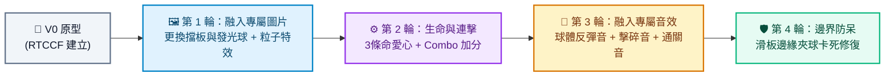

# 打磚塊遊戲 (Breakout Game) - Prompt 指南

> **開發工具建議**：本專案推薦使用 **Google AI Studio** 進行開發，技術棧採用 Vite、React、TypeScript 與 HTML5 Canvas。產出程式碼後可於本地環境執行，或透過 StackBlitz、CodeSandbox 即時預覽與測試。

---

## 遊戲簡介與資源
打磚塊（Breakout）是一款極具代表性的街機經典遊戲。玩家控制螢幕底部的一塊滑動擋板（Paddle），反彈在空中飛行的彈珠，擊破頂部排列整齊的彩色磚塊。目標是在球掉出畫面底部之前清除所有磚塊。

### 📦 專案資源與素材下載
- 🎁 **[專屬圖片與音效素材包下載 (assets.zip)](./assets/assets.zip)**（解壓後請放入專案 `public/assets/`）：
  - 🖼️ **圖片**：`paddle.png`（滑板擋板）、`ball.png`（發光彈球）
  - 🎵 **音效**：`bounce.wav`（反彈音）、`brick-hit.wav`（擊碎磚塊音）、`win.wav`（通關勝利音）

---

## 一、 專案建立階段：V0 原型建立

在初次建立專案原型時，請一律使用 **RTCCF 結構化框架**，明確定義 Canvas 繪圖、球體物理向量反彈與鍵盤/滑鼠監聽，讓 Google AI Studio 產出架構清晰且可運行的專案。

### 💡 如何用別的 AI 產生 RTCCF 格式？
若想自行設計關卡或加入其他掉落技能，可複製下方折疊區內的**自然語言指令**，貼給 ChatGPT、Claude 或 Gemini 產出專屬的 RTCCF 規格書：

<details>
<summary>👉 點擊展開：請其他 AI 協助產生 RTCCF 的自然語言指令（可直接複製）</summary>

```text
我想在 Google AI Studio 使用 HTML5 Canvas 與 React + TypeScript 開發經典街機「打磚塊（Breakout）遊戲」。
請扮演資深前端遊戲引擎工程師，使用標準 RTCCF 框架（包含：# 角色 Role、## 任務目標 Task、## 背景情境 Context、## 核心規則與限制 Constraints、## 輸出規格與風格 Format）為我撰寫一份結構完整、涵蓋滑塊操控、球體物理反彈、磚塊消除與遊戲迴圈的軟體需求規格 Prompt，讓我可以直接複製貼入 Google AI Studio 生成可運行的程式碼。
```

</details>

<br>

### 📋 專案建立 RTCCF Prompt（複製貼入 Google AI Studio）

請複製以下整段規格，貼入 **Google AI Studio** 對話框：

```markdown
# 角色 (Role)
你是一位精通 HTML5 Canvas 2D 物理碰撞反彈與 React 元件架構的資深遊戲工程師。

## 任務目標 (Task)
請幫我建立一個具備現代視覺、物理反彈流暢的「經典打磚塊小遊戲」（V0 原型版本）。

## 背景情境 (Context)
- 開發環境與技術棧：Google AI Studio、Vite、React 18+、TypeScript、HTML5 Canvas (搭配 useRef)。
- 效能要求：使用 `requestAnimationFrame` 驅動遊戲主迴圈，避免不必要的 React re-render 造成掉幀。

## 核心規則與限制 (Constraints)
1. 畫布規格：
   - Canvas 區域尺寸建議 800x500 像素，居中顯示並具備自適應縮放（RWD）。
2. 滑動擋板 (Paddle)：
   - 位於底部，支援鍵盤方向鍵（左右）以及滑鼠水平移動直接同步跟隨。
3. 彈球 (Ball) 與物理反彈：
   - 球體具備位置 (x, y) 與速度向量 (dx, dy)。
   - 撞擊左、右、頂部牆壁時反彈。
   - 撞擊底部擋板時向上反彈，並依擊中擋板中心或邊緣稍微改變反彈水平角度。
4. 磚塊陣列 (Bricks)：
   - 頂部配置 4 行 x 8 列的彩色磚塊矩陣。
   - 球體撞擊磚塊時：磚塊消失，反彈球體，分數增加 10 分。
5. 勝負條件：
   - 球體掉落畫布底端時，遊戲結束，顯示「Game Over」與最終分數。
   - 所有磚塊清除完畢時，顯示「You Win!」獲勝訊息。
   - 提供「再玩一次」按鈕重置球與磚塊。

## 輸出規格與風格 (Format)
- UI/UX 風格：現代暗色系霓虹科技感，Canvas 具備精緻微光邊框，上方設置分數資訊列。
- 程式碼規範：
  - 清楚的 TypeScript 型別定義（Ball, Paddle, Brick 介面）。
  - 詳細的繁體中文註解說明。
  - 提供完整且可獨立運行的完整程式碼。
```

---

## 二、 作品迭代階段：自然語言多輪進化

原型成功運行後，請先下載 **[assets.zip](./assets/assets.zip)** 並將解壓後的檔案放入專案 `public/assets/` 目錄中，接著依循 **[作品迭代與修改技巧](../../作品迭代與修改技巧/README.md)**，每一輪對話**使用自然語言**，一次針對一個維度進行升級：



### 🔹 第 1 輪迭代：替換為專屬小圖片與磚塊爆破粒子動效
- **改動重點**：將預設方塊繪製替換為精緻的專屬圖標，並加入擊碎粒子特效。
- 💬 **自然語言 Prompt（直接複製貼給 Google AI Studio）**：
  ```text
  打磚塊的基本物理反彈與消除都很順暢！
  我已經把專屬圖片放入 public/assets/ 資料夾中了。
  現在我想將畫面升級為精緻的圖標呈現與打擊感：
  1. 請替換擋板與球體為真實圖片繪製：
     - 底部滑動擋板改用 `/assets/paddle.png` 圖片繪製。
     - 移動中的彈球改用 `/assets/ball.png` 圖片繪製。
  2. 當磚塊被擊破消失的瞬間，產生由 10~15 顆同色微小碎片組成的「粒子噴發爆炸效果 (Particle Burst)」，粒子受重力落下並逐漸透明消失。
  請保持既有反彈物理邏輯，並提供修改後的完整程式碼。
  ```

---

### 🔹 第 2 輪迭代：3 條生命系統與連擊加成
- **改動重點**：增加遊戲容錯率與高分挑戰樂趣。
- 💬 **自然語言 Prompt（直接複製貼給 Google AI Studio）**：
  ```text
  粒子效果非常漂亮！接下來我想完善遊戲機制：
  1. 增加生命值系統：玩家共有 3 條愛心生命。當球掉到底部時，扣除 1 條生命，將球與滑塊重置回中央停頓 1 秒後再發球；生命全部扣光才真正 Game Over。
  2. 加入連擊 (Combo) 計分機制：球在沒有碰到底部滑塊的情況下連續擊破磚塊，每次連擊分數額外遞增（例如第 1 塊 10 分、第 2 塊 20 分、第 3 塊 30 分），並在畫面上短暫彈出「Combo x3!」字樣。
  請提供更新後的完整程式碼。
  ```

---

### 🔹 第 3 輪迭代：融入專屬遊戲音效
- **改動重點**：加入聽覺反饋，串接 `public/assets/` 下的音效。
- 💬 **自然語言 Prompt（直接複製貼給 Google AI Studio）**：
  ```text
  遊戲玩法很刺激！我已經在 public/assets/ 準備好了音效檔案，現在請幫我加入聲音反饋：
  1. 球撞擊滑塊或牆壁反彈時：即時播放反彈音效 `/assets/bounce.wav`。
  2. 球擊中並消除磚塊時：即時播放碎裂音效 `/assets/brick-hit.wav`。
  3. 清除所有磚塊獲勝時：播放通關勝利音效 `/assets/win.wav`。
  4. 畫面上方提供靜音按鈕，允許玩家隨時開關音效。
  請提供修改後的完整程式碼。
  ```

---

### 🔹 第 4 輪迭代：邊界防呆與球體夾縫卡死修復
- **改動重點**：解決物理反彈中常見的「球體卡在滑塊邊界反覆抽搐穿透」與「水平無限橫移」Bug。
- 💬 **自然語言 Prompt（直接複製貼給 Google AI Studio）**：
  ```text
  我測試時發現了兩個物理引擎常見的 Bug：
  1. 當球以接近完全水平的角度反彈時，會在左右牆壁之間無限水平來回，很久都碰不到磚塊或滑塊。
  2. 當滑塊快速移動去切球邊緣時，球會被卡在滑塊內部並反覆觸發碰撞穿透到底部。
  請幫我加入防呆物理修正：
  - 限制球的垂直速度 |dy| 不能小於最小閾值，避免水平無限循環。
  - 當球與滑塊碰撞時，立即將球的 y 座標強制修正回滑塊頂部邊界之上，徹底防止卡球穿透現象。
  請提供修改後的完整程式碼。
  ```

---

## 三、 除錯心法：遇到 Bug 時怎麼問？

若遇到 Canvas 畫面黑屏、FPS 嚴重掉幀或物理計算報錯：
1. 按 `F12` 打開開發者工具的 **Console（主控台）**。
2. 複製出現的錯誤訊息。
3. 自然語言提問範例：
   ```text
   我在 Google AI Studio 運行打磚塊時，圖片載入或碰撞後畫面卡頓並出現以下錯誤：
   [在此處貼上 Console 錯誤訊息]
   看起來是圖片未完全 loaded 或是音效實例播放異常。請幫我修正並提供完整程式碼。
   ```
