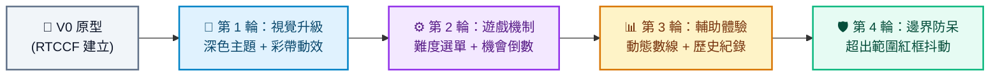

# 猜數字遊戲 (Number Guessing Game) - Prompt 指南

> **開發工具建議**：本專案推薦使用 **Google AI Studio** 進行開發，技術棧採用 Vite、React 與 TypeScript（亦可使用純 HTML/CSS/JS）。建議學員在 Google AI Studio 產出程式碼後，在本地執行或直接使用線上編輯器（如 StackBlitz、CodeSandbox）預覽。

---

## 遊戲簡介
猜數字遊戲是一個經典的邏輯推理遊戲。電腦隨機產生一個 1～100 的數字，玩家透過輸入數值並觀察系統提示（「太大了」、「太小了」）逐步縮小範圍，最終猜出正確答案。

---

## 一、 專案建立階段：V0 原型建立

在初次建立專案原型時，請一律使用 **RTCCF 結構化框架**，讓 Google AI Studio 能一次性精準產出完整的可運行程式碼架構。

### 💡 如何用別的 AI 產生 RTCCF 格式？
如果你想自己發想其他遊戲規則，可以直接複製下方折疊區內的**自然語言指令**，貼給 ChatGPT、Claude 或 Gemini，讓它幫你生成標準的 RTCCF 規格書！

<details>
<summary>👉 點擊展開：請其他 AI 協助產生 RTCCF 的自然語言指令（可直接複製）</summary>

```text
我想在 Google AI Studio 上用 Vite + React + TypeScript 建立一個具有現代質感的網頁版「猜數字益智遊戲」。
請扮演資深前端工程師，使用標準 RTCCF 框架（包含：# 角色 Role、## 任務目標 Task、## 背景情境 Context、## 核心規則與限制 Constraints、## 輸出規格與風格 Format）為我撰寫一份完整、嚴謹的軟體需求規格 Prompt，讓我可以直接複製貼入 Google AI Studio 生成可運行的程式碼。
```

</details>

<br>

### 📋 專案建立 RTCCF Prompt（複製貼入 Google AI Studio）

請直接複製以下整段規格，貼入 **Google AI Studio** 的對話框中：

```markdown
# 角色 (Role)
你是一位精通 React 與 TypeScript 的資深前端架構師與 UI/UX 設計師。

## 任務目標 (Task)
請幫我建立一個具備現代感且互動流暢的網頁版「猜數字小遊戲」（V0 原型版本）。

## 背景情境 (Context)
- 開發環境與技術棧：Google AI Studio、Vite、React 18+、TypeScript、Vanilla CSS / CSS Modules。
- 專案交付目標：產出單一核心元件或完整程式碼結構，讓使用者可以直接執行預覽。

## 核心規則與限制 (Constraints)
1. 隨機數生成：遊戲初始化時，使用 Math.random() 隨機產生一個 1～100 的目標整數。
2. 核心遊戲流程：
   - 包含數字輸入框（受控元件 Controlled Component）與「猜測」按鈕。
   - 玩家輸入數字並送出後，系統比對目標值：
     - 若大於目標：顯示「太大了！」提示。
     - 若小於目標：顯示「太小了！」提示。
     - 若猜中目標：顯示「恭喜！猜對了！」祝賀訊息。
   - 記錄並即時顯示玩家目前已猜測的次數。
   - 猜中後顯示「再玩一次」按鈕，點擊後重置遊戲狀態並產生新題目。
3. 邊界防呆：
   - 玩家若未輸入數字或輸入空白，點擊猜測時給予提示，不增加猜測次數。

## 輸出規格與風格 (Format)
- UI/UX 風格：現代簡約卡片式設計，居中版面，柔和陰影與精緻按鈕懸停動畫（Hover effect）。
- 程式碼規範：
  - 清楚的 TypeScript 型別定義（Props 與 State 介面）。
  - 詳細的繁體中文註解說明。
  - 提供完整且可獨立運行的完整程式碼。
```

---

## 二、 作品迭代階段：自然語言多輪進化

原型建立完成並在瀏覽器執行確認無誤後，請依循 **[作品迭代與修改技巧](../../作品迭代與修改技巧/README.md)**，每一輪對話**使用自然語言**，一次只做一項改動！



### 🔹 第 1 輪迭代：視覺打磨與慶祝特效
- **改動重點**：提升產品質感，引入深色模式與過關驚喜動畫。
- 💬 **自然語言 Prompt（直接複製貼給 Google AI Studio）**：
  ```text
  目前猜數字遊戲的核心邏輯已經可以正常運作了！
  現在我想升級視覺風格與遊戲反饋：
  1. 請將整體的介面配色改為科技質感的「現代深色模式 (Dark Mode)」，搭配柔和的霓虹邊框與半透明卡片背景。
  2. 當玩家猜對數字時，請在畫面上觸發彩色紙花慶祝特效（Confetti 動畫），並讓祝賀文字帶有彈跳放大的動態效果。
  請保持既有遊戲邏輯不變，並提供修改後的完整程式碼。
  ```

---

### 🔹 第 2 輪迭代：難度選擇與機會限制
- **改動重點**：增加遊戲挑戰性與緊張感。
- 💬 **自然語言 Prompt（直接複製貼給 Google AI Studio）**：
  ```text
  外觀改得很漂亮！接下來我想增加遊戲挑戰性：
  1. 在上方加入「難度選擇」切換按鈕：
     - 簡單：數字範圍 1～50，最多可猜 10 次。
     - 中等：數字範圍 1～100，最多可猜 7 次。
     - 困難：數字範圍 1～200，最多可猜 5 次。
  2. 每一局畫面需即時顯示「剩餘機會次數」。若次數用盡仍未猜中，判定遊戲失敗，公布正確答案，並顯示「重新挑戰」按鈕。
  請提供更新後的完整程式碼。
  ```

---

### 🔹 第 3 輪迭代：動態數線輔助與猜測歷史
- **改動重點**：提升玩家操作體驗與策略分析。
- 💬 **自然語言 Prompt（直接複製貼給 Google AI Studio）**：
  ```text
  遊戲難度運作良好！為了讓玩家更有策略感，我想增加視覺化輔助資訊：
  1. 請在輸入框下方加入一條「動態可能範圍指示條（數線）」：每次猜測後，即時用視覺化標記當前縮小的可能區間（例如原本 1～100，猜了 40 太小後，指示條縮小為 41～100）。
  2. 在下方增加「歷史猜測列表」：條列顯示玩家本次遊戲猜過的所有數字，並用不同顏色標註「太大了（紅色）」或「太小了（藍色）」。
  請提供更新後的完整程式碼。
  ```

---

### 🔹 第 4 輪迭代：邊界防呆與無效輸入震動提示
- **改動重點**：強化邊界條件處理，防止玩家誤操作浪費次數。
- 💬 **自然語言 Prompt（直接複製貼給 Google AI Studio）**：
  ```text
  我測試時發現，如果玩家輸入負數、超出當前範圍的數字（例如已被縮小到 41～100，玩家卻輸入 20 或 150）時，系統仍會扣除剩餘次數。
  請幫我加入防呆機制：
  1. 若輸入的數字超出當前有效的可能範圍，不扣除次數。
  2. 在輸入框下方顯示「請輸入有效範圍內的數字」提示文字，並讓輸入框產生紅色邊框抖動動畫（Shake animation）。
  請提供修改後的完整程式碼。
  ```

---

## 三、 除錯心法：遇到 Bug 時怎麼問？

如果在 Google AI Studio 生成或修改程式碼時遇到錯誤，請遵守以下步驟：
1. 在瀏覽器網頁上按 `F12`，切換到 **Console（主控台）** 分頁。
2. 複製紅色的錯誤訊息（例如：`Uncaught TypeError: Cannot read property of undefined`）。
3. 用自然語言貼回給 Google AI Studio：
   ```text
   我執行剛才產生的程式碼時，瀏覽器 Console 出現了這段錯誤訊息：
   [在此處貼上完整的錯誤訊息]
   請幫我分析出錯原因，修正這個 Bug，並提供修復後的完整程式碼。
   ```
