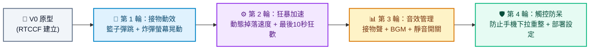

# 發票接物挑戰 (Invoice Catching Challenge) - Prompt 指南

這是一款以日常生活收集發票為主題的趣味接物小遊戲！玩家操控螢幕底部的籃子，在限時 40 秒內接住從天而降的各類發票爭取高分，同時必須靈活閃避危險的地雷炸彈。

---

## 遊戲簡介與資源

### 🎮 玩法與計分規則
- ☁️ **雲端發票（藍色）**：環保最高分 **+3 分** 
- 📱 **電子發票（綠色）**：常見好夥伴 **+2 分**
- 🧾 **紙本收據（白色）**：基本小收據 **+1 分**
- 💣 **地雷炸彈（紅色）**：當心陷阱！接到倒扣 **-5 分**

### 🕹️ 操作方式
- **電腦版**：鍵盤「左、右」方向鍵或滑鼠移動操控籃子。
- **手機版**：手指在螢幕左右滑動靈活操控。

### 📦 專案資源與範例
- 🌐 [線上立即試玩](https://roberthsu2003.github.io/__Invoice_Catching_Challenge__/)
- 💾 [Google AI Studio 完成範例 ZIP 下載](./google_ai_studio_完成範例/發票接物挑戰-(invoice-catching-challenge).zip)
- 📂 [GitHub 原始碼庫](https://github.com/roberthsu2003/__Invoice_Catching_Challenge__)
- 🎵 [所有圖片與音效素材下載](./assets/assets.zip)

---

## 一、 專案建立階段：V0 原型建立

在初次建立專案原型時，請一律使用 **RTCCF 結構化框架**，明確規範物件類型、掉落速度與輸入邏輯，讓 Google AI Studio 能一次產出高完成度的原型。

### 💡 如何用別的 AI 產生 RTCCF 格式？
若想自行增減掉落物道具或調整規則，可複製下方折疊區內的**自然語言指令**，貼給 ChatGPT、Claude 或 Gemini 產出專屬的 RTCCF 規格書：

<details>
<summary>👉 點擊展開：請其他 AI 協助產生 RTCCF 的自然語言指令（可直接複製）</summary>

```text
我想在 Google AI Studio 使用 Vite + React + Tailwind CSS 開發一個名為「發票接物挑戰」的趣味小遊戲。
玩法是玩家在 40 秒內控制底部籃子接住上方掉落的雲端發票 (+3分)、電子發票 (+2分)、紙本收據 (+1分)，並避開地雷炸彈 (-5分)。
請扮演資深前端遊戲工程師，使用標準 RTCCF 框架（包含：# 角色 Role、## 任務目標 Task、## 背景情境 Context、## 核心規則與限制 Constraints、## 輸出規格與風格 Format）為我撰寫一份結構完整的軟體需求規格 Prompt，讓我可以直接複製貼入 Google AI Studio 生成可運行的程式碼。
```

</details>

<br>

### 📋 專案建立 RTCCF Prompt（複製貼入 Google AI Studio）

請複製以下整段規格，貼入 **Google AI Studio** 對話框：

```markdown
# 角色 (Role)
你是一位精通 React、Tailwind CSS 與現代 Web 動畫的前端遊戲工程師。

## 任務目標 (Task)
請幫我建立一個具備現代深色質感、流暢有趣的「發票接物挑戰網頁小遊戲」（V0 原型版本）。

## 背景情境 (Context)
- 開發環境與技術棧：Google AI Studio、Vite、React 18+、TypeScript、Tailwind CSS。
- 專案交付目標：提供單一檔案或完整的元件架構，可直接於瀏覽器即時預覽。

## 核心規則與限制 (Constraints)
1. 遊戲核心玩法：
   - 玩家控制畫面底部的「收集籃」，可在水平方向左右移動。
   - 上方隨機位置持續掉落物品。
2. 掉落物種類與計分：
   - ☁️ 雲端發票（藍色標示）：加 3 分
   - 📱 電子發票（綠色標示）：加 2 分
   - 🧾 紙本收據（白色標示）：加 1 分
   - 💣 地雷炸彈（紅色標示）：扣 5 分
3. 遊戲流程與時間限制：
   - 每局遊戲限時 40 秒倒數。
   - 上方即時顯示：當前分數、最高分紀錄、剩餘秒數。
   - 40 秒結束時彈出遊戲結算畫面，顯示總得分與評語，並提供「重新挑戰」按鈕。
4. 操作支援：
   - 電腦版：支援左右鍵或滑鼠游標水平跟隨。
   - 手機版：支援觸控滑動（Touch move）操控。

## 輸出規格與風格 (Format)
- UI/UX 風格：現代深色模式 (Dark Mode)，精緻卡片容器，清晰的發票圖示與色塊標註。
- 程式碼規範：
  - 嚴謹的 TypeScript 型別定義（Item 介面、GameState 等）。
  - 詳細繁體中文註解說明。
  - 提供完整且可獨立運行的完整程式碼。
```

---

## 二、 作品迭代階段：自然語言多輪進化

原型在 Google AI Studio 成功運行後，請依循 **[作品迭代與修改技巧](../../作品迭代與修改技巧/README.md)**，每一輪對話**使用自然語言**小步快跑升級：



### 🔹 第 1 輪迭代：接物彈跳動效與炸彈螢幕晃動
- **改動重點**：強化打擊反饋與受傷懲罰感。
- 💬 **自然語言 Prompt（直接複製貼給 Google AI Studio）**：
  ```text
  發票接物的基本碰撞與計分都很正常！
  現在我想加強遊戲的反饋與動態特效：
  1. 當籃子成功接到發票時，讓籃子產生微妙的「彈跳縮放動畫 (Scale 1.1)」，並在接到位置浮現「+3」或「+2」向上淡出的飄字特效。
  2. 當不幸接到紅色炸彈時，整個遊戲畫布產生「劇烈震動效果 (Screen Shake)」，同時畫布短暫閃爍紅色遮罩以示警告。
  請保持既有計分邏輯，並提供修改後的完整程式碼。
  ```

---

### 🔹 第 2 輪迭代：動態掉落加速與最後 10 秒狂歡時間
- **改動重點**：隨時間推移增加挑戰難度與刺激感。
- 💬 **自然語言 Prompt（直接複製貼給 Google AI Studio）**：
  ```text
  動畫反饋很棒！現在我想優化遊戲節奏：
  1. 隨著時間流逝，物品掉落的速度逐漸加快 20%，生成頻率也微幅提高。
  2. 在最後 10 秒時進入「Fever Time（發票狂歡時間）」：
     - 畫布邊框出現金色流光呼吸燈。
     - 所有發票得分加倍（雲端 +6、電子 +4、收據 +2）。
     - 畫面上方顯示「FEVER TIME 雙倍得分！」動態標籤。
  請提供更新後的完整程式碼。
  ```

---

### 🔹 第 3 輪迭代：背景音樂、音效與靜音控制
- **改動重點**：引入聽覺享受並提供友善控制。
- 💬 **自然語言 Prompt（直接複製貼給 Google AI Studio）**：
  ```text
  節奏改動非常刺激！接下來我想增加音效支援：
  1. 整合音效系統：加入背景輕快 BGM（可循環播放）、接到發票的清脆鈴聲、以及炸彈爆炸的低音音效。
  2. 在畫面右上角增加「靜音切換按鈕（喇叭圖示）」，點擊可在開關音效之間切換，並記住使用者喜好。
  請提供修改後的完整程式碼。
  ```

---

### 🔹 第 4 輪迭代：觸控手勢防呆與 GitHub Pages 部署優化
- **改動重點**：消除手機端手勢誤觸，確保靜態站點正確運行。
- 💬 **自然語言 Prompt（直接複製貼給 Google AI Studio）**：
  ```text
  我測試手機操作時發現，手指在螢幕上快速左右滑動時，容易不小心觸發手機瀏覽器的「下拉重新整理」或頁面水平滾動。
  另外我準備將專案部署到 GitHub Pages。
  請幫我優化：
  1. 在遊戲容器加上 `touch-action: none` 與 `user-select: none`，防止手機觸控時畫面滾動或選取文字。
  2. 確保 `vite.config.ts` 的 `base` 設定為 `'./'` 相對路徑，避免部署至 GitHub Pages 後資源路徑失效。
  請提供修復與優化後的完整程式碼。
  ```

---

## 三、 除錯心法：遇到 Bug 時怎麼問？

若遇到倒數計時加速異常、掉落物穿透穿底不消失：
1. 按 `F12` 打開開發者工具的 **Console（主控台）**。
2. 複製出現的錯誤訊息。
3. 自然語言提問範例：
   ```text
   我在 Google AI Studio 測試時，遊戲倒數結束後掉落物依然沒有停止生成，Console 出現了這行警告：
   [在此處貼上 Console 錯誤訊息]
   看起來是 useEffect 中的 setInterval 在遊戲結束時沒有被正確 clearInterval。請幫我修正這段生命週期邏輯並提供完整程式碼。
   ```
