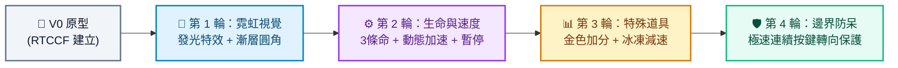

# 貪食蛇遊戲 (Snake Game) - Prompt 指南

> **開發工具建議**：本專案推薦使用 **Google AI Studio** 進行開發，技術棧採用 Vite、React、TypeScript 與 HTML5 Canvas。產出程式碼後可於本地環境執行，或透過 StackBlitz、CodeSandbox 即時預覽。

---

## 遊戲簡介
貪食蛇（Snake）是一個歷久彌新的經典街機遊戲。玩家透過方向鍵操控一條不斷游動的蛇，在封閉區域中吃取食物以增加身長與分數，同時必須精準操控，避免撞擊周圍邊界或咬到自己的身體。

---

## 一、 專案建立階段：V0 原型建立

在初次建立專案原型時，請一律使用 **RTCCF 結構化框架**，明確定義狀態管理與 Canvas 渲染邏輯，讓 Google AI Studio 產出完整可運行的專案架構。

### 💡 如何用別的 AI 產生 RTCCF 格式？
若想自行調整畫布尺寸或控制方式，可複製下方折疊區內的**自然語言指令**，貼給 ChatGPT、Claude 或 Gemini 產出專屬的 RTCCF 規格書：

<details>
<summary>👉 點擊展開：請其他 AI 協助產生 RTCCF 的自然語言指令（可直接複製）</summary>

```text
我想在 Google AI Studio 開發一個使用 HTML5 Canvas 與 React + TypeScript 的經典「網頁版貪食蛇小遊戲」。
請扮演資深遊戲開發專家，使用標準 RTCCF 框架（包含：# 角色 Role、## 任務目標 Task、## 背景情境 Context、## 核心規則與限制 Constraints、## 輸出規格與風格 Format）為我撰寫一份結構完整、包含碰撞檢測與計分機制的軟體需求規格 Prompt，讓我可以直接複製貼入 Google AI Studio 生成可運行的程式碼。
```

</details>

<br>

### 📋 專案建立 RTCCF Prompt（複製貼入 Google AI Studio）

請複製以下整段規格，貼入 **Google AI Studio** 對話框：

```markdown
# 角色 (Role)
你是一位精通 HTML5 Canvas 物理渲染與 React 遊戲狀態機的資深遊戲工程師。

## 任務目標 (Task)
請幫我建立一個具備現代感、流暢無卡頓的「貪食蛇網頁小遊戲」（V0 原型版本）。

## 背景情境 (Context)
- 開發環境與技術棧：Google AI Studio、Vite、React 18+、TypeScript、HTML5 Canvas (搭配 useRef)。
- 渲染機制：使用 requestAnimationFrame 或精確計時器實現平滑的遊戲主迴圈 (Game Loop)。

## 核心規則與限制 (Constraints)
1. 畫布規格與網格系統：
   - 建立一個固定網格的 Canvas 區域（例如 20x20 網格，每格 20px，總解析度 400x400 像素）。
2. 蛇的身體與移動：
   - 初始長度為 3 節，從畫布中央開始向右前進。
   - 透過鍵盤方向鍵（上下左右）或 WASD 控制前進方向。
   - 防自殺限制：蛇不可直接向當前移動的反方向迴轉（例如向右移動時按左鍵無效）。
3. 食物與成長：
   - 在網格內隨機生成食物，且食物座標絕對不可與蛇身任何一節重疊。
   - 當蛇頭碰到食物時：蛇身長度增加 1 節，分數增加 10 分，並在隨機空格重新生成新食物。
4. 遊戲結束判定：
   - 蛇頭超出畫布四週邊界。
   - 蛇頭撞擊到自身的身體節點。
   - 遊戲結束時彈出覆蓋層，顯示最終分數與「重新開始」按鈕。

## 輸出規格與風格 (Format)
- UI/UX 風格：現代暗色系街機風格，清晰的 Canvas 邊框，上方設置分數面板。
- 程式碼規範：
  - 狀態與繪圖邏輯分離，嚴謹的 TypeScript 型別定義。
  - 清晰的繁體中文註解說明。
  - 提供完整且可獨立運行的完整程式碼。
```

---

## 二、 作品迭代階段：自然語言多輪進化

原型可順暢遊玩後，請依循 **[作品迭代與修改技巧](../../作品迭代與修改技巧/README.md)**，在 Google AI Studio 中使用**自然語言對話**循序漸進調教功能：



### 🔹 第 1 輪迭代：霓虹發光視覺升級
- **改動重點**：讓方塊像素感升級為賽博朋克霓虹風格。
- 💬 **自然語言 Prompt（直接複製貼給 Google AI Studio）**：
  ```text
  貪食蛇的基本移動與吃食物判定都非常流暢！
  現在我想將畫面視覺全面升級為「賽博朋克霓虹風格 (Cyberpunk Neon)」：
  1. 將蛇身繪製成帶有圓角的漸層色塊（蛇頭帶有眼睛效果，身體每一節微漸變），並加上微弱的綠色外發光（shadowBlur）。
  2. 食物改為帶有脈衝呼吸燈特效的發光紅寶石或紅蘋果。
  3. 畫布加上深色微格紋背景，營造出經典復古街機螢幕的氛圍。
  請保持既有移動邏輯，並提供修改後的完整程式碼。
  ```

---

### 🔹 第 2 輪迭代：生命機制、暫停與動態加速
- **改動重點**：提升容錯率並隨著遊戲進程增加緊張感。
- 💬 **自然語言 Prompt（直接複製貼給 Google AI Studio）**：
  ```text
  視覺效果非常棒！接下來我想強化遊戲玩法：
  1. 增加生命值系統：玩家初始有 3 顆愛心生命值。撞牆或自撞時扣除 1 顆愛心，並讓蛇回到畫布中央重置長度繼續遊戲；當 3 顆愛心全耗盡才真正遊戲結束。
  2. 加入動態速度機制：每吃滿 5 個食物，蛇的移動速度加快 5%，讓遊戲後期更有挑戰性。
  3. 加入暫停功能：按鍵盤「P」鍵或畫面上的暫停按鈕可暫停/繼續遊戲，暫停時畫布中央顯示 PAUSED。
  請提供更新後的完整程式碼。
  ```

---

### 🔹 第 3 輪迭代：特殊道具與限時效果
- **改動重點**：增加策略性與突發驚喜。
- 💬 **自然語言 Prompt（直接複製貼給 Google AI Studio）**：
  ```text
  遊戲難度很適中！現在我想豐富食物種類：
  1. 普通食物（紅色）：增加 10 分，蛇身長度加 1。
  2. 金色幸運食物（稀有出現，出現 8 秒後消失）：增加 30 分，蛇身長度加 2。
  3. 藍色冰凍食物：吃下後蛇的移動速度暫時減緩 30%，持續 5 秒。
  4. 當特殊道具生效時，請在上方狀態列顯示剩餘秒數倒數進度條。
  請提供修改後的完整程式碼。
  ```

---

### 🔹 第 4 輪迭代：邊界防呆與快速轉向死角修復
- **改動重點**：修復玩家在極快連續按鍵時「判定反向自殺」的經典 Bug。
- 💬 **自然語言 Prompt（直接複製貼給 Google AI Studio）**：
  ```text
  我測試時發現一個常見的按鍵 Bug：如果蛇正在向右移動，我如果用極快手速連續按下「上」然後緊接著按「左」，在下一個迴圈更新前，系統直接讀取了最後的「左」，導致蛇向左撞向自己的第二節暴斃。
  請幫我加入「單格轉向輸入緩衝佇列 (Input Queue) 防呆」：
  確保蛇在每個網格移動更新週期內，只會執行一次有效轉向，杜絕因為連續超快按鍵引發的反向自撞 Bug。
  請提供修復後的完整程式碼。
  ```

---

## 三、 除錯心法：遇到 Bug 時怎麼問？

若遇到遊戲畫面卡住、蛇停止移動或按鍵沒反應，請依下列方式回報給 Google AI Studio：
1. 按 `F12` 開啟瀏覽器開發者工具，點擊 **Console（主控台）** 分頁。
2. 複製紅字錯誤訊息。
3. 自然語言提問範例：
   ```text
   我在 Google AI Studio 執行貪食蛇遊戲時，移動蛇之後畫面卡住，Console 出現了以下錯誤：
   [在此處貼上 Console 錯誤訊息]
   這似乎發生在 requestAnimationFrame 迴圈或座標陣列更新時。請幫我排查錯誤並提供修改後的完整程式碼。
   ```
