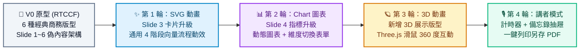

# 📊 建立線上簡報網頁 (Interactive Web Presentation Deck) - Prompt 指南

> **開發工具建議**：本專案推薦使用 **Google AI Studio** 進行開發，技術棧採用 Vite、React、TypeScript 與 Tailwind CSS（或現代 CSS）。
> 
> 💼 **上班族職場必備・趨勢首選**：厭倦了千篇一律、靜態呆板的 PowerPoint 了嗎？現代科技發布會、年會提案與高端商業匯報正迅速擁抱「網頁型互動簡報（Web Presentation Deck）」。在任何瀏覽器一鍵開啟、無須安裝軟體，更能無縫整合 **SVG 流程動效**、**Chart 動態數據圖表** 與 **3D 互動模型**，讓你的每一次簡報都成為全場焦點！

---

## 專案簡介與核心觀念

打造線上簡報網頁是上班族展現專業與科技品味的最佳實戰專案。本專案**不需要預先想好特定簡報主題**，而是透過提供標準化的 `Slide 1` ~ `Slide X` **通用偽內容（Mock Data）與多種經典商務版型樣式（Layout Styles）**，讓任何人未來只需打開資料檔替換文字即可套用！

在本單元中，你將學到：
1. **投影片資料與版型抽離（Data-Driven Slides）**：所有投影片內容皆定義於 `slidesData.ts`，包含 `slide1` 到 `slide6` 的佔位文字、排版佈局與講者提詞備忘錄。
2. **多種現代商務版型切換（Layout Styles）**：涵蓋「封面版型」、「雙欄對比」、「三卡片網格」、「大數字指標」、「核心金句」與「結尾 Q&A」。
3. **鍵盤與全螢幕沉浸控制（Presentation Keyboard Controls & Fullscreen API）**：實作左右方向鍵翻頁、空白鍵前進、快捷鍵全螢幕播放與進度條聯動。
4. **漸進式高質感微互動**：從基礎排版出發，逐步解鎖 **SVG 向量路徑動效**、**Chart.js 動態數據互動表單** 與 **Three.js 3D 互動模型**。

---

## 一、 專案建立階段：V0 原型建立

在初次建立專案原型時，請一律使用 **RTCCF 結構化框架**，明確定義投影片資料架構、快捷鍵行為、現代商業視覺與全螢幕機制，讓 Google AI Studio 能一次性精準產出完整的可運行專案。

### 💡 如何用別的 AI 產生 RTCCF 格式？
若想根據你自己的需求增減投影片數量或微調版型，可複製下方折疊區內的**自然語言指令**，貼給 ChatGPT、Claude 或 Gemini 產出專屬的 RTCCF 規格書：

<details>
<summary>👉 點擊展開：請其他 AI 協助產生 RTCCF 的自然語言指令（可直接複製）</summary>

```text
我想在 Google AI Studio 開發一個專為上班族設計的「通用線上簡報單頁系統 (Interactive Web Presentation Deck SPA)」，技術棧使用 Vite + React + TypeScript + Tailwind CSS。
特別要求：
1. 不要寫死特定業務領域的內容，請使用 Slide 1 ~ Slide 6 的通用偽內容（Placeholder / Mock Data，例如 [簡報主標題]、[副標題說明]、[重點 01~03]、[指標 99%] 等）。
2. 每張 Slide 必須具備不同的經典商務排版樣式（封面、雙欄對比、三卡片網格、大數字指標、引言聚焦、結尾感謝）。
3. 具備完整的簡報切換功能（左右鍵/空白鍵翻頁、全螢幕、底部進度條、投影片大綱目錄抽屜）。
請扮演資深前端架構師與 Keynote 簡報設計專家，使用標準 RTCCF 框架（包含：# 角色 Role、## 任務目標 Task、## 背景情境 Context、## 核心規則與限制 Constraints、## 輸出規格與風格 Format）為我撰寫一份結構完整的軟體需求規格 Prompt，讓我可以直接複製貼入 Google AI Studio 生成可運行的程式碼。
```

</details>

<br>

### 📋 專案建立 RTCCF Prompt（複製貼入 Google AI Studio）

請複製以下整段規格，貼入 **Google AI Studio** 對話框：

```markdown
# 角色 (Role)
你是一位精通 React 18+、TypeScript、現代 CSS 排版與商業簡報（Keynote/Deck）UI/UX 設計的資深前端架構師。

## 任務目標 (Task)
請幫我開發一個極具現代科技感、高階商務質感的「線上互動簡報單頁系統 (Web Presentation Deck)」（V0 原型版本）。

## 背景情境 (Context)
- 開發環境與技術棧：Google AI Studio、Vite、React 18+、TypeScript、Tailwind CSS、Lucide React 圖示庫。
- 適用對象：企業上班族、專案經理與演講者，打造超越傳統 PPT 的網頁型沉浸式簡報。
- 內容與素材原則：
  - **不需要特定行業的實際簡報內容**，請在資料檔中預置 `Slide 1` ~ `Slide 6` 的通用偽內容（Placeholder / Mock Data），方便使用者日後直接換字。
  - **完全不依賴外部圖片與聲音檔案**，運用純 CSS 漸層色塊、精緻陰影與幾何向量打造高階商務質感。

## 核心規則與限制 (Constraints)
1. 嚴格的資料抽離與型別定義 (slidesData.ts)：
   - 建立獨立的資料結構，包含完整的 TypeScript 介面：
     - `LayoutType`: `'cover' | 'split-columns' | 'three-cards' | 'metrics' | 'quote' | 'closing'`。
     - `Slide` 介面：包含 `id`, `layout`, `badge`, `title`, `subtitle`, `data`（依版型包含的自訂欄位）, `notes`（講者備忘錄偽內容）。
   - 請提供包含 6 張不同商務版型與偽內容的初始資料陣列：
     - **Slide 1【封面版型 cover】**：
       - 樣式：大標題居中排版、分類 Badge 標籤、雙色微光漸層背景、演講者/日期資訊列。
       - 偽內容：`badge: "CATEGORY"`、`title: "線上簡報主標題範例 (Slide 1 Title)"`、`subtitle: "副標題說明文字，此處可放置演講重點、主講人姓名與日期職稱"`、`notes: "Slide 1 講者備忘錄：開場問候與簡報主題介紹。"`。
     - **Slide 2【大綱與雙欄版型 split-columns】**：
       - 樣式：左右對稱排版，左側條列章節項目，右側重點特色說明卡片。
       - 偽內容：`badge: "AGENDA"`、`title: "簡報核心大綱與章節規劃 (Slide 2 Agenda)"`、`items: ["01. 核心背景與現況分析說明", "02. 關鍵策略與解決方案解析", "03. 預期效益與數據指標呈現", "04. 執行計畫與後續行動方案"]`、`card: { title: "核心總結", desc: "此處放置針對大綱的綜合總結或重要提示文字。" }`。
     - **Slide 3【三卡片網格版型 three-cards】**：
       - 樣式：水平並排三等分卡片網格、頂部編號與圖示、毛玻璃半透明微光卡片、Hover 浮起動效。
       - 偽內容：`badge: "HIGHLIGHTS"`、`title: "三大核心特色展示 (Slide 3 Three Cards)"`、`cards: [{ step: "01", title: "特色亮點 A", desc: "此處填入模組 A 的說明文字與核心優勢描述。" }, { step: "02", title: "特色亮點 B", desc: "此處填入模組 B 的說明文字與核心優勢描述。" }, { step: "03", title: "特色亮點 C", desc: "此處填入模組 C 的說明文字與核心優勢描述。" }]`。
     - **Slide 4【關鍵數據指標版型 metrics】**：
       - 樣式：四宮格或三欄高亮大數字展示卡片（Hero Numbers），搭配漸層數字色彩與小標籤。
       - 偽內容：`badge: "METRICS"`、`title: "關鍵績效指標與數據成果 (Slide 4 Metrics)"`、`stats: [{ value: "+128%", label: "指標數值 A", desc: "相較前期同期成長幅度" }, { value: "99.9%", label: "指標數值 B", desc: "系統穩定度與滿意度" }, { value: "3.5x", label: "指標數值 C", desc: "工作效率與產能提升" }, { value: "500K+", label: "指標數值 D", desc: "累計觸及或服務人次" }]`。
     - **Slide 5【核心金句聚焦版型 quote】**：
       - 樣式：巨幅醒目引言排版、中央對齊、發光大引號、引言人與出處。
       - 偽內容：`badge: "STATEMENT"`、`title: "「此處可填入震撼全場的核心金句或核心結論觀點。」"`、`author: "—— 演講者 / 引言出處名言"`、`desc: "輔助說明文字，用來補充此核心觀點的背景脈絡。"`。
     - **Slide 6【感謝與問答結尾版型 closing】**：
       - 樣式：優雅的 Thank You / Q&A 居中卡片，條列聯絡管道與社交資訊。
       - 偽內容：`badge: "WRAP UP"`、`title: "感謝聆聽・歡迎交流討論 (Slide 6 Thank You)"`、`subtitle: "若有任何問題或合作意向，歡迎透過下方管道聯繫洽詢"`、`contacts: [{ type: "Mail", text: "contact@example.com" }, { type: "Web", text: "https://example.com" }, { type: "Phone", text: "+886 912-345-678" }]`。

2. 簡報播放與控制核心：
   - ⌨️ **鍵盤快捷鍵**：支援鍵盤 `→`（下一頁）、`←`（上一頁）、`Space`（下一頁）、`Home`（回首頁）、`F`（切換全螢幕模式）。
   - 🖱️ **畫面互動元件**：
     - 畫面兩側或底部具備半透明懸浮導覽按鈕（上一頁、下一頁）。
     - 底部具備「簡報進度條（Progress Bar）」與「當前頁碼指示器（如：03 / 06）」。
     - 頂部或角落具備「全螢幕切換按鈕」與「投影片大綱目錄按鈕」。
   - 📑 **大綱目錄抽屜 (Slide Outline Drawer)**：點擊可從側邊滑出所有投影片的標題與版型清單，點選任一頁面即刻平滑跳轉。

3. 視覺與過渡效果：
   - 投影片切換時帶有絲滑的淡入淡出（Fade）與輕微位移動畫（Slide Transition）。
   - 自適應視窗大小，無論筆電螢幕或投影機皆能保持 16:9 或全螢幕自適應美感。

## 輸出規格與風格 (Format)
- UI/UX 風格：現代極簡深色（Dark Slate / Deep Navy）科技商務風格，搭配精緻的毛玻璃導覽列（Glassmorphism）、微光邊框（Accent Glow）與現代無襯線字體排版。
- 程式碼規範：
   - 完整的 TypeScript 型別定義與繁體中文註解。
   - 核心邏輯抽離（自訂 Hook `usePresentationControls` 控制鍵盤與全螢幕）。
   - 提供完整且可獨立運行的前端代碼。
```

---

## 二、 作品迭代階段：自然語言多輪進化

原型成功運行後，請依循 **[作品迭代與修改技巧](../../作品迭代與修改技巧/README.md)**，在 Google AI Studio 中使用**自然語言對話**循序漸進調教，一步步為各個 Slide 注入 **SVG 動畫**、**Chart 互動圖表** 與 **3D 視覺模型**：



---

### 🔹 第 1 輪迭代：在 Slide 3 加入通用 SVG 動態流程圖 (SVG Animations)
- **改動重點**：將 Slide 3 的卡片版型升級，加入一組通用的 **4 階段 SVG 向量工作流動態圖**（Stage 1 ➔ Stage 2 ➔ Stage 3 ➔ Stage 4），搭配路徑描邊流動動效（Stroke Dashoffset）與發光節點，提供通用的流程展示樣式。
- 💬 **自然語言 Prompt（直接複製貼給 Google AI Studio）**：
  ```text
  簡報的 6 種版型與鍵盤切換運作非常滑順！
  現在我想在 Slide 3（三卡片亮點版型）加入引人注目的「通用 SVG 動態架構流程圖」：
  1. 在原本的三張卡片上方或下方，設計一個通用的 4 階段流程向量圖：
     - 節點偽內容：「階段 01：需求定義」➔「階段 02：策略規劃」➔「階段 03：執行開發」➔「階段 04：成果交付」。
  2. 加入 SVG 動畫效果：
     - 節點之間的連接線使用 SVG 虛線流動動效（stroke-dashoffset 動畫），模擬光訊號在各節點間傳遞的過程。
     - 每個流程節點帶有微光的呼吸燈效果（Glow Pulse）與專屬精美向量圖示。
     - 當簡報切換到此頁時，整個 SVG 圖形由左至右依序漸進繪出並淡入。
  請保持程式碼純前端實作（可使用純 CSS/SVG 或 Framer Motion），並提供更新後的完整代碼。
  ```

---

### 🔹 第 2 輪迭代：在 Slide 4 加入 Chart 動態圖表與切換表單 (Dynamic Chart & Interactive Form)
- **改動重點**：將 Slide 4 的靜態大數字，升級為 **動態數據圖表（Chart.js / SVG 圖表）**，上方附帶通用篩選表單（如：季度選擇、部門選項），切換時圖表動態重繪且關鍵數字自動累加跳動。
- 💬 **自然語言 Prompt（直接複製貼給 Google AI Studio）**：
  ```text
  SVG 流程圖效果很棒！接下來我想把 Slide 4（關鍵指標版型）升級為「動態數據互動圖表」：
  1. 引入圖表套件（如 Chart.js、Recharts 或精緻的純 SVG 動態圖表），呈現兩組通用的商業數據偽圖表：
     - 圖表 A：年度趨勢折線圖（平滑曲線，具有動態繪製與懸浮 Tooltip 數值提示）。
     - 圖表 B：各項目對比長條圖（帶有漸層色彩與長條高度生長動效）。
  2. 在圖表上方加入一組「動態切換表單」：
     - 下拉選單（Select）或按鈕群組（Tabs）：可切換「2024 年 Q1-Q4」、「2025 年預測」或「方案 A / 方案 B」。
     - 點選切換不同選項時，數據即時平滑重新計算與補間動畫跳動，下方大數字指標同步產生數字跳動累加效果（Count-up Animation）。
  請提供修改後的完整程式碼。
  ```

---

### 🔹 第 3 輪迭代：新增 3D 動態互動模型版型 (3D WebGL Animation)
- **改動重點**：新增一個全新的 **3D 展示版型（`3d-showcase`）**，嵌入輕量級 **Three.js** 3D 互動場景，呈現一個可 360 度滑鼠拖曳旋轉、具備光影粒子效果的立體科技展示物體。
- 💬 **自然語言 Prompt（直接複製貼給 Google AI Studio）**：
  ```text
  圖表與數據表單切換效果非常棒！現在我想在簡報中新增一個「3D 互動展示版型（slide-3d）」：
  1. 在 slidesData.ts 中新增一頁 3D 版型，內容為偽文字：
     - badge: "3D SHOWCASE"
     - title: "立體核心模型展示 (Slide 3D)"
     - subtitle: "支援滑鼠 360 度自由旋轉探索，為產品發布或技術架構提供沉浸式展示"
  2. 引入輕量級 3D 渲染技術（Three.js）：
     - 在簡報中央或右半部建立 3D 渲染區，呈現一個具備發光粒子、幾何多面體或科技水晶球的 3D 物體。
     - 物體會平滑自動慢速自轉，並散發精緻的環境微光。
     - 簡報者或觀眾可以使用滑鼠進行「拖曳 360 度旋轉」、「滑鼠移動視差傾斜（Parallax）」。
  3. 效能優化：切換至其他投影片時自動暫停 3D 渲染迴圈，切回該頁時自動恢復。
  請提供完整的整合程式碼與清楚註解。
  ```

---

### 🔹 第 4 輪迭代：演講者講者模式 (Presenter Mode)、計時器與匯出列印
- **改動重點**：強化實戰演講功能，提供專業講者專屬的倒數計時器、講者備忘錄小抽屜（Speaker Notes），並支援 `@media print` 一鍵匯出成高品質 PDF 簡報。
- 💬 **自然語言 Prompt（直接複製貼給 Google AI Studio）**：
  ```text
  3D 效果讓人眼睛為之一亮！為了讓這套線上簡報在職場演講時真正實用，請幫我加入專業的演講輔助功能：
  1. 講者備忘錄抽屜 (Speaker Notes)：
     - 按下鍵盤快捷鍵 `N` 或點擊右下角小圖示，可滑出半透明講者抽屜，顯示當前頁面的講稿備忘錄與演講重點提詞（讀取各 slide 的 notes 欄位）。
  2. 簡報計時器 (Presentation Timer)：
     - 在左下角或右上角加入優雅的「演講計時碼表（包含開始、暫停、重設功能）」與當前時間顯示，幫助講者精準掌控簡報時間。
  3. 一鍵列印與另存 PDF 優化：
     - 加入列印按鈕，支援 `@media print` 專屬樣式：列印時自動解除單頁播放狀態，將所有投影片依序排版展開為一頁頁的 A4 橫式簡報，去除所有操作按鈕與背景雜訊，方便直接另存成 PDF 簡報手冊傳送給客戶與長官。
  請提供修復與優化後的完整代碼。
  ```

---

## 三、 除錯心法：遇到 Bug 時怎麼問？

在整合 SVG、圖表與 3D 動畫時，常見的除錯技巧如下：

### 1. 鍵盤事件在表單輸入時打架（例如在篩選輸入框按左右鍵卻翻頁了）
- **原因**：鍵盤監聽事件未判斷目標元素是否為 `input` 或 `select`。
- **提問範例**：
  ```text
  我在切換圖表的下拉表單時，按方向鍵或空白鍵會不小心觸發簡報翻頁。請幫我在 usePresentationControls 加上防呆判斷（當事件來源為 INPUT、SELECT 或 TEXTAREA 時不觸發簡報翻頁），請提供修正後的代碼。
  ```

### 2. 3D Canvas 切換頁面後畫面空白或記憶體洩漏
- **原因**：Three.js 容器在 React 元件重新渲染時未正確取得 DOM 寬高，或 `requestAnimationFrame` 未在 `useEffect cleanup` 中取消。
- **提問範例**：
  ```text
  當我切換投影片離開 3D 頁面再切回來時，3D Canvas 偶爾會變黑或沒有自動 Resize。請幫我檢查 Three.js 的 useEffect 生命週期，確保加入 cancelAnimationFrame，並在 ResizeObserver 中動態更新相機 aspect 與 renderer 大小。
  ```

---

## 總結：上班族如何更換自己的簡報內容？

1. **零成本換內容**：專案生成後，只要打開 `slidesData.ts`，將 `Slide 1` ~ `Slide 6` 的偽標題、條列文字換成你自己的報告內容，不到 5 分鐘就擁有一套高質感的線上簡報！
2. **隨意增減頁數**：在 `slidesData.ts` 的陣列中複製貼上物件，並指定 `layout: 'cover' | 'split-columns' | 'three-cards' | 'metrics' | 'quote' | 'closing'`，即可隨意擴充簡報頁數！
3. **免裝軟體、跨平台隨開即用**：部署到 Google Cloud Run 取得公開網址，任何裝置、會議室大螢幕皆能完美投放！
