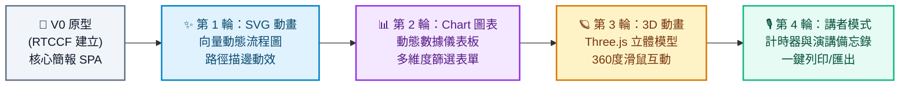

# 📊 建立線上簡報網頁 (Interactive Web Presentation Deck) - Prompt 指南

> **開發工具建議**：本專案推薦使用 **Google AI Studio** 進行開發，技術棧採用 Vite、React、TypeScript 與 Tailwind CSS（或現代 CSS）。
> 
> 💼 **上班族職場必備・趨勢首選**：厭倦了千篇一律、靜態呆板的 PowerPoint 了嗎？現代科技發布會、年會提案與高端商業匯報正迅速擁抱「網頁型互動簡報（Web Presentation Deck）」。在任何瀏覽器一鍵開啟、無須安裝軟體，更能無縫整合 **SVG 流程動效**、**Chart 動態數據圖表** 與 **3D 互動模型**，讓你的每一次簡報都成為全場焦點！

---

## 專案簡介與核心觀念

打造線上簡報網頁是上班族展現專業與科技品味的最佳實戰專案。在本單元中，你將學到：
1. **投影片資料與版型分離（Data-Driven Slides）**：將每頁簡報的標題、內文、排版佈局與講者備忘錄抽離至獨立資料檔（`slidesData.ts`），換內容就像換投影片一樣簡單。
2. **鍵盤與全螢幕沉浸控制（Presentation Keyboard Controls & Fullscreen API）**：實作左右方向鍵翻頁、空白鍵前進、快捷鍵全螢幕播放與進度條聯動。
3. **高質感商務微互動**：從單頁切換出發，逐步解鎖 **SVG 向量路徑動效**、**Chart.js 動態數據互動表單** 與 **Three.js 3D 互動模型**，完成一次降維打擊的職場提案！

---

## 一、 專案建立階段：V0 原型建立

在初次建立專案原型時，請一律使用 **RTCCF 結構化框架**，明確定義投影片資料架構、快捷鍵行為、現代商業視覺與全螢幕機制，讓 Google AI Studio 能一次性精準產出完整的可運行專案。

### 💡 如何用別的 AI 產生 RTCCF 格式？
若想根據你的職場產業（如：數位行銷、產品經理、財務分析、業務提案、年終述職）客製化簡報主題，可複製下方折疊區內的**自然語言指令**，貼給 ChatGPT、Claude 或 Gemini 產出專屬的 RTCCF 規格書：

<details>
<summary>👉 點擊展開：請其他 AI 協助產生 RTCCF 的自然語言指令（可直接複製）</summary>

```text
我想在 Google AI Studio 開發一個專為上班族設計的「現代科技感線上簡報單頁系統 (Interactive Web Presentation Deck SPA)」，技術棧使用 Vite + React + TypeScript + Tailwind CSS。
核心功能：支援滑鼠點擊切換、鍵盤左右箭頭/空白鍵翻頁、全螢幕簡報模式、底部即時進度條、投影片大綱目錄抽屜。
特別要求：資料必須嚴格抽離為獨立的 TypeScript 資料檔案（包含多頁商業提案：封面、痛點分析、核心解決方案、商業亮點、感謝頁），採用現代簡約高階商務深色/淺色排版。
請扮演資深前端架構師與 Keynote 簡報設計專家，使用標準 RTCCF 框架（包含：# 角色 Role、## 任務目標 Task、## 背景情境 Context、## 核心規則與限制 Constraints、## 輸出規格與風格 Format）為我撰寫一份結構完整的軟體需求規格 Prompt，讓我可以直接複製貼入 Google AI Studio 生成可運行的程式碼。
```

</details>

<br>

### 📋 專案建立 RTCCF Prompt（複製貼入 Google AI Studio）

請複製以下整段規格，貼入 **Google AI Studio** 對話框：

```markdown
# 角色 (Role)
你是一位精通 React 18+、TypeScript、現代 CSS 排版與商業簡報（Keynote/Deck）UI/UX 設計的資深前端架構師。

## 任務目標 (Task)
請幫我開發一個極具現代科技感、高階商務質感的「線上互動簡報單頁系統 (Web Presentation Deck)」（V0 原型版本）。

## 背景情境 (Context)
- 開發環境與技術棧：Google AI Studio、Vite、React 18+、TypeScript、Tailwind CSS、Lucide React 圖示庫。
- 適用對象：企業上班族、專案經理與提案演講者，打造超越傳統 PPT 的網頁型沉浸式簡報。
- 素材限制：初期**完全不依賴外部圖片與聲音檔案**，運用高品質純 CSS 漸層色塊、精緻排版與幾何向量打造尊榮商務質感。

## 核心規則與限制 (Constraints)
1. 資料抽離與型別定義 (Data-Driven Architecture)：
   - 建立獨立的資料結構 `slidesData.ts`，包含嚴謹的 TypeScript 介面：
     - `SlideType`：`'cover' | 'problem' | 'solution' | 'metrics' | 'quote' | 'closing'`。
     - `Slide` 介面：包含 `id`, `title`, `subtitle`, `type`, `layout`（單欄/雙欄/三卡片）, `content`（標籤、條列重點、關鍵數字）, `badge`（分類標籤）, `notes`（講者備忘錄）。
   - 預設提供 5~6 頁完整的職場高階提案內容（例如：「企業 AI 數位轉型與智能工作流提案」）。
2. 簡報播放與控制核心：
   - ⌨️ **鍵盤快捷鍵**：支援鍵盤 `→`（下一頁）、`←`（上一頁）、`Space`（下一頁）、`Home`（回首頁）、`F`（切換全螢幕模式）。
   - 🖱️ **畫面互動元件**：
     - 兩側/底部具備簡潔的懸浮導覽按鈕（上一頁、下一頁）。
     - 底部具備「簡報進度條（Progress Bar）」與「當前頁碼指示器（如：03 / 06）」。
     - 頂部或角落具備「全螢幕切換按鈕」與「投影片大綱目錄按鈕」。
   - 📑 **大綱目錄抽屜 (Slide Outline Drawer)**：點擊開啟右側縮圖或標題清單，點選任意頁面可瞬間跳轉。
3. 視覺與過渡效果：
   - 投影片切換時帶有絲滑的淡入淡出（Fade）與輕微位移動畫（Slide Transition）。
   - 自動適應視窗大小，無論筆電螢幕或投影機皆能保持 16:9 或全螢幕自適應美感。

## 輸出規格與風格 (Format)
- UI/UX 風格：現代極簡深色（Dark Slate / Deep Navy）科技商務風格，搭配精緻的毛玻璃導覽列（Glassmorphism）、微光邊框（Accent Glow）與現代無襯線字體排版。
- 程式碼規範：
   - 完整的 TypeScript 型別定義與繁體中文註解。
   - 核心邏輯抽離（如自訂 Hook `usePresentationKeyControls` 控制鍵盤與全螢幕）。
   - 提供完整且可獨立運行的前端代碼。
```

---

## 二、 作品迭代階段：自然語言多輪進化

原型成功運行後，請依循 **[作品迭代與修改技巧](../../作品迭代與修改技巧/README.md)**，在 Google AI Studio 中使用**自然語言對話**循序漸進調教，一步步為簡報注入 **SVG 動畫**、**Chart 互動圖表** 與 **3D 視覺模型**：



---

### 🔹 第 1 輪迭代：加入 SVG 動態流程圖與脈動動效 (SVG Animations)
- **改動重點**：在「核心解決方案頁」中，告別死板的文字條列，改用手繪級 **SVG 動態流程圖**，包含路徑描邊動畫（Stroke Dasharray）、節點發光脈動與光點傳輸動效，直觀展現商業業務流程。
- 💬 **自然語言 Prompt（直接複製貼給 Google AI Studio）**：
  ```text
  簡報的鍵盤切換與全螢幕控制非常流暢！
  現在我想在「核心解決方案（Solution）」這一頁加入引人注目的「SVG 動態架構流程圖」：
  1. 請設計一個包含 3~4 個階段節點的商業工作流向量圖（例如：「數據收集 ➔ AI 分析處理 ➔ 智能決策 ➔ 自動化執行」）。
  2. 加入 SVG 動畫效果：
     - 節點之間的連接線使用 SVG 虛線流動動效（stroke-dashoffset 動畫），模擬光訊號在各節點間傳遞的過程。
     - 每個流程節點帶有微光的呼吸燈效果（Glow Pulse）與專屬精美向量圖示。
     - 當簡報切換到此頁時，整個 SVG 圖形由左至右依序漸進繪出並淡入。
  請保持程式碼純前端實作（可使用純 CSS/SVG 或 Framer Motion / SVG SMIL），並提供更新後的完整代碼。
  ```

---

### 🔹 第 2 輪迭代：加入 Chart 動態圖表與切換表單 (Dynamic Chart & Interactive Form)
- **改動重點**：在「關鍵指標（Metrics/ROI）」頁面中，加入 **Chart.js**（或 Recharts / 純 SVG 動態長條與折線圖），並搭配動態篩選表單，讓演講者或觀眾可現場切換年份、季度或部門維度，圖表會平滑重繪跳動！
- 💬 **自然語言 Prompt（直接複製貼給 Google AI Studio）**：
  ```text
  SVG 流程圖的動畫效果非常震撼！接下來我想把「關鍵成就與效益（Metrics）」頁面升級為「動態數據互動圖表」：
  1. 引入圖表套件（如 Chart.js、Recharts，或高質感的純 SVG 動態繪製元件），展示兩組關鍵業務數據：
     - 上半部：年度營收成長曲線圖（平滑曲線，具有動態繪製與懸浮 Tooltip 數值提示）。
     - 下半部：各部門效率提升對比長條圖（帶有漸層色彩與長條高度生長動效）。
  2. 在圖表上方加入一組「動態切換表單與過濾按鈕」：
     - 下拉選單（Select）或按鈕群組（Tabs）：可切換「2024 年 Q1-Q4」、「2025 年預測」或「不同事業部」。
     - 點選切換不同選項時，數據即時平滑重新計算與補間動畫跳動，並同步計算出關鍵總結數字（如：「ROI 提升 320%」動態數字跳動累加計數）。
  請提供修改後的完整程式碼。
  ```

---

### 🔹 第 3 輪迭代：加入 3D 動態互動模型與場景 (3D WebGL Animation)
- **改動重點**：在「旗艦產品發布 / 科技亮點」頁面中，嵌入輕量級 **Three.js**（或 React Three Fiber）3D 互動場景（例如：可 360 度旋轉的科技立體核心、幾何數據魔方或立體晶片模型），支援滑鼠拖曳旋轉與自動公轉。
- 💬 **自然語言 Prompt（直接複製貼給 Google AI Studio）**：
  ```text
  圖表與數據表單切換效果非常棒！現在我想在「產品亮點 / 科技核心」這一頁打造最高規格的「3D 互動視覺展示」：
  1. 引入輕量級 3D 渲染技術（使用 Three.js、Lucide 3D 輔助或純 WebGL Canvas）：
     - 在簡報右側建立一個 3D 科技感展示區，呈現一個具備科技粒子微光、旋轉環繞與光影質感的立體幾何物體（例如：立體發光晶片、互動科技魔方或幾何球體核心）。
     - 物體會平滑自動慢速自轉，並散發精緻的環境微光。
  2. 加入滑鼠互動控制：
     - 簡報者或觀眾可以使用滑鼠在 3D 區域進行「拖曳 360 度旋轉」、「滾輪縮放視角」。
     - 當滑鼠在畫面上移動時，3D 物體會產生微妙的視差傾斜跟隨效果（Parallax Effect）。
  3. 確保效能與自適應：在切換到其他投影片時自動暫停 3D 渲染迴圈（避免消耗記憶體），切回該頁時恢復。
  請提供完整的整合程式碼與清楚註解。
  ```

---

### 🔹 第 4 輪迭代：演講者講者模式 (Presenter Mode)、計時器與匯出列印
- **改動重點**：強化實戰演講功能，提供專業講者專屬的倒數計時器、講者備忘錄小抽屜（Speaker Notes），並支援 `@media print` 一鍵匯出成高品質 PDF 簡報。
- 💬 **自然語言 Prompt（直接複製貼給 Google AI Studio）**：
  ```text
  3D 效果讓人眼睛為之一亮！為了讓這套線上簡報在職場演講時真正實用，請幫我加入專業的演講輔助功能：
  1. 講者備忘錄抽屜 (Speaker Notes)：
     - 按下鍵盤快捷鍵 `N` 或點擊右下角小圖示，可滑出半透明講者抽屜，顯示當前頁面的講稿備忘錄與演講重點提詞。
  2. 簡報計時器 (Presentation Timer)：
     - 在左下角或右上角加入優雅的「演講計時碼表（包含開始、暫停、重設功能）」與當前時間顯示，幫助講者精準掌控簡報時間。
  3. 一鍵列印與另存 PDF 優化：
     - 加入列印按鈕，支援 `@media print` 專屬樣式：列印時自動解除單頁播放狀態，將所有投影片依序排版展開為一頁頁的 A4 橫式簡報，去除所有操作按鈕與背景雜訊，方便直接另存成 PDF 簡報手冊傳送給客戶與長官。
  請提供修復與優化後的完整代碼。
  ```

---

## 三、 除錯心法：遇到 Bug 時怎麼問？

在整合 SVG、圖表與 3D 動畫時，常見的除錯技巧如下：

### 1. 鍵盤事件在表單輸入時打架（例如在篩選輸入框按左右鍵卻翻頁了）
- **原因**：鍵盤監聽事件未判斷目標元素是否為 `input` 或 `select`。
- **提問範例**：
  ```text
  我在切換圖表的下拉表單時，按方向鍵或空白鍵會不小心觸發簡報翻頁。請幫我在 usePresentationKeyControls 加上防呆判斷（當事件來源為 INPUT、SELECT 或 TEXTAREA 時不觸發簡報翻頁），請提供修正後的代碼。
  ```

### 2. 3D Canvas 切換頁面後畫面空白或記憶體洩漏
- **原因**：Three.js 容器在 React 元件重新渲染時未正確取得 DOM 寬高，或 `requestAnimationFrame` 未在 `useEffect cleanup` 中取消。
- **提問範例**：
  ```text
  當我切換投影片離開 3D 頁面再切回來時，3D Canvas 偶爾會變黑或沒有自動 Resize。請幫我檢查 Three.js 的 useEffect 生命週期，確保加入 cancelAnimationFrame，並在 ResizeObserver 中動態更新相機 aspect 與 renderer 大小。
  ```

---

## 總結：上班族如何用此範例在職場脫穎而出？

1. **直接當作專案成果報告**：將你的季報、專案成果直接填入 `slidesData.ts`，開會時直接用瀏覽器全螢幕投影，質感瞬間超越所有人！
2. **免裝軟體、跨平台隨開即用**：部署到 GitHub Pages 或 Vercel 後，只要給長官或客戶一個網址，手機、平板、甚至會議室電視螢幕都能完美呈現！
3. **無痛擴充多媒體**：後續還能搭配課程中的 [加入圖片和音樂](../加入圖片和音樂/README.md) 單元，加入背景輕音樂或產品示範影片，打造無懈可擊的互動發表會！
