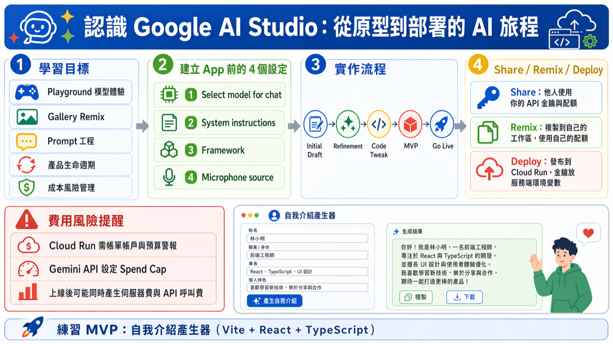

# 🚀 認識 Google AI Studio：從原型到部署的 AI 旅程

歡迎來到 Google AI Studio 的實作課程！本單元將帶領你認識 Google 最強大的 AI 工作臺——Gemini AI Studio。在這裡，你將學會如何從一個簡單的文字提示（Prompt）開始，快速迭代出 AI 應用原型（Prototype），直到最終可以考慮部署到實際的服務環境。

---

## 💡 本單元學習目標 (What You Will Learn)

完成本單元後，你將能夠：

*   **掌握 Playground**：了解 Google 提供的各種模型（包括免費與付費資源）的基礎用法與性能差異。
*   **探索 Gallery**：瀏覽和快速「混搭 (Remix)」業界頂尖的 AI 應用範例，學習不同模型如何應用。
*   **精通 Prompt 工程**：透過反覆迭代，學會如何精準地指導 AI 產出符合預期的結果。
*   **理解 AI 產品生命週期**：區分 Share、Remix 與 Deploy 的不同意義，了解應用程式從個人原型到公開服務的完整流程。
*   **風險管理意識**：建立對雲端服務（Google Cloud Run）和 API 費用（Gemini Spend Cap）的敏銳感知，有效控制成本。

---


## 🛠️ 實作準備：建立 App 前的關鍵設定 (Advanced Settings)

在開始建立你的第一個 App 之前，請先在「進階設定」中確認以下四個關鍵欄位。理解這些設定背後的邏輯，是做出穩定 AI 應用的基礎。

1.  **Select model for chat**：選擇使用的 AI 模型。
    *   *👉 **備註：** 初次使用建議選擇預設模型（如 Gemini Flash），熟悉操作流程後再替換其他高性能模型。*
2.  **System instructions**：輸入專案的整體目標、角色設定與回覆風格。
    *   *👉 **備註：** 這是定義 AI 「人設」的核心，有效的指令能極大避免 AI 輸出內容過於發散或跑題。*
3.  **Framework**：選擇應用程式的技術框架。
    *   *👉 **備註：** 選擇課程指定的框架（React / Next.js / Angular），確保後續的程式碼能順利銜接。*
4.  **Microphone source**：語音互動功能所需的來源設定。
    *   *👉 **備註：** 僅當你專案需要語音輸入功能時才需要配置此項，否則可忽略。*

---

## 🗺️ 實作流程地圖 (The Workflow)

我們的實作過程遵循一個清晰的迭代路徑：

1.  **起點 (Initial Draft)**：使用預設模型，透過一句話需求建立應用程式的第一個基礎版本。
2.  **迭代 (Refinement)**：進入 Prompt 調整階段，透過不斷細化需求，逐步優化 AI 的輸出品質。
3.  **優化 (Code Tweak)**：切換到 Code 模式，進行小幅度的程式碼修補或介面調整，隨後切回 Preview 進行驗證。
4.  **最小化產品 (MVP)**：確保你的應用程式能完成最核心的任務（例如：文字產生器），達到最小可行產品 (MVP)。
5.  **發布決策 (Go Live)**：當你準備好讓世界看看你的作品時，再考慮使用 Share 或 Deploy 功能。

---

## 🔗 核心概念解析：Share, Remix, Publish (Deploy)

這三個操作決定了你的應用程式的「使用權」和「維護權」。請務必理解它們對 **API 金鑰、配額與隱私** 的影響：

*   **🌐 Share (分享)**：
    *   **行為**：你將 AI Studio 中的 App 或 Prompt 原型分享給他人。
    *   **費用與配額責任**：對方在執行你的 App 時，會**使用並消耗你自己的 API 金鑰和配額**。
*   **🔄 Remix (複製/重製)**：
    *   **行為**：將別人的公開專案複製到你自己的工作區進行二次修改。
    *   **費用與配額責任**：當你執行 Remix 過來的專案時，會**改為使用你自己的 API 金鑰和配額**。
*   **🚢 Publish / Deploy (部署上線)**：
    *   **行為**：在 Build Mode 中點擊 **Publish**（火箭圖示），一鍵將應用程式打包容器化並發布至 **Google Cloud Run** 獨立服務，生成專屬 HTTPS 網址（支援 `*.ai.studio` 子網域）。
    *   **金鑰安全隔離**：部署後的服務會透過伺服器端環境變數與 App Proxy 自動保護 Gemini API Key，**絕不會**直接暴露在前端原始碼中。
    *   **GitHub 雙向同步 (Two-way sync)**：最新版本支援與 GitHub 儲存庫雙向連結，可直接將 AI Studio 產出的程式碼 Push 到 GitHub，或自本地編輯後 Pull 同步回 AI Studio 繼續迭代。

---

## ⚠️ 極重要！2026 最新規範、部署與費用風險管理 (Rules & Cost Management)

Google AI Studio 與 Gemini API 近期進行了重大的規則升級與架構調整，從「原型實驗室」走向「正式產品」前，請務必掌握以下五大關鍵變動：

### 1. ☁️ 部署等級變革：新增 Google Cloud Starter Tier
*   **🆓 Starter Tier（初學者零門檻部署）**：
    *   **免綁信用卡**：過去部署至 Cloud Run 必須綁定 GCP 帳單帳戶，現在只要符合資格（未曾綁定過 GCP 付費帳戶之個人帳號），可享有 **最多免費部署 2 個全端應用程式**。
    *   **限制**：服務會部署在 Google 指定的預設區域（如 `us-west1`），且不得為 Workspace 企業/校園授權帳號。
*   **💼 Standard Tier（標準部署）**：
    *   若帳號已啟用 GCP 帳單，或需部署超過 2 個應用程式，則走標準 Cloud Run 部署流程，由你的 Google Cloud 帳單計費。
    *   **預防措施**：使用 Standard Tier 強烈建議立即至「Google Cloud -> 帳單 -> 預算與警告」設定預算警報。系統會發信警示超標，但**不會自動暫停服務**。

### 2. 🛡️ 服務條款、年齡限制與資料隱私規範 (Terms & Privacy)
*   **商業與專業開發定位**：官方最新服務條款明訂 Google AI Studio 與 Gemini API 專為專業開發者與商業產品原型設計，非一般終端消費者工具。
*   **年齡限制嚴格要求**：使用者必須年滿 **18 歲**；嚴格禁止建構專門針對 18 歲以下未成年人使用的應用程式。
*   **資料隱私與模型訓練（關鍵差異！）**：
    *   **免費層 (Free Tier)**：你的 Prompt 輸入與生成內容，**可能會被 Google 人工審查員檢視，並用於後續模型訓練與產品改善**。⚠️ **切勿在免費版輸入公司機密、客戶隱私或敏感個資！**
    *   **付費層 (Paid Tier)**：Google 承諾**不會**將付費使用者的數據用於訓練模型，僅作短暫濫用偵測記錄。
    *   **歐盟/英國/瑞士地區限制**：若服務對象涵蓋 EEA、英國或瑞士地區，依規必須切換至付費服務（Paid Tier）。

### 3. 🤖 計費模式更新 (Prepay / Postpay & Spend Cap)
*   **計費架構轉型**：已全面導入 **Prepay（預付儲值）** 與 **Postpay（後付月結）** 彈性機制。
*   **Gemini API 費用上限 (Spend Cap)**：
    *   使用付費 API 金鑰時，**強烈建議在 Dashboard 設定「每月支付上限」（Spend Cap）**（路徑：「Google AI Studio -> Dashboard -> Spend」）。
    *   一旦當月呼叫金額達到上限，金鑰會自動暫停，防止因程式無窮迴圈或惡意流量刷爆帳單。

### 4. ⚡ 配額與模型存取調整 (Rate Limits & Quota)
*   **模型分級**：免費層（Free Tier）主力支援高速的 **Gemini Flash** 系列模型，適合原型開發；頂級 Pro 系列模型配額已大幅限縮或主要開放予付費帳戶及訂閱方案。
*   **免費層頻率限制 (RPM / RPD / TPM)**：免費方案具備每分鐘請求數（RPM）與每日請求數（RPD）硬性上限，若高頻呼叫容易收到 `429 Too Many Requests`。

### 5. 💰 雙重費用來源總結（Standard Tier 上線時）
*   一旦專案以標準付費架構成功上線，費用包含兩部分：
    1.  **Google Cloud Run 伺服器運算費用**（依據 CPU、記憶體與請求時間計費，具縮容至 0 的省錢特性）。
    2.  **Gemini API 呼叫費用**（依據 Input/Output Tokens 與快取狀態計費）。

---

## 🎯 練習目標：從 Prompt 訓練模型到完成 MVP

在這個練習中，我們的目標是利用 Google AI Studio 的 Prompt 功能，生成一個可部署的前端 MVP（以 Vite + React + TypeScript 為例），並學會如何透過指令精準地控制複雜的輸出結構。

### 🏆 練習 Prompt（自我介紹產生器｜Share / Deploy 練習用）

```
請用 vite-react-typescript 做單一網頁：
1. App 名稱：「自我介紹產生器」。
2. 介面分成左右兩欄：左側輸入、右側輸出結果（RWD 手機版改成上下排列）。
3. 左側表單欄位：
   - 姓名（必填）
   - 身份（下拉：大學生 / 轉職中 / 在職進修 / 其他）
   - 興趣（文字輸入，逗號分隔）
   - 目標（文字輸入，例如：想應徵的職位 / 想達成的學習目標）
   - 語氣（下拉：正式 / 活潑 / 專業）
4. 按下「生成」後，請用 Gemini 產生以下三段內容並顯示在右側：
   - 100 字自我介紹（繁體中文）
   - 30 秒電梯簡報（繁體中文，口語自然）
   - 3 個面試官/助教可能會追問的問題（條列）
5. 右側每一段內容都要有「複製」按鈕，按下後會複製該段文字，並顯示成功提示。
6. 嚴格要求：不需使用任何後端服務。
7. 請提供完整的、可直接複製貼上的程式碼，並附帶簡潔的介面操作說明。
```

> **說明（重要）**  

> 本章提供這個「自我介紹產生器」作為你第一次上手 Google AI Studio 的練習題，重點是讓你熟悉在 Google AI Studio 內：
>
> - 如何把你做好的內容 **Share** 給同學/助教/老師檢視  
> - 如何使用 **Deploy** 把成果部署出去，取得可對外使用/展示的連結  
