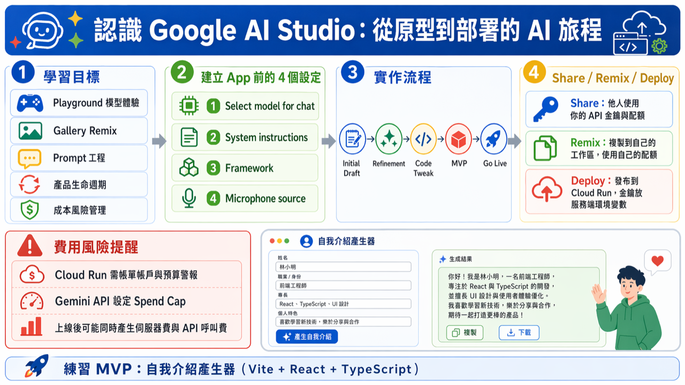
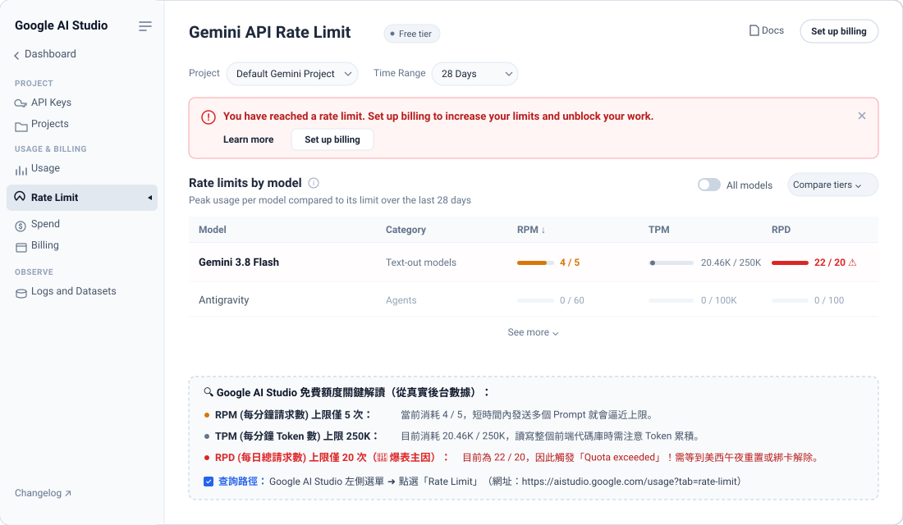

# 🚀 認識 Google AI Studio：從原型到部署的 AI 旅程

歡迎來到 Google AI Studio 的實作課程！本單元將帶領你認識 Google 最強大的 AI 工作臺——Gemini AI Studio。在這裡，你將學會如何從一個簡單的文字提示（Prompt）開始，快速迭代出 AI 應用原型（Prototype），直到最終可以考慮部署到實際的服務環境。

---

## 💡 本單元學習目標 (What You Will Learn)

完成本單元後，你將能夠：

*   **掌握 Playground**：了解 Google 提供的各種模型（包括免費與付費資源）的基礎用法與性能差異。
*   **探索 Gallery**：瀏覽和快速「混搭 (Remix)」業界頂尖的 AI 應用範例，學習不同模型如何應用。
*   **精通 Prompt 工程**：透過反覆迭代，學會如何精準地指導 AI 產出符合預期的結果。
*   **理解 AI 產品生命週期**：區分 Share、Remix 與 Deploy 的不同意義，了解應用程式從個人原型到公開服務的完整流程。
*   **風險管理意識**：建立對雲端服務（Google Cloud Run）和 API 費用（Gemini Spend Cap）的敏銳感知，有效控制成本。

---


## 🛠️ 實作準備：認識 Google AI Studio 介面與設定

進入 [Google AI Studio (https://aistudio.google.com/)](https://aistudio.google.com/) 後，點擊左側「**+ New app**」，你會看到建立專案的首頁介面（**Build your ideas with Gemini**）。在開始建立前，有兩大極為關鍵的操作細節必須掌握：

### 1. ⚙️ 右上角進階設定 (Advanced Settings)

在尚未輸入 Prompt 前，可點擊右上角的 **齒輪 ⚙️ 圖示** 開啟「Advanced settings」面板確認或自訂設定：
*   **Select model to use in Chat**：選擇 AI 模型，預設為最新高速模型 **Default (Gemini 3.8 Flash)**。
*   **Framework**：選擇應用程式的開發框架，建議使用 **React**。
*   **System instructions**：輸入全域系統指令或角色風格（例如：`Custom instructions` 中設定 `所有回覆請使用繁體中文`）。
*   **Usage**：檢視目前配額狀態（如 `Free requests` 免費版層級）。
*   **Microphone source**：若需要語音輸入功能可設定麥克風來源。

### 2. ⚠️ 重要限制：建立 App 時的檔案上傳支援規格

在首頁輸入框左下角的「**`+`**」按鈕中，提供了 `Import from GitHub`、`Drive`、`Upload Files`、`Camera` 等選項。請務必注意：

> 🚨 **極重要觀念**：  
> **初始建立 App 的對話框上傳（Upload Files），目前只支援「純文字檔案」（如 `.txt`、`.md`、`.csv`、代碼檔）與「圖片檔案」（如 `.jpg`、`.png`、`.webp`、`.svg`）！**  
> ❌ **無法直接上傳 Word (`.docx`)、Excel (`.xlsx`)、PowerPoint (`.pptx`) 等 Office 二進位檔案！**  
> - 如果你有現成的 Word 規格書、Excel 報表或 PPT 簡報想提供給 AI 參考，**請務必先將內容轉存為 Markdown (`.md`)、CSV (`.csv`)、純文字 (`.txt`) 或截圖圖片**，再提供給 AI 讀取；或者直接複製文字內容貼入 Prompt 提示詞中。

---

## 🗺️ 實作流程地圖：專案建立與 Integrations 的極速啟用

很多初學者常困惑：「*為什麼我在首頁找不到 Integrations（整合）面板？*」  
這是因為 **Google AI Studio 的功能面板是「兩階段」的**，而且**具備超聰明的「對話框自動啟用整合」機制**：

```
【階段一：首頁建立】                        【階段二：專案工作區（對話框自動提示）】
輸入 RTCCF 提示詞 ──► 點擊發送生成專案 ──► 進入 App 預覽與對話工作區
(右上角可先調齒輪設定)                      
                                                      ▼
                                           💡 對話框自動跳出整合確認卡片：
                                           「I accept, continue to enable Google Sheets」
                                           ──► 直接點擊卡片完成授權，自動啟用！
                                           (無需手動至右側 Integrations 面板尋找)
```

1.  **專案生成 (Initial App Creation)**：在首頁對話框「Describe an app and let Gemini do the rest」貼入 Prompt，讓 Gemini 建立專案並進入應用程式開發工作區（Code & Preview）。
2.  **一鍵確認啟用整合 (In-Chat Auto Enable)**：
    *   只要你的 Prompt 中有明確提及需要使用 Google Sheets、Google Calendar 或 Firebase 等原生整合，**Gemini 生成時會在對話框中自動跳出「`I accept, continue to enable [服務名稱]`」的確認卡片**。
    *   **直接點擊該卡片**，即可自動完成授權並啟用該項整合，完全不需要手動進入右側側邊欄！
    *   *(備援方式：若對話未跳出提示，亦可在專案右側側邊欄的 `Integrations` 標籤頁中手動點擊 Enable)*。
3.  **迭代與除錯 (Refinement & Code)**：在畫面中進行即時預覽測試，或在對話框中發送修改指令調整功能。
4.  **發布上線 (Publish)**：在右側面板切換至 **`Publish`**，一鍵將全端網頁部署至 **Google Cloud Run**！

---

## 🔗 核心概念解析：Share, Remix, Publish (Deploy)

這三個操作決定了你的應用程式的「使用權」和「維護權」。許多人常混淆它們對 **API 金鑰與費用責任** 的影響，請務必釐清以下核心差異：

*   **🌐 Share (在 AI Studio 內分享連結)**：
    *   **行為**：你透過右上角的 **Share** 按鈕，產生一個專案或 Prompt 模板的連結分享給同學、助教或朋友。
    *   **金鑰與費用真相**：**完全不會洩漏你的 API 金鑰，也不會扣你的費用！**
        *   對方點開連結時，必須登入他自己的 Google 帳號。
        *   對方看到的是你的提示詞與設定範本，當對方在自己的畫面上按下「Run」測試時，消耗的是**「對方自己帳號的配額 / 對方自己的金鑰」**。
*   **🔄 Remix (複製/分叉專案)**：
    *   **行為**：將別人分享出來的專案或公開 Gallery 範本「分叉（Fork/Copy）」一份到自己的工作區進行二次修改。
    *   **費用責任**：這完全變成你帳號下的獨立專案，執行與調整時**使用你自己的配額與金鑰**。
*   **🚢 Publish / Deploy (部署為獨立公開網站)**：
    *   **行為**：在 Build Mode 中點擊 **Publish**（火箭圖示），一鍵將應用程式打包並發布至 **Google Cloud Run**，產生一個全世界任何人不用登入 AI Studio 就能直接瀏覽的獨立 Web App 網址。
    *   **費用責任（⚠️ 真正會花你錢的是這裡）**：
        *   因為這是一個獨立對外服務的網站，網站後端使用的是**你部署時所綁定的雲端資源與 Gemini API 金鑰**。
        *   因此，外部一般訪客進入該網站點擊操作時，**產生的 API 呼叫費與雲端伺服器運行費，將由身為開發者/擁有者的「你」全權負擔**！
    *   **金鑰安全隔離**：部署後的服務會透過伺服器端環境變數與 App Proxy 自動保護 Gemini API Key，不會在前端原始碼中洩漏。
    *   **GitHub 雙向同步 (Two-way sync)**：最新版本支援與 GitHub 儲存庫雙向連結，可直接將 AI Studio 產出的程式碼 Push 到 GitHub，或自本地編輯後 Pull 同步回 AI Studio 繼續迭代。

---

## ⚠️ 極重要！2026 最新規範、部署與費用風險管理 (Rules & Cost Management)

Google AI Studio 與 Gemini API 近期進行了重大的規則升級與架構調整，從「原型實驗室」走向「正式產品」前，請務必掌握以下五大關鍵變動：

### 1. ☁️ 部署等級變革：新增 Google Cloud Starter Tier
*   **🆓 Starter Tier（初學者零門檻部署）**：
    *   **免綁信用卡**：過去部署至 Cloud Run 必須綁定 GCP 帳單帳戶，現在只要符合資格（未曾綁定過 GCP 付費帳戶之個人帳號），可享有 **最多免費部署 2 個全端應用程式**。
    *   **限制**：服務會部署在 Google 指定的預設區域（如 `us-west1`），且不得為 Workspace 企業/校園授權帳號。
*   **💼 Standard Tier（標準部署）**：
    *   若帳號已啟用 GCP 帳單，或需部署超過 2 個應用程式，則走標準 Cloud Run 部署流程，由你的 Google Cloud 帳單計費。
    *   **預防措施**：使用 Standard Tier 強烈建議立即至「Google Cloud -> 帳單 -> 預算與警告」設定預算警報。系統會發信警示超標，但**不會自動暫停服務**。

### 2. 🛡️ 服務條款、年齡限制與資料隱私規範 (Terms & Privacy)
*   **商業與專業開發定位**：官方最新服務條款明訂 Google AI Studio 與 Gemini API 專為專業開發者與商業產品原型設計，非一般終端消費者工具。
*   **年齡限制嚴格要求**：使用者必須年滿 **18 歲**；嚴格禁止建構專門針對 18 歲以下未成年人使用的應用程式。
*   **資料隱私與模型訓練（關鍵差異！）**：
    *   **免費層 (Free Tier)**：你的 Prompt 輸入與生成內容，**可能會被 Google 人工審查員檢視，並用於後續模型訓練與產品改善**。⚠️ **切勿在免費版輸入公司機密、客戶隱私或敏感個資！**
    *   **付費層 (Paid Tier)**：Google 承諾**不會**將付費使用者的數據用於訓練模型，僅作短暫濫用偵測記錄。
    *   **歐盟/英國/瑞士地區限制**：若服務對象涵蓋 EEA、英國或瑞士地區，依規必須切換至付費服務（Paid Tier）。

### 3. 🤖 計費模式更新 (Prepay / Postpay & Spend Cap)
*   **計費架構轉型**：已全面導入 **Prepay（預付儲值）** 與 **Postpay（後付月結）** 彈性機制。
*   **Gemini API 費用上限 (Spend Cap)**：
    *   使用付費 API 金鑰時，**強烈建議在 Dashboard 設定「每月支付上限」（Spend Cap）**（路徑：「Google AI Studio -> Dashboard -> Spend」）。
    *   一旦當月呼叫金額達到上限，金鑰會自動暫停，防止因程式無窮迴圈或惡意流量刷爆帳單。

### 4. ⚡ 配額機制與「Quota exceeded」排查指南 (Rate Limits & Quota)

在 Google AI Studio 中使用免費帳號（Free Tier）時，系統針對每個專案設有三大維度的速率保護：
*   **RPM (Requests Per Minute)**：每 60 秒內的 API 請求次數上限（免費版通常為 **10 ~ 15 RPM**）。
*   **TPM (Tokens Per Minute)**：每分鐘處理的文字與代碼 Token 總量上限（免費版通常為 **1,000,000 TPM**）。
*   **RPD (Requests Per Day)**：每日總請求數上限（免費版通常為 **1,500 RPD**，部分實驗性或大模型更低），於**太平洋時間午夜（台灣時間約下午 3:00~4:00）**重置。
*   **全球共享算力池 (Shared Capacity)**：免費層資源由全球開發者共用，尖峰時段系統會動態調節單一專案的軟性配額。

#### ❓ 為什麼會看到「`⚠️ Quota exceeded. Please try again later.`」？
當你看到畫面標註 `Ran for 500s+`（模型在背景自動連續執行、讀取代碼並反覆修改多個檔案長達數分鐘），表示 AI 在短時間內發送了非常多次內部推理請求。這極容易在一分鐘內瞬間**衝破 RPM 或 TPM 門檻**，因而觸發暫時性限流！

#### 🔍 如何查看你目前帳號的最新免費額度與使用狀況？
Google 官方會依據模型更新與伺服器承載動態調整額度，請透過以下方式查看最新即時數據：
1.  **直接開啟配額控制台（最快 ⚡）**：  
    瀏覽器直接造訪 👉 **[https://aistudio.google.com/usage?tab=rate-limit](https://aistudio.google.com/usage?tab=rate-limit)**
2.  **從 AI Studio 導覽列進入**：  
    點選左側選單的 **`Dashboard`**（或左下角 ⚙️ 設定圖示），切換至 **Rate Limits** 標籤頁，即可一覽所有模型的 RPM、TPM、RPD 數值與目前剩餘配額。
3.  **從 App 建立畫面查看**：  
    點擊右上角齒輪 ⚙️ **Advanced settings**，在 **Usage (Free requests)** 區塊右側點擊小齒輪圖示，直接連至配額儀表板。
4.  **Google Cloud Console 完整監控**：  
    造訪 [GCP 配額頁面](https://console.cloud.google.com/iam-admin/quotas)，搜尋 `Generative Language API`，可查閱詳細使用折線圖。

#### 📸 官方 Rate Limit 儀表板與真實超標畫面解析



> 💡 **從真實後台數據看最新限制（Gemini 3.8 Flash 免費層）**：  
> - **RPM（每分鐘請求數）**：上限為 **5 次**（截圖中當前達 `4 / 5` 橙色預警）。
> - **TPM（每分鐘 Token 數）**：上限為 **250K**（當前達 `20.46K / 250K`）。
> - **RPD（每日總請求數）**：上限為 **20 次**！截圖中數值已達 **`22 / 20` 鮮紅超額**，這正是系統跳出 `You have reached a rate limit` 與 `Quota exceeded` 的真正核心原因！

#### 🛠️ 遇到 Quota exceeded 的 4 大應對 SOP：
1.  **靜置 1 ~ 3 分鐘再重試（90% 立即解決）**：  
    短時間內衝破的 RPM/TPM 屬於「滑動時間窗口（Rolling Window）」，只要停手稍等 1~3 分鐘，每分鐘額度就會自動釋放，即可繼續操作。
2.  **使用 Checkpoint 還原（Restore）**：  
    若模型跑了數百秒卡在代碼修改迴圈中，點擊右下角的 **`[↩️ Restore]`** 回復到前一個乾淨的 Checkpoint，避免無窮重試消耗額度。
3.  **分步驟提示，降低單次 Token 暴衝**：  
    避免一次丟出包含十幾個複雜功能的龐大 Prompt。建議採用「先搭好前端骨架 ➜ 再請 AI 串接特定服務」的分段迭代模式。
4.  **升級為 Pay-as-you-go（徹底擺脫限流與尖峰排隊）**：  
    點選左下角 **`Upgrade to unlock more`** 綁定 GCP 帳單帳戶：
    *   **費用極其低廉**：Flash 模型每次代碼修正通常僅耗費 **$0.0001 ~ $0.001 美元**（不到台幣幾毛錢）。
    *   **專屬獨立保障算力**：RPM/TPM 配額暴增數倍，且享有最高穩定度，不再與免費使用者擠共享算力池。
    *   **安全防爆表**：可至 `Dashboard -> Spend` 設置「每月支付上限（Spend Cap，例如設 $5 美元）」，完全零風險。

### 5. 💰 雙重費用來源總結（Standard Tier 上線時）
*   一旦專案以標準付費架構成功上線，費用包含兩部分：
    1.  **Google Cloud Run 伺服器運算費用**（依據 CPU、記憶體與請求時間計費，具縮容至 0 的省錢特性）。
    2.  **Gemini API 呼叫費用**（依據 Input/Output Tokens 與快取狀態計費）。

---

## 🎯 練習目標：從 Prompt 訓練模型到完成 MVP

在這個練習中，我們的目標是利用 Google AI Studio 的 Prompt 功能，生成一個可部署的前端 MVP（以 Vite + React + TypeScript 為例），並學會如何透過指令精準地控制複雜的輸出結構。

### 🏆 練習 Prompt（自我介紹產生器｜Share / Deploy 練習用）

```
請用 vite-react-typescript 做單一網頁：
1. App 名稱：「自我介紹產生器」。
2. 介面分成左右兩欄：左側輸入、右側輸出結果（RWD 手機版改成上下排列）。
3. 左側表單欄位：
   - 姓名（必填）
   - 身份（下拉：大學生 / 轉職中 / 在職進修 / 其他）
   - 興趣（文字輸入，逗號分隔）
   - 目標（文字輸入，例如：想應徵的職位 / 想達成的學習目標）
   - 語氣（下拉：正式 / 活潑 / 專業）
4. 按下「生成」後，請用 Gemini 產生以下三段內容並顯示在右側：
   - 100 字自我介紹（繁體中文）
   - 30 秒電梯簡報（繁體中文，口語自然）
   - 3 個面試官/助教可能會追問的問題（條列）
5. 右側每一段內容都要有「複製」按鈕，按下後會複製該段文字，並顯示成功提示。
6. 嚴格要求：不需使用任何後端服務。
7. 請提供完整的、可直接複製貼上的程式碼，並附帶簡潔的介面操作說明。
```

> **說明（重要）**  

> 本章提供這個「自我介紹產生器」作為你第一次上手 Google AI Studio 的練習題，重點是讓你熟悉在 Google AI Studio 內：
>
> - 如何把你做好的內容 **Share** 給同學/助教/老師檢視  
> - 如何使用 **Deploy** 把成果部署出去，取得可對外使用/展示的連結  
