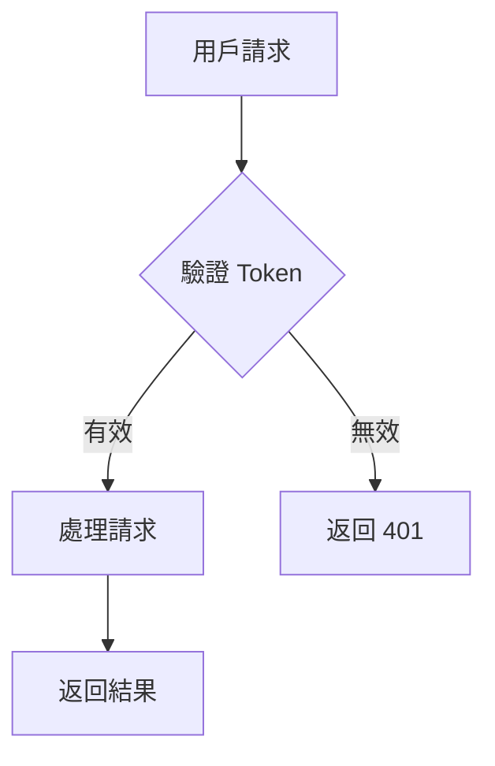

# 4.5 文檔生成 (docs)

## 簡介

良好的文檔是專案成功的關鍵，但撰寫和維護文檔往往是開發者最不喜歡的任務。Claude Code CLI 能夠自動為你的代碼生成清晰、完整的文檔，包括 API 文檔、使用指南、註解等。

透過 Claude 的協助，你可以輕鬆維護高品質的文檔，讓團隊成員和使用者更容易理解和使用你的代碼。

## 基本用法

### 生成代碼註解

```bash
# 為單一檔案添加註解
claude "為 calculator.js 中的所有函數添加 JSDoc 註解"

# 為整個目錄添加註解
claude "為 src/utils 下的所有檔案添加註解"
```

### 生成 README

```bash
# 生成專案 README
claude "為這個專案生成 README.md，包含：
- 專案簡介
- 安裝步驟
- 使用範例
- API 說明"

# 生成模組 README
claude "為 src/auth 模組生成 README"
```

### 生成 API 文檔

```bash
# 自動生成 API 文檔
claude "根據 Express 路由生成 API 文檔"

# 生成 OpenAPI/Swagger 規格
claude "生成 OpenAPI 3.0 規格檔案"
```

## 文檔類型

### 1. 程式碼內註解

#### JSDoc (JavaScript/TypeScript)

```bash
claude "添加 JSDoc 註解"
```

**生成範例：**
```javascript
/**
 * 計算兩個數字的總和
 * @param {number} a - 第一個數字
 * @param {number} b - 第二個數字
 * @returns {number} 兩數之和
 * @throws {TypeError} 當參數不是數字時
 * @example
 * add(2, 3); // 返回 5
 */
function add(a, b) {
  if (typeof a !== 'number' || typeof b !== 'number') {
    throw new TypeError('參數必須是數字');
  }
  return a + b;
}
```

#### Docstring (Python)

```bash
claude "為 Python 函數添加 docstring"
```

**生成範例：**
```python
def calculate_discount(price, discount_rate):
    """
    計算折扣後的價格

    Args:
        price (float): 原始價格
        discount_rate (float): 折扣率 (0-1 之間)

    Returns:
        float: 折扣後的價格

    Raises:
        ValueError: 當折扣率不在 0-1 範圍內時

    Examples:
        >>> calculate_discount(100, 0.2)
        80.0
    """
    if not 0 <= discount_rate <= 1:
        raise ValueError("折扣率必須在 0-1 之間")
    return price * (1 - discount_rate)
```

#### JavaDoc (Java)

```bash
claude "添加 JavaDoc 註解"
```

### 2. API 文檔

#### REST API 文檔

```bash
claude "生成 REST API 文檔，包含：
- 所有端點
- 請求/回應格式
- 狀態碼說明
- 範例請求"
```

**生成範例：**
```markdown
## User API

### GET /api/users
獲取所有用戶列表

**參數**
- `page` (number, optional): 頁碼，預設為 1
- `limit` (number, optional): 每頁筆數，預設為 10

**回應**
```json
{
  "users": [
    {
      "id": 1,
      "name": "John Doe",
      "email": "john@example.com"
    }
  ],
  "total": 100,
  "page": 1
}
```

**狀態碼**
- 200: 成功
- 400: 參數錯誤
- 500: 伺服器錯誤
```

#### OpenAPI/Swagger

```bash
claude "生成 OpenAPI 3.0 規格"
```

**生成範例：**
```yaml
openapi: 3.0.0
info:
  title: User API
  version: 1.0.0
paths:
  /api/users:
    get:
      summary: 獲取用戶列表
      parameters:
        - name: page
          in: query
          schema:
            type: integer
      responses:
        '200':
          description: 成功
          content:
            application/json:
              schema:
                type: object
                properties:
                  users:
                    type: array
```

### 3. 使用指南

#### 快速開始指南

```bash
claude "生成快速開始指南，包含：
- 環境需求
- 安裝步驟
- 基本設定
- Hello World 範例"
```

#### 教學文件

```bash
claude "生成詳細教學，教導如何：
1. 建立新專案
2. 配置設定
3. 實作基本功能
4. 部署到生產環境"
```

### 4. 架構文檔

```bash
claude "生成架構文檔，包含：
- 系統架構圖
- 模組說明
- 資料流程
- 技術選型說明"
```

### 5. 變更日誌 (CHANGELOG)

```bash
# 根據 git commits 生成
claude "根據 git commit 歷史生成 CHANGELOG.md"

# 手動更新
claude "更新 CHANGELOG，新增版本 2.0.0 的變更記錄"
```

**生成範例：**
```markdown
# Changelog

## [2.0.0] - 2024-01-15

### Added
- 新增用戶權限系統
- 支援 OAuth 2.0 登入

### Changed
- 改善 API 回應格式
- 更新相依套件

### Fixed
- 修復登入 token 過期問題
- 修正資料庫連線池洩漏

### Deprecated
- `getUserInfo()` 已棄用，請使用 `getUser()`
```

## 實用範例

### 範例 1：完整專案文檔

```bash
claude "為整個專案生成完整文檔，包含：
1. README.md - 專案概述
2. docs/API.md - API 文檔
3. docs/CONTRIBUTING.md - 貢獻指南
4. docs/DEPLOYMENT.md - 部署指南
5. CHANGELOG.md - 版本變更記錄"
```

### 範例 2：元件文檔

```bash
# React 元件
claude "為 Button 元件生成文檔，包含：
- Props 說明
- 使用範例
- 樣式客製化方法
- Storybook stories"
```

### 範例 3：函式庫文檔

```bash
claude "為這個工具函式庫生成文檔網站，使用 VuePress"
```

### 範例 4：資料庫結構文檔

```bash
claude "根據 Mongoose schema 生成資料庫結構文檔"
```

## 文檔格式

### Markdown

```bash
# 標準 Markdown
claude "生成 Markdown 格式的文檔"

# GitHub Flavored Markdown
claude "使用 GitHub Markdown 語法"
```

### HTML

```bash
# 靜態 HTML
claude "生成 HTML 格式的 API 文檔"

# 使用文檔生成器
claude "用 JSDoc 生成 HTML 文檔"
```

### PDF

```bash
claude "生成 PDF 格式的技術文檔"
```

## 自動化文檔

### 持續更新

```bash
# Git hook - 每次 commit 前更新文檔
claude "建立 pre-commit hook，自動更新文檔註解"

# CI/CD 整合
claude "建立 GitHub Action，自動生成並發布文檔"
```

### 版本管理

```bash
# 為不同版本維護文檔
claude "建立文檔版本控制系統，支援多版本文檔"
```

## 文檔網站生成

### VuePress

```bash
claude "用 VuePress 建立文檔網站"
```

### Docusaurus

```bash
claude "用 Docusaurus 建立文檔網站，包含：
- 多版本支援
- 搜尋功能
- 深色模式"
```

### GitBook

```bash
claude "整理現有文檔，轉換為 GitBook 格式"
```

### Storybook (元件文檔)

```bash
claude "為 React 元件生成 Storybook stories"
```

## 最佳實踐

### 1. 保持文檔與代碼同步

```bash
# 每次修改代碼時更新文檔
git add src/api/user.js
claude "更新 user.js 的文檔註解"
git add docs/API.md
```

### 2. 使用範例

```bash
claude "在文檔中加入實際可運行的範例"
```

### 3. 提供視覺化元素

```bash
# 生成圖表
claude "生成架構圖的 Mermaid 語法"

# 生成流程圖
claude "為這個流程生成流程圖"
```

**範例：**
```markdown

```

### 4. 分層文檔

- **新手文檔**: 快速開始、基本概念
- **開發者文檔**: API 參考、進階主題
- **維護者文檔**: 架構、部署、故障排除

### 5. 可搜尋性

```bash
claude "建立文檔索引，方便搜尋"
```

## 文檔檢查清單

建立文檔時確保包含：

- [ ] 清晰的標題和描述
- [ ] 安裝/使用步驟
- [ ] 實際範例
- [ ] 參數/回傳值說明
- [ ] 常見問題 FAQ
- [ ] 錯誤處理說明
- [ ] 版本資訊
- [ ] 授權資訊
- [ ] 貢獻指南
- [ ] 聯絡方式

## 文檔品質指標

| 指標 | 說明 | 目標 |
|------|------|------|
| 覆蓋率 | 有文檔的公開 API 百分比 | > 90% |
| 範例數量 | 每個 API 的範例數量 | ≥ 1 |
| 新鮮度 | 文檔更新與代碼修改的時間差 | < 1 天 |
| 可讀性 | 文檔的易讀性評分 | > 60 |

## 常見問題

### Q: 需要為所有函數寫文檔嗎？
A: 至少為公開 API 提供文檔。私有函數如果邏輯複雜也應該加上註解。

### Q: 文檔應該多詳細？
A: 足夠讓不熟悉代碼的人能理解和使用。包含參數、回傳值、範例和注意事項。

### Q: 如何保持文檔更新？
A: 將文檔納入開發流程，code review 時也檢查文檔，使用自動化工具輔助。

### Q: 英文還是中文文檔？
A: 如果專案是開源的，建議英文。內部專案可以用團隊熟悉的語言。

## 小技巧

1. **用範例說話**：一個好的範例勝過千言萬語
2. **保持簡潔**：避免冗長的描述，直接切入重點
3. **使用清單**：步驟和選項用清單呈現更清楚
4. **加入搜尋**：文檔多時一定要有搜尋功能
5. **定期審查**：每季度審查一次文檔，移除過時內容

## 延伸閱讀

- [6.4 建立文檔](../chapter6/6.4-documentation.md) - 實戰練習
- 《Writing Great Documentation》
- [Write the Docs](https://www.writethedocs.org/)

---

⏳ 內容持續補充中

## 導航

- **上一節**: [4.4 測試生成](./4.4-testing.md)
- **下一節**: [4.6 批次處理功能](./4.6-batch-processing.md)
- **返回章節目錄**: [第四章目錄](./README.md)
- **返回首頁**: [教材首頁](../../README.md)
