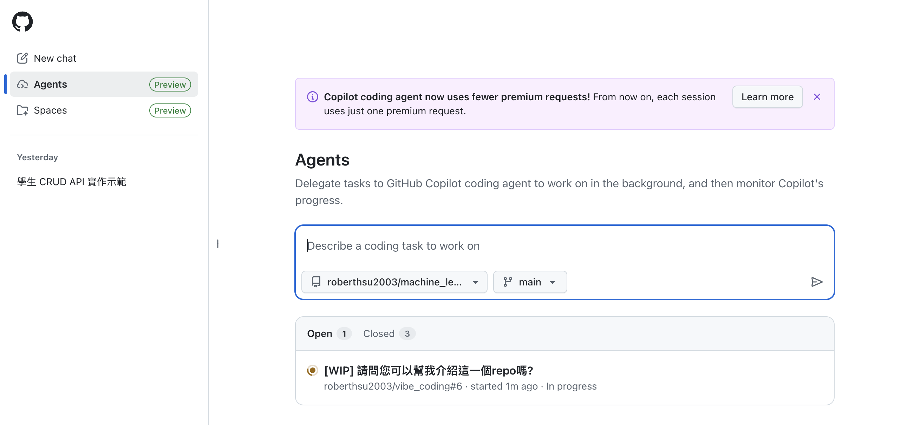

# GitHub Copilot Coding Agent
**自動修Bug,寫測試,拉PR**


## 什麼是Coding Agent

- 讓GitHub Copilot在背景中獨立執行任務
	- 修復錯誤
	- 實作漸進式新功能
	- 提升測試覆蓋率
	- 更新文件處理


| 功能 | Copilot in the editor | Copilot coding agent |
|--- |--- |--- |
| 介面 | 開發工具(code editor)  | issues 與 Pull Requests |
| 工作範圍 | 本地檔案 | 儲存庫 |
| 使用方式 | inline code suggestions chat view | issue指派 |
| 客製化 | Custom instructions | Custom instructions |
| MCP Support | Yes | Yes |
| Vibe Coding | Yes | Yes |


## Coding Agent 優勢

**傳統方式(IDE AI 助手)**

- AI 助手在本地同步運行
- 屬於GitHub Copilot Edits功能
- 所有步驟(建立分支, 撰寫commit, 建立PR等)需手動完成
- 協作透明度低、開發記錄難以追蹤

**Coding Agent**

- 所有操作都透過GitHub網站進行(自動建立分支、提交、PR)
- 在GitHub Actions的沙箱環境中運作
- 開發歷程可追溯，紀錄完整
- 開發者僅需審查與指導Copilot,即可完成任務
- 團隊更容容參與協作

## Coding Agent如何將任務交給Copilot

- 網頁上指派Issue給Copilot-[演示1](#演示1流程)
- 要求Copilot建立Pull Request(PR)
	- 網頁上GitHub的Agents頁面-會對整個repo處理-[演示2](#演示2流程)
	- 網頁上GitHub的chat頁面-可指定repo內的特定資料夾處理 [演示3](#演示3流程)
	- 支援GitHub MCP Server的IDE



### 演示1流程:
1. 進入vibe_coding的repo
2. 建立一個issue

	```
	介紹這一個repo嗎?
	
	- 請建立markdown格式
	```
	
3. 指派給copilot
4. 會自動建立一個PR和一個分支
5. 在PR內可以點選[view session]->了解copilot做了那些事情
6. 刪除分支,close pr,close issue回覆原狀

### 演示2流程:
1. 進入至Agents的網頁頁面
2. 選擇vibe_coding的repo
3. 詢問:
	
	```
	可以幫我介紹這一個repo嗎?
	```

 4. 會自動建立一個名為`copilot/fix-xxxx`的分支,此分支會建立一個PR
 5. 進入vibe_coding的repo
 6. 檢查pull request
 7. 刪除分支,回覆原狀

### 演示3流程:

- [演示專案-使用專案範例1](../../vibe_coding範例樣版)
- GitHub的chat內指定vibe_coding的repo
- 並且指定工作目錄
- 工作目錄內可以增加AGENTS.md
- 依專案範例1內容詢問
- 刪除分支,回覆原狀

---

## Coding Agent 使用情境與成本
**使用情境**
- 將backlog中簡單的需求交給Copilot,節省時間處理更複雜的任務
- 委派Copilot處理改善程式品質的任類(如重構、增加紀錄)
- Copilot可先啟動任務,您再接手處理細節
- 可快速建立專案架構,節省重複勞動時間

**Coding Agent會消耗**
- GitHub Actions 執行時間
- Copilot Premium請求數量
