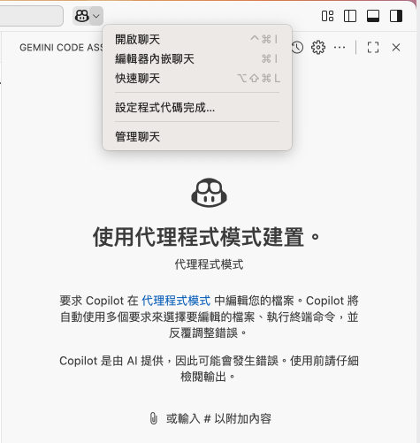
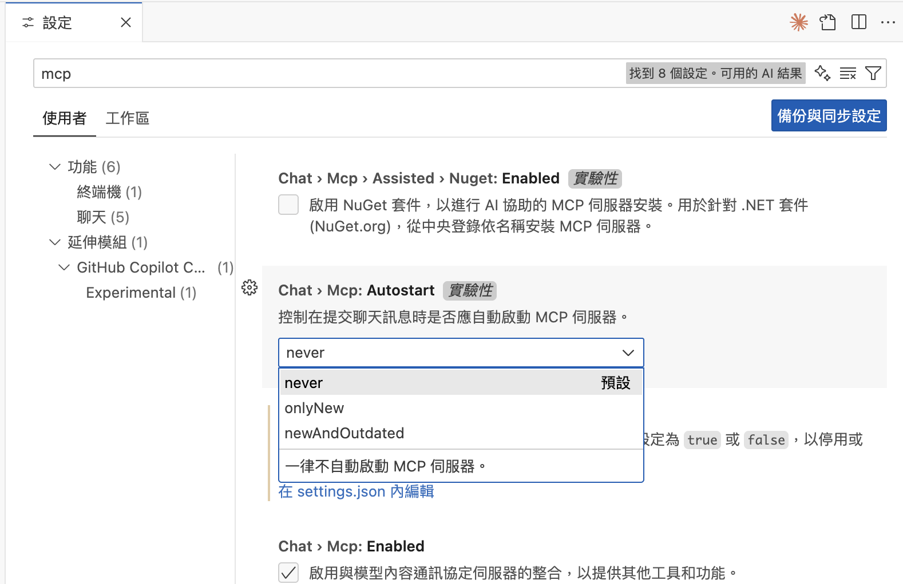
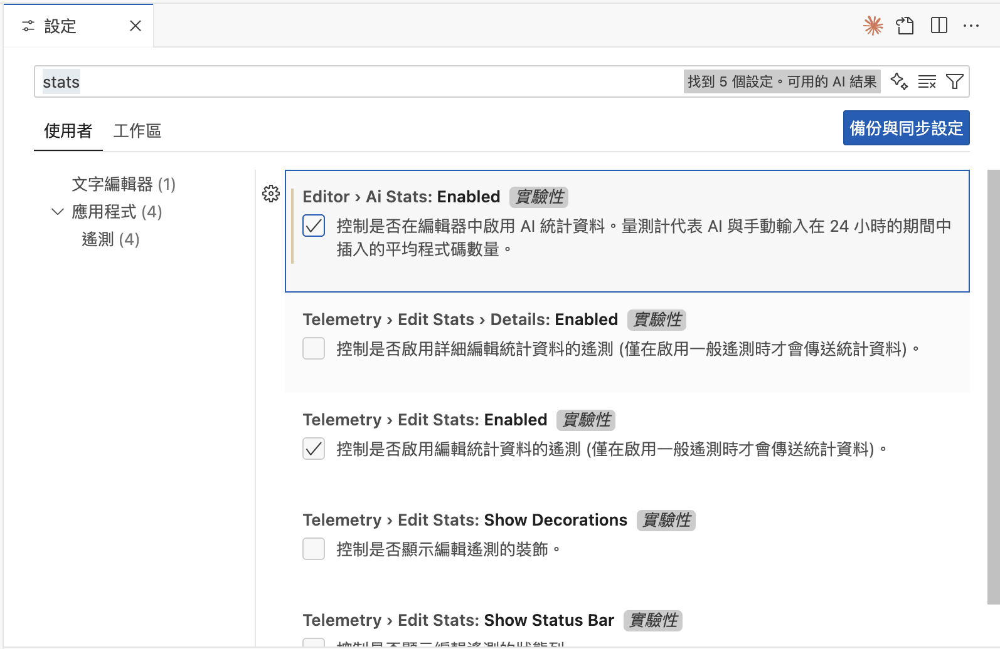
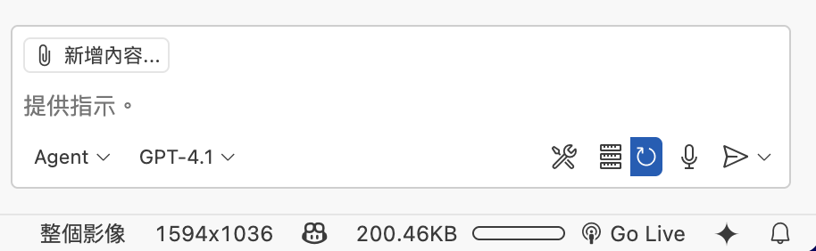
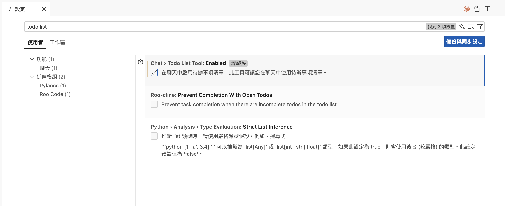

# Github_Copilot實用小功具
- [設定位置-開啟方式](#設定位置-開啟方式)
- [MCP自動開啟](#MCP自動開啟)
- [AI Stats(AI統計)](#AI-Stats(AI統計))
- todolist(觀察任務拆解和執行狀況)
- UI Integration(整合Github Copilot Coding Agent)
- agent_session(查看Github Coding Agent工作流程)

## 設定位置-開啟方式

上面`github copilot 按鈕`->`設定程式代碼完成`->`Edit Setting`

---

## MCP自動開啟

### 設定步驟

1. 搜尋關鍵字`mcp`
2.Chat > Mcp:Autostart

---

## AI Stats(AI統計)

- 統計使用AI的狀態

### 設定步驟

1. 搜尋關鍵字`stats`
2. Editor > Ai Stats:Enabled

## todolist

觀察任務拆解和執行狀況

### 設定步驟

1. 搜尋關鍵字`todo list`
2. Chat> Todo List Tool:Enabled

### 範例實作
- 專案:fastAPI基本樣版
- 工作目錄:[專案範例](./專案目錄)
- 工作主程式:main.py
- 執行開發命令: fastapi dev main.py
- prompt:`我要增加一個講師的CRUD功能`

