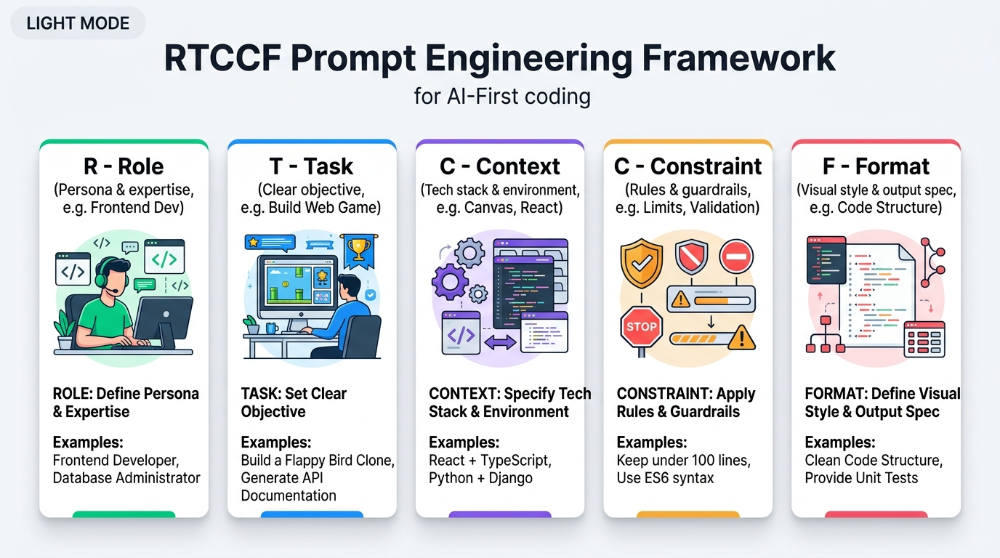

# AI First 提示詞（Prompt）與 Vibe Coding 實戰指南

在 **AI First 的 Vibe Coding（直覺式 AI 編程）** 時代，你與 AI 溝通的指令結構，直接決定了 AI 產出程式碼的品質與系統穩定度。

很多人以為跟 AI 溝通就像隨便傳訊息，但隨興的口語指令往往會導致 AI 漏掉規則、介面陽春、程式碼難以維護。本章節將幫助你掌握**結構化提示詞的核心技巧**，從提示詞結構、系統提示詞、到不知如何下筆時的解決方法，全面提升你的 AI 協作效率。

---

## 一、 內容格式：從自然語言到 Markdown 結構化

### 1. 自然語言（口語式）
- **特點**：想到什麼說什麼，沒有層次與規範。
- **問題**：需求複雜時容易變成流水帳，AI 容易忽略邊界條件（如漏掉碰撞、缺乏重新開始、輸入防呆等）。
- **範例**：「*幫我寫一個猜數字遊戲，1 到 100，太大太小要提示，畫面好看一點。*」

### 2. Markdown 結構化格式（強烈推薦）
- **特點**：利用標題（`#`）、清單（`-`）、粗體（`**`）將需求拆解成如同「產品需求規格書（PRD）」的區塊。
- **優勢**：
  - **人機皆好讀**：人類一眼看懂，AI 的注意力機制（Attention）也能精準錨定各項規則。
  - **不易遺漏**：將角色、規則、技術棧與 UI 風格分區，大幅提高一次生成成功率（One-shot）。
  - **高度可重用**：樣板只要修改變數，即可套用到不同專案。

---

## 二、 提示詞黃金架構：RTCCF 框架

要寫出高品質的結構化 Prompt，最推薦採用 **RTCCF 框架**（五大要素）。你可以將它想像成由 5 塊精密模組拼裝而成的「軟體需求規格書」：




| 要素 | 英文 | 核心重點 | Vibe Coding 實戰應用 |
| :--- | :--- | :--- | :--- |
| **R – 角色** | Role | AI 的專家身份 | 設定為「資深前端工程師與 UI/UX 設計師」 |
| **T – 任務** | Task | 具體要完成的產出 | 「建立一個網頁版猜數字遊戲」 |
| **C – 背景** | Context | 技術棧與執行環境 | 「使用 Vite + React + TypeScript」或「單一 HTML/CSS/JS」 |
| **C – 限制** | Constraint | 遊戲規則、邊界條件、防呆 | 「最多猜 7 次」、「禁止使用外部肥大套件」、「需有防呆驗證」 |
| **F – 格式** | Format | 視覺風格與程式結構 | 「Dark Mode 暗色系」、「繁體中文註解」、「邏輯與渲染分離」 |

### 💡 RTCCF Markdown 快速通用樣板

```markdown
# 角色 (Role)
你是一位……（例如：資深前端工程師、遊戲開發專家）。

## 任務目標 (Task)
請幫我建立……（例如：經典貪食蛇遊戲）。

## 背景情境 (Context)
- 開發環境 / 技術棧：……（例如：HTML5 Canvas、Vanilla JS）
- 目標對象：……

## 核心規則與限制 (Constraints)
1. 核心流程：……
2. 限制與條件：……（字數、生命次數、特定限制）
3. 邊界防呆：……（錯誤輸入處理、重新開始機制）

## 輸出規格與風格 (Format)
- UI/UX 風格：……（例如：現代暗色系、卡片式設計、流暢過渡動畫）
- 程式碼規範：提供完整可運行的程式碼，包含清晰的繁體中文註解。
```

---

## 三、 系統提示詞（System Prompt）vs 使用者提示詞（User Prompt）

在 Google AI Studio、ChatGPT 或開發 AI 應用時，常會看到 **System Prompt（系統提示詞 / Instructions）**。

| 比較項目 | 系統提示詞（System Prompt） | 使用者提示詞（User Prompt） |
| :--- | :--- | :--- |
| **比喻** | 老闆給員工的「工作守則 / 開機設定」 | 今日收到的「具體待辦任務」 |
| **設定時機** | 對話開始前就事先固定好 | 每次對話時由使用者輸入 |
| **主要功能** | 固定 AI 的角色、說話風格、禁忌與程式碼規範 | 提出當下想要解決的具體問題 |

### 🛠️ Vibe Coding 推薦的系統提示詞範例
如果你在 Google AI Studio 或 Cursor 開發，可以將這段設定為 System Prompt：
```text
你是一位頂尖的資深全端工程師與 UI/UX 大師。
請遵循以下規則：
1. 一律使用繁體中文回覆與註解。
2. 產出的程式碼必須完整、現代化、具備優秀的錯誤處理。
3. 介面設計優先採用現代質感風格（如深色模式、細緻微動畫、符合人因工程的間距）。
4. 避免過度冗長的客套話，直接給出清晰的技術解釋與可運行的程式碼。
```

---

## 四、 提示詞不知道怎麼寫？兩大破局解法

當你面對空白輸入框毫無頭緒，不知道如何下手時，**不要自己硬想，請直接讓 AI 幫你寫！**

### 解法 1：請 AI 直接產生 RTCCF 樣版
將你模糊的想法告訴 AI，要求它直接產出一份標準的 RTCCF Markdown 樣版，你只要「填空」即可。

> 💬 **你可以這樣下指令**：  
> 「我想做一個【請填入你的目標，例如：反應力測試小遊戲】，請使用 **RTCCF (Role, Task, Context, Constraint, Format)** 的 Markdown 格式，為我產生一個結構完整的 Prompt 範本，保留需要我補充的欄位，讓我可以直接填空使用。」

---

### 解法 2：要求 AI 用「一問一答」的方式引導你
讓 AI 扮演產品經理或技術顧問，主動詢問你關鍵細節，最後自動組裝成專業 Prompt。

> 💬 **你可以這樣下指令**：  
> 「我想做一個【請填入你的目標，例如：打磚塊遊戲】，但我現在不確定 Prompt 該如何寫才完整。  
> 請以**一問一答**的方式引導我：每次只問我 1～2 個關鍵問題（例如技術選型、規則機制、視覺風格），等我回答後再問下一題。  
> 收集完所需資訊後，請直接幫我組合成一份專業的 **RTCCF Markdown 格式** Prompt。」

---

## 五、 🚀 課堂實戰：小遊戲提示詞練習（4 選 1）

在實務開發中，我們**不需要死背或硬想每一條提示詞**！請運用第四節所學的**「兩大破局解法」**，挑選以下 **4 個小遊戲** 其中 1 個，直接複製對應的發問 Prompt 貼給 AI（如 Google AI Studio），體驗讓 AI 協助你打造出專屬的完整規格！

---

### 1. [猜數字遊戲](../AIFirst實作課程/建立小遊戲/猜數字遊戲/README.md)
> 🎮 **簡介**：電腦隨機產生數字，玩家透過提示（太大、太小）猜出正確答案。

- **解法 1：向 AI 索取 RTCCF 填空樣板（複製後貼給 AI）**
  ```text
  我想用單一 HTML 檔案（內含 CSS 與 JavaScript）做一個具有現代質感的網頁版「猜數字益智遊戲」。請使用 RTCCF (Role, Task, Context, Constraint, Format) 的 Markdown 格式，為我產生一個結構完整的 Prompt 範本，保留需要我補充的欄位，讓我可以直接填空使用。
  ```

- **解法 2：讓 AI 用「一問一答」引導你（複製後貼給 AI）**
  ```text
  我想做一個網頁版「猜數字遊戲」，但我現在不確定 Prompt 要設定哪些規則和細節。請以一問一答的方式引導我：每次只問我 1～2 個關鍵問題（例如規則、次數限制、視覺風格），等我回答後再問下一題。最後再幫我組合成一份專業的 RTCCF Markdown Prompt。
  ```

---

### 2. [貪食蛇遊戲](../AIFirst實作課程/建立小遊戲/貪食蛇遊戲/README.md)
> 🎮 **簡介**：控制蛇移動吃食物成長，避免撞到牆壁或自己的身體。

- **解法 1：向 AI 索取 RTCCF 填空樣板（複製後貼給 AI）**
  ```text
  我想使用 HTML5 Canvas 與原生 JavaScript 開發經典的「網頁版貪食蛇小遊戲」。請使用 RTCCF (Role, Task, Context, Constraint, Format) 的 Markdown 格式，為我產生一個結構完整、包含碰撞檢測與計分機制的 Prompt 範本，保留需要我填空微調的欄位。
  ```

- **解法 2：讓 AI 用「一問一答」引導你（複製後貼給 AI）**
  ```text
  我想用 Canvas 寫一個「貪食蛇小遊戲」，但我不知道如何下精確的遊戲開發指令。請扮演資深遊戲開發顧問，用一問一答的方式引導我：每次只問我 1～2 個核心問題（例如畫布大小、控制方式、遊戲難度與視覺風格），等我回答後再問下一題，最後幫我產出標準的 RTCCF Markdown Prompt。
  ```

---

### 3. [反應力測試](../AIFirst實作課程/建立小遊戲/反應力測試/README.md)
> 🎮 **簡介**：看到訊號瞬間做出反應，精準測量人體反應毫秒數。

- **解法 1：向 AI 索取 RTCCF 填空樣板（複製後貼給 AI）**
  ```text
  我想製作一個測量點擊反應速度的「人體反應力測試」網頁小遊戲。請使用 RTCCF (Role, Task, Context, Constraint, Format) 的 Markdown 格式，為我產生一個清楚定義狀態機（等待、準備、點擊、結算）的 Prompt 範本，保留欄位讓我填空。
  ```

- **解法 2：讓 AI 用「一問一答」引導你（複製後貼給 AI）**
  ```text
  我想做一個「反應力測試」網頁工具，但不知道該如何規範防作弊機制與狀態轉換。請以一問一答的方式引導我：每次只問我 1～2 個關鍵問題（例如狀態流程、防作弊處罰、成績評級與畫面風格），等我回答後再問下一題，最後幫我組合成一份專業的 RTCCF Markdown Prompt。
  ```

---

### 4. [打磚塊遊戲](../AIFirst實作課程/建立小遊戲/打磚塊遊戲/README.md)
> 🎮 **簡介**：控制平台反彈球體，擊碎上方全部磚塊。

- **解法 1：向 AI 索取 RTCCF 填空樣板（複製後貼給 AI）**
  ```text
  我想使用 HTML5 Canvas 開發經典街機「打磚塊（Breakout）遊戲」。請使用 RTCCF (Role, Task, Context, Constraint, Format) 的 Markdown 格式，為我產生一個涵蓋滑塊操控、球體物理反彈、磚塊消除與生命機制的 Prompt 範本，方便我填空使用。
  ```

- **解法 2：讓 AI 用「一問一答」引導你（複製後貼給 AI）**
  ```text
  我想做一個網頁版「打磚塊遊戲」，但不知道如何向 AI 描述物理反彈角度與生命機制。請扮演資深前端遊戲工程師，用一問一答的方式引導我：每次只問我 1～2 個問題，循序漸進釐清各項功能與關卡設計，最後組合成一份高質量的 RTCCF Markdown Prompt。
  ```

---

> 💡 **結語**：  
> Vibe Coding 的精髓不在於自己苦思冥想，而是**善用 AI 幫你寫出最好的 Prompt**！複製上方任一問法貼給 AI，立刻開啟你的小遊戲開發之旅吧！
