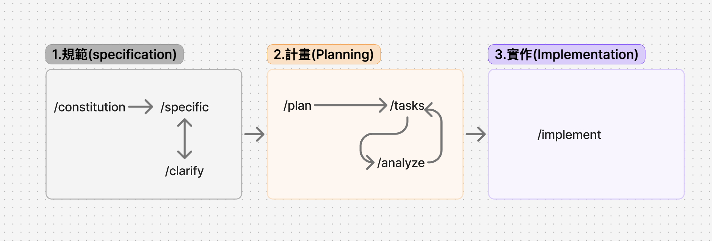

# Spec-Driven-Development

## Spec-kit
[官方網站](https://github.com/github/spec-kit)

## 限制
- 適合建立全新的專案,不適合已經有的專案
- 適合在新專案內建立一個專用的資料夾

### Sepc-Kit Workflow



### 1️⃣ 規範(Specification)

**/constitution（專案原則）**：定下不可違反的標準規則

**/specify（需求規格）**：明確解釋做什麼、目標為何，聚焦「做什麼」與「為什麼」，不提及任何技術棧

**/clarify（釐清模糊）**：確認與補充疑點，在進入P1an前，要視情況使用以加強規格清晰

**Checkpoint 1**：確認所有原則、需求被充分定義，有缺漏必須回到 clarify


### 2️⃣ 計畫(Planning)

**/plan（規劃技術方案）**：明確技術選型、規格、架構、元件劃分等

**/tasks（拆分任務清單）**：生成實作細項任務清單，且為具體、可驗收、可分派工作項目

**/analyze（分析一致性/ 風險)**：檢查任務是否完全覆蓋需求、規格、技術限制；可隨時回流補強前面的步驟（例如，plan有疑問、spec沒覆蓋）

**Checkpoint 2** ：任務須經 /analyze 驗證，確保可落地性，且不脫離原先的規劃再進入/implement


### 3️⃣ 實作(Implementation)

**/implement（實作功能）**：按任務推進，保持與計畫、規格同步

**Review & Verify（品質驗）**：整合 review（人、機驗收），verify（量化指標達標），隨時補強

**Improvements（持續改進）**：根據驗收、回饋、技術債清單精準修正，修正後同步所有相關文件（spec/plan/tasks）。

**Release/Merge（整合交付）**：主支合併、產品發布、價值對外同步，並留下可觀測與回溯紀錄。

**Checkpoint 3**：交付前必經過驗收與回饋，確保最終產出可被所有利害關係人驗證。

### 注意事項

#### 初始化部份

- 如果是初始化專案內的一個特定資料夾,請進入特定資料夾內,還有不要有git(因為資料夾上層已經有git)執行

```bash

cd 特定資料夾

specify init . --no-git 或都 specify init --here --no-git
```

- gemini執行時,以這個資料夾為**根目錄**

#### specification 規範注意事項

- 指定工作目錄`/speckit.constitution`

```

/speckit.constitution

## 工作目錄和工作區
- 2025_08_31_Chihlee_raspberry/貪食蛇2/

## 虛擬環境
- 使用uv的虛擬環境
- 已經有建立虛擬環境
- 進入虛擬環境指令`source .venv/bin/activate`

## 注意事項
- 所有回應請使用繁體中文
- 所有建立的md檔也使用繁體中文
```


- 簡單使用/speckit.specify

```
/speckit.specify \
我要建立一個視窗版繁體中文的貪食蛇遊戲

## ai目標
- 使用pygame製作貪食蛇遊戲
- 必需要有計分功能
- 必需有等級功能
- 結束後可以讓使用者重玩
- 必需記錄使用者的名稱和等級
- 使用者不可以重覆
- 遊戲時,必需要顯示使用者名稱和最高紀錄
- 遊戲過程中,如果使用者超過自已最高紀錄,必需提示
```


#### plan 計畫注意事項

- 將自已規格的內容建立在Gemini.md

```
>/speckit.plan
  請依據 @GEMINI.md 生成
  注意事項:我的工作資料夾和工作區都是在**/貪食蛇2**資料夾 
```

- 建立task.md

```
>/speckit.tasks/
```


#### implement 注意事項

```
>/speckit.implement
```


Q