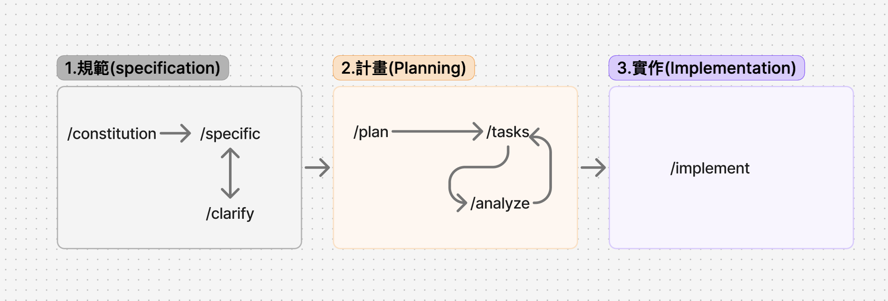

# Spec-Driven-Development

## Spec-kit
[官方網站](https://github.com/github/spec-kit)

### Sepc-Kit Workflow

### 1️⃣ 規範(Specification)

**/constitution（專案原則）**：定下不可違反的標準規則

**/specify（需求規格）**：明確解釋做什麼、目標為何，聚焦「做什麼」與「為什麼」，不提及任何技術棧

**/clarify（釐清模糊）**：確認與補充疑點，在進入P1an前，要視情況使用以加強規格清晰

**Checkpoint 1**：確認所有原則、需求被充分定義，有缺漏必須回到 clarify

### 2️⃣ 計畫(Planning)

**/plan（規劃技術方案）**：明確技術選型、規格、架構、元件劃分等

**/tasks（拆分任務清單）**：生成實作細項任務清單，且為具體、可驗收、可分派工作項目

**/analyze（分析一致性/ 風險)**：檢查任務是否完全覆蓋需求、規格、技術限制；可隨時回流補強前面的步驟（例如，plan有疑問、spec沒覆蓋）

**Checkpoint 2** ：任務須經 /analyze 驗證，確保可落地性，且不脫離原先的規劃再進入/implement

### 3️⃣ 實作(Implementation)

**/implement（實作功能）**：按任務推進，保持與計畫、規格同步

**Review & Verify（品質驗）**：整合 review（人、機驗收），verify（量化指標達標），隨時補強

**Improvements（持續改進）**：根據驗收、回饋、技術債清單精準修正，修正後同步所有相關文件（spec/plan/tasks）。

**Release/Merge（整合交付）**：主支合併、產品發布、價值對外同步，並留下可觀測與回溯紀錄。

**Checkpoint 3**：交付前必經過驗收與回饋，確保最終產出可被所有利害關係人驗證。

