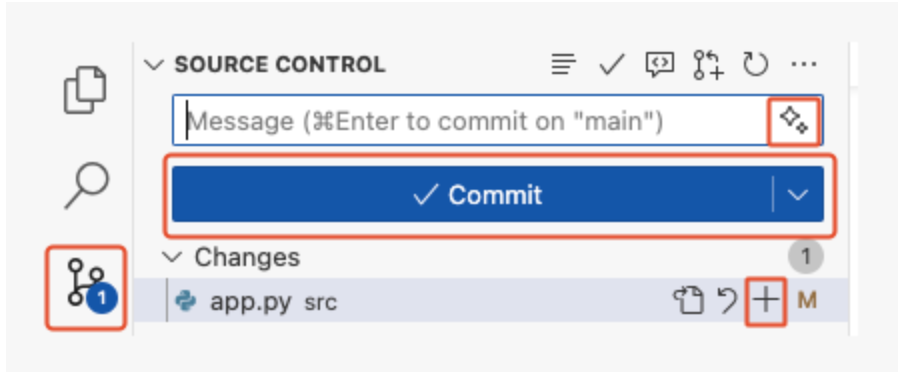

# VibeCoding的專案範例
## 主要提供給所有此repo所有主題需演示的範例

- 為確保範例樣版可以永久保存,必需依照下列方法操作
- copy每個樣版專案內容至「演示目錄」,演示完畢後再刪除演示的資料夾


### [專案範例1](./專案範例1)

- 目的:增加新功能
- 內容:FastAPI
- prompt1:

	```prompt
	請增加一個`講師`所有CRUD的功能
	```
	
	```prompt
	請增加一個`學生`所有CRUD的功能
	```
	
### [專案範例2](./專案範例2)
	
**說明**
	- github提供的範例專案
	- 這是一個fastapi的網頁範例(已更改為繁體中文版)
	- 使用conda的`vibe_coding`環境
	- requirements.txt套件要安裝
	- .vscode內有設定debug,所以可以使用debug來執行
	- 建立AGENT.md,使用時必需先拉進prompt或者使用`產生指示`,建立.github/copilot-instructions.md,並加入下放資訊  

	```
	## 專案工作虛擬環境
	- 執行時必需先執行`conda activate vibe_coding`,進入虛擬環境
	```
	
	
- 檔案執行`uvicorn src.app:app`

### ‼️依順序promp1

#### ❗️Activity: 從Copilot Chat取得專案介紹(使用copilot Ask Mode)	

	```
	prompt:@workspace 請簡單介紹一下這個專案的結構。我該怎麼做才能運行它？
	```

在上一步中，GitHub Copilot 幫助我們啟動了專案。僅此一項就節省了大量時間，現在讓我們開始工作吧！ 我們最近發現一個 bug，`導致學生重複註冊相同的活動。`這實在令人無法接受，所以讓我們趕緊修復它吧！遺憾的是，我們得到的資訊很少，無法解決這個問題。所以，讓我們藉助 Copilot 來找到問題所在，並找到一個潛在的解決方案。

#### ❗️Activity: 使用Copilot幫助記住終端命令
太棒了！現在我們已經熟悉了這款應用，也知道它能正常運作了，接下來我們請求 Copilot 幫忙創建一個分支，這樣就可以進行一些自訂了。

1. 請返回 VS Code。
2. 在底部面板中，選擇“終端”標籤。在右側，按一下加號 + 以建立新的終端視窗。

> 注意：這將避免停止託管我們的 Web 應用程式服務的現有偵錯會話。

3. 在新終端機視窗中，使用鍵盤快速鍵 Ctrl + I（Windows）或 Cmd + I（Mac）調出 Copilot 的終端內聯聊天。

4. ❗️讓我們請 Copilot 幫助我們記住一個我們已經忘記的命令：建立一個分支並發布它。

```
Hey copilot,我如何創建和發布一個名為“accelerate-with-copilot”的新Git分支？
```

> 提示：如果 Copilot 沒有提供您想要的信息，您可以繼續解釋您的需求。 Copilot 會記住對話歷史記錄，以便您進行後續回應。

5. 按下「運行」按鈕，Copilot 會自動插入終端命令。無複製貼上！
6. 片刻之後，查看 VS Code 左側下方的狀態欄，查看活動分支。現在應該顯示“accelerate-with-copilot”。如果顯示“accelerate-with-copilot”，則表示您已完成此步驟！
7. 現在你的分支已推送到 GitHub

### ‼️依順序promp2-使用 Copilot 完成工作

#### ❗️Activity:使用copoit解決重複註冊相同的活動,使用copilot Ask Mode

```
prompt:@workspace 學生可以註冊兩次活動。這個bug是從哪裡來的？
```

現在我們知道問題出在 src/app.py 檔案和 signup_for_activity 方法中，讓我們按照 Copilot 的建議（半手動）修復它。我們先加入註釋，然後讓 Copilot 完成修改。

 1. 在 VS Code 中，選擇檔案總管標籤以顯示專案檔案並開啟 src/app.py 檔案。
 2. 捲動到文件底部附近並找到 signup_for_activity 方法。
 3. 找到描述新增學生的註解行。這行程式碼上方似乎是進行註冊檢查的合理位置。

 4. ❗️使用自動完成來解決問題,程式碼內加上註解

```
		# 驗證學生是否已經加入
```

#### ❗️Activity: 讓Copilot產生樣本數據

在新專案開發中，準備一些看起來逼真的模擬資料進行測試通常很有幫助。 Copilot 在這方面非常出色，因此，讓我們加入一些範例活動，並介紹另一種使用`inline chat 內嵌聊天`與 Copilot 互動的方式。

`inline內嵌聊天`和 `Copilot chat` 面板是非常相似的工具，但自動上下文略有不同。因此，Copilot 聊天擅長解釋專案內容，而內嵌聊天在詢問特定線路或功能時可能感覺更自然。

1. 如果尚未打開，請開啟 src/app.py 檔案。
2. 在頂部附近（大約第 23 行），找到activities變數，我們的範例課外活動就是在這裡配置的。
3. 點擊任意相關行並使用鍵盤命令 Ctrl + I（Windows）或 Cmd + I（Mac）調出 Copilot 線上聊天。

> [!TIP]
> 調出 Copilot 線上聊天的另一種方法是：右鍵點擊任意選定的線路 -> Copilot -> 編輯器線上聊天。

4. 輸入以下提示文本

>
```
增加2項體育相關活動、2項藝術活動及2項智力活動。
```


5. 片刻之後，Copilot 將直接開始修改程式碼。修改後的樣式將有所不同，以便輕鬆識別任何新增和刪除的內容。請稍等片刻，然後按下「接受」按鈕。


#### ❗️Activity: 使用Copilot來描述我們的工作

修復了那個 bug，擴展了範例活動，幹得好！現在，讓我們提交工作並推送到 GitHub，再次感謝 Copilot 的幫助！

1. 在左側邊欄中，選擇「原始碼控制」標籤。

> Tip: 從來源控制區域開啟檔案將顯示與原始檔案的差異，而不是簡單地開啟它。

2. 找到 app.py 檔案並按 + 號將您的變更收集到暫存區中。

3. 在已暫存變更清單上方，找到「訊息」文字方塊，但暫時不要輸入任何內容。

4. 通常，您會在此處簡短描述更改內容，但現在我們有 Copilot 來幫忙了！

5. 在「訊息」文字方塊右側，找到並點擊「使用 Copilot 產生提交訊息」按鈕（閃爍圖示）。

6. 點擊「提交」按鈕和「同步變更」按鈕，將您的變更推送到 GitHub。



