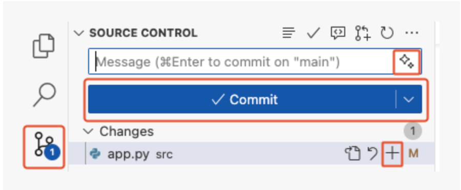
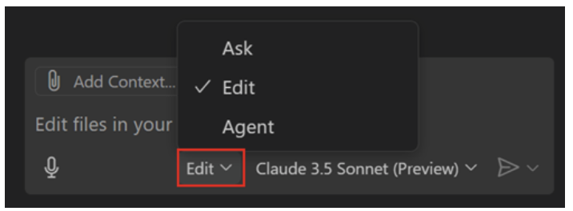
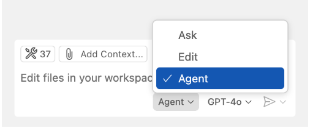

# 專案範例2操作流程
Mergington 高中管理系統 API-高中的課外活動

**說明**

- github提供的範例專案
- 這是一個fastapi的網頁範例(已更改為繁體中文版)
- 使用conda的`vibe_coding`環境
- requirements.txt套件要安裝
- .vscode內有設定debug,所以可以使用debug來執行。(必需設定於.vscode/launch.json),內容如下(如有不同環境請修改)

> 
```
{
  // Use IntelliSense to learn about possible attributes.
  // Hover to view descriptions of existing attributes.
  // For more information, visit: https://go.microsoft.com/fwlink/?linkid=830387
  "version": "0.2.0",
  "configurations": [
    {
      "name": "Launch Mergington WebApp",
      "type": "debugpy",
      "python":"/opt/miniconda3/envs/vibe_coding/bin/python",
      "request": "launch",
      "module": "uvicorn",
      "args": [
        "src.app:app",
        "--reload"
      ],
      "jinja": true
    }
  ]
}
```


- 建立AGENT.md,使用時必需先拉進prompt或者使用`產生指示`,建立.github/copilot-instructions.md,並加入下例資訊  

> 
	```
	## 專案工作虛擬環境
	- 執行時必需先執行`conda activate vibe_coding`,進入虛擬環境
	```
	
	
- 手動檔案執行`uvicorn src.app:app`

### ‼️依順序promp1

#### ❗️Activity: 從Copilot Chat取得專案介紹(使用copilot Ask Mode)	

	```
	prompt:@workspace 請簡單介紹一下這個專案的結構。我該怎麼做才能運行它？
	```

在上一步中，GitHub Copilot 幫助我們啟動了專案。僅此一項就節省了大量時間，現在讓我們開始工作吧！ 我們最近發現一個 bug，`導致學生重複註冊相同的活動。`這實在令人無法接受，所以讓我們趕緊修復它吧！遺憾的是，我們得到的資訊很少，無法解決這個問題。所以，讓我們藉助 Copilot 來找到問題所在，並找到一個潛在的解決方案。

#### ❗️Activity: 使用Copilot幫助記住終端命令
太棒了！現在我們已經熟悉了這款應用，也知道它能正常運作了，接下來我們請求 Copilot 幫忙創建一個分支，這樣就可以進行一些自訂了。

1. 請返回 VS Code。
2. 在底部面板中，選擇“終端”標籤。在右側，按一下加號 + 以建立新的終端視窗。

> 注意：這將避免停止託管我們的 Web 應用程式服務的現有偵錯會話。

3. 在新終端機視窗中，使用鍵盤快速鍵 Ctrl + I（Windows）或 Cmd + I（Mac）調出 Copilot 的終端內聯聊天。

4. ❗️讓我們請 Copilot 幫助我們記住一個我們已經忘記的命令：建立一個分支並發布它。

```
Hey copilot,我如何創建和發布一個名為“accelerate-with-copilot”的新Git分支？
```

> 提示：如果 Copilot 沒有提供您想要的信息，您可以繼續解釋您的需求。 Copilot 會記住對話歷史記錄，以便您進行後續回應。

5. 按下「運行」按鈕，Copilot 會自動插入終端命令。無複製貼上！
6. 片刻之後，查看 VS Code 左側下方的狀態欄，查看活動分支。現在應該顯示“accelerate-with-copilot”。如果顯示“accelerate-with-copilot”，則表示您已完成此步驟！
7. 現在你的分支已推送到 GitHub

### ‼️依順序promp2-使用 Copilot 完成工作

#### ❗️Activity:使用copoit解決重複註冊相同的活動,使用copilot Ask Mode

```
prompt:@workspace 學生可以註冊兩次活動。這個bug是從哪裡來的？
```

現在我們知道問題出在 src/app.py 檔案和 signup_for_activity 方法中，讓我們按照 Copilot 的建議（半手動）修復它。我們先加入註釋，然後讓 Copilot 完成修改。

 1. 在 VS Code 中，選擇檔案總管標籤以顯示專案檔案並開啟 src/app.py 檔案。
 2. 捲動到文件底部附近並找到 signup_for_activity 方法。
 3. 找到描述新增學生的註解行。這行程式碼上方似乎是進行註冊檢查的合理位置。

 4. ❗️使用自動完成來解決問題,程式碼內加上註解

```
		# 驗證學生是否已經加入
```

#### ❗️Activity: 讓Copilot產生樣本數據

在新專案開發中，準備一些看起來逼真的模擬資料進行測試通常很有幫助。 Copilot 在這方面非常出色，因此，讓我們加入一些範例活動，並介紹另一種使用`inline chat 內嵌聊天`與 Copilot 互動的方式。

`inline內嵌聊天`和 `Copilot chat` 面板是非常相似的工具，但自動上下文略有不同。因此，Copilot 聊天擅長解釋專案內容，而內嵌聊天在詢問特定線路或功能時可能感覺更自然。

1. 如果尚未打開，請開啟 src/app.py 檔案。
2. 在頂部附近（大約第 23 行），找到activities變數，我們的範例課外活動就是在這裡配置的。
3. 點擊任意相關行並使用鍵盤命令 Ctrl + I（Windows）或 Cmd + I（Mac）調出 Copilot 線上聊天。

> [!TIP]
> 調出 Copilot 線上聊天的另一種方法是：右鍵點擊任意選定的線路 -> Copilot -> 編輯器線上聊天。

4. 輸入以下提示文本

>
```
增加2項體育相關活動、2項藝術活動及2項智力活動。
```


5. 片刻之後，Copilot 將直接開始修改程式碼。修改後的樣式將有所不同，以便輕鬆識別任何新增和刪除的內容。請稍等片刻，然後按下「接受」按鈕。


#### ❗️Activity: 使用Copilot來描述我們的工作

修復了那個 bug，擴展了範例活動，幹得好！現在，讓我們提交工作並推送到 GitHub，再次感謝 Copilot 的幫助！

1. 在左側邊欄中，選擇「原始碼控制」標籤。

> Tip: 從來源控制區域開啟檔案將顯示與原始檔案的差異，而不是簡單地開啟它。

2. 找到 app.py 檔案並按 + 號將您的變更收集到暫存區中。

3. 在已暫存變更清單上方，找到「訊息」文字方塊，但暫時不要輸入任何內容。

4. 通常，您會在此處簡短描述更改內容，但現在我們有 Copilot 來幫忙了！

5. 在「訊息」文字方塊右側，找到並點擊「使用 Copilot 產生提交訊息」按鈕（閃爍圖示）。

6. 點擊「提交」按鈕和「同步變更」按鈕，將您的變更推送到 GitHub。



### ‼️依順序promp3-使用 Copilot Edits 更快完成工作

在先前的步驟中，我們使用了 Copilot 的一些需要更多實際指導的功能，而這些功能大多只產生了局部性的結果。現在，我們將探索 Copilot Edits，這項功能可以幫助我們更全面地處理程式碼庫。

`Copilot - Edit Mode`是一個由人工智慧驅動的程式碼編輯會話，可以使用自然語言對多個檔案進行更改，並將編輯直接應用於編輯器，您可以在其中就地查看它們，並獲取周圍程式碼的完整上下文。

**主要功能**

- 多重檔案編輯：Copilot Edits 可以對工作區中的多個檔案進行變更。
- 互動工作流程：專為快速迭代而設計，可讓您審查、接受或放棄 AI 生成的程式碼。
- 就地編輯：直接在編輯器中顯示產生的程式碼，提供類似程式碼審查的流程。
- 工作集：允許您定義要套用編輯的檔案。

**工作原理**

- 設定上下文：選擇要新增至工作集中的檔案。
- 提供說明：使用自然語言描述所需的變更。
- 審核變更：查看程式碼中建議的變更。
- 接受或放棄：審核每個建議的編輯，並選擇保留哪些。
- 重覆執行：如有必要，提供後續說明以完善變更。

#### ❗️Activity: 使用 Copilot 新增功能!

1. 如果看不到 Copilot 聊天面板，請重新開啟它。
2. 在 Copilot Chat 視窗底部，使用下拉式選單切換到編輯模式。



3. 開啟與我們的網頁相關的文件，然後將每個編輯器視窗（或文件）拖曳到聊天面板，通知 Copilot 將它們用作上下文。

	- src/static/app.js
	- src/static/index.html
	- src/static/styles.css

> 提示：您也可以使用新增上下文...按鈕提供其他上下文項目來源，例如 GitHub 問題、整個程式碼庫或終端機視窗的結果。

4. 請 Copilot 更新我們的項目，以顯示目前活動的參與者。請稍等片刻，等待編輯建議到達並應用。
> 
```
Hey，Copilot，你能編輯活動卡片，增加一個參與者部分嗎？它會以項目符號清單的形式顯示已經報名參加該活動的參與者。記得把它弄得漂亮一點！
```

> - 文件名和打開的編輯器視窗旁邊出現了一個額外的圖標，表示它們建議進行編輯。

> - 編輯器視窗右下方出現了一個建議的編輯面板，提供跳到建議更改的控制項。

5. 在我們接受更改之前，請再次檢查我們的網站，確認所有內容均已按預期更新。以下是更新後的活動卡片範例。您可能需要重新啟動應用程式或重新整理頁面。

6. 現在我們已經確認我們的更改是正確的，請使用面板循環瀏覽每個建議的編輯，然後按“Keep”應用更改。

> 您可以直接接受變更、修改變更或使用聊天介面提供其他說明來完善變更。

7. 隨著我們的新功能的完成，請提交並將變更推送到 GitHub。

### ‼️依順序promp4-額外活動GitHub Copilot 代理模式

Agent mode 透過自動提供回饋來增強 Copilot，通常是您在查看 Copilot 建議的編輯後提供的回饋類型。

Agent mode 為 Copilot 提供了一個反饋循環，使其能夠檢查自身結果中是否存在程式碼甚至終端中的問題、錯誤、不一致等！這使得它能夠在許多情況下自動修改工作。同樣，這意味著代理模式通常可以處理更複雜、步驟更繁瑣的任務。


#### ❗️Activity: 使用agent mode新增功能性「取消註冊」按鈕

讓我們嘗試一些更具開放性的請求，為我們的 Web 應用添加更多功能。請記住，即使提供相同的提示，AI 助理也常常會產生不同的結果。如果您沒有獲得預期的結果，可以嘗試其他模型或提供後續回饋來優化結果。

1. 開啟 Copilot chat面板並使用下拉式選單切換到agent模式。



2. 測試時間到了！讓我們請 Copilot 增加移除參與者的功能。
> 
```
#codebase 請在每位參與者旁邊新增一個刪除圖標，並隱藏重點。
點擊後，將從活動中取消該參與者的註冊。
```

> #codebase = 請 Copilot Chat 參考目前整個專案的程式碼，而不只是你目前打開的檔案。

- 如果您在Edit Mode下嘗試此提示，您可能會發現前端和後端的變更只是理論上的。雖然沒有出現語法或運行時錯誤，但這些變更不相容，並且沒有達到預期目標。

- 在代理模式下，Copilot 審查了自己的工作並進行了改進，以確保所有變更都沒有錯誤並且協調一致。

3. Copilot 完成後，重新啟動偵錯器並檢查結果。如果您對結果滿意，請按下「保留」按鈕。如果不滿意，請嘗試向 Copilot 提供一些回饋，以優化結果。

4. 請 Copilot 修復註冊錯誤。

>

```
#codebase 我注意到似乎有一個 bug。當參與者註冊後，必須刷新頁面才能看到活動的變化。
```

#### ❗️Activity: 使用代理模式更改資料庫！

讓我們嘗試一些更困難和開放的事情，看看會發生什麼！

> [!TIP]
> 在我們的實驗中，大多數情況下都能獲得有效結果，但並非每次都能。您可以嘗試其他模型，或暫停一下，以便 Copilot 提供回饋。

1. （可選）如果您可以使用，您可以嘗試另一個型號，例如 Claude 3.5 Sonnet。


2. 請 Copilot 安裝本地sqlite資料庫服務。

>
```
出於開發原因，請安裝本機 sqlite 資料庫。之後，執行列出集合的命令，以驗證服務是否處於活動狀態並正常運作。請勿修改我們的程序。
```

3. 要求 Copilot 更改我們的應用程式以使用資料庫服務。

> 
```
#codebase 我不喜歡將資料儲存在記憶體中。我們切換到使用 sqlite db 吧。
目前使用本地開發實例。請使用現有的硬編碼 JSON 活動預先填入資料庫，並將活動名稱作為鍵。
```


### ‼️ 回復到原來狀態
- 回到 main branch
- 刪除accelerate-with-copilot