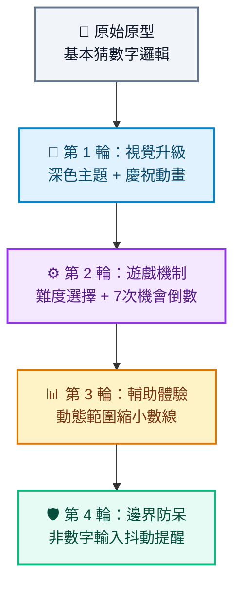

# 作品迭代與修改技巧：如何引導 AI 進化你的應用程式

當你運用前面學到的 **RTCCF 結構化提示詞** 產出第一個小遊戲原型後，真正的魔法才剛開始！

在 Vibe Coding（直覺式 AI 編程）的世界裡，沒有人是一次就把軟體做到完美的。真正的開發高手，不是「一次寫出萬行程式碼」，而是懂得**「小步快跑、循序迭代」**——先做出能動的原型，再一步步引導 AI 改進細節。

---

## 一、 為什麼不能「一次叫 AI 改全部」？

許多初學者在拿到第一版程式碼後，常會迫不及待一口氣打入一長串要求：
> ❌ *「請幫我加上音效、增加三種難度、背景改成賽博朋克風、修一下碰撞沒反應的 Bug、順便再加上排行榜和多國語言支援！」*

**這樣做通常會帶來災難性的結果：**
1. **改 A 壞 B**：AI 專注於處理新功能時，容易不小心刪掉原本正常運作的邏輯。
2. **AI 記憶體負載超載（產生幻覺）**：指令過多會稀釋注意力，導致很多細節被跳過。
3. **除錯困難**：一次改動數百行，當遊戲跑不動時，你完全不知道是哪一項功能引發了錯誤。

---

## 二、 迭代修改的四大黃金法則

為了讓 AI 能穩健、可控地修改你的作品，請嚴格遵守以下四大法則：

### 1. 一次只做一件事（單點突破）
每一輪對話只鎖定 **一個核心改動**（例如：這輪只做「深色模式」，下一輪再做「次數限制」）。  
改完後立刻在瀏覽器上測試，確認沒問題再進入下一個需求。

---

### 2. 精準描述「現狀 vs 期望」（What is vs What should be）
請告訴 AI「目前發生了什麼」以及「你希望變成什麼」，避免模稜兩可的形容詞。

- ❌ **模糊描述**：「*按鈕怪怪的，點了沒什麼感覺。*」
- ✅ **精準描述**：「*目前點擊『重新開始』按鈕時，分數沒有歸零。我期望點擊後分數重設為 0，且蛇回到畫布中央。*」

---

### 3. 遇到 Bug 時：抓取 Console 錯誤餵給 AI
程式卡住跑不動時，**千萬不要只對 AI 說「*程式壞了*」**！

🛠️ **除錯三步驟**：
1. 在瀏覽器網頁上按 `F12`（或點右鍵選擇「檢查」），切換到 **Console（主控台）** 分頁。
2. 找到紅色的錯誤訊息（例如：`Uncaught TypeError: Cannot read properties of undefined`），將錯誤訊息完整複製。
3. 直接貼給 AI，並下達指令：
   > 💬 *「我執行時瀏覽器 Console 出現以下錯誤訊息：`[貼上錯誤訊息]`。請幫我分析原因並修正這段程式碼。」*

---

### 4. 明確要求程式碼交付方式
初學者常不知道 AI 給出的程式碼片段該插在檔案哪裡，因此在迭代修改時，建議一律要求 AI 給出完整代碼：
> 💬 *「請在修改完成後，提供修改後的完整單一 HTML 檔案，方便我直接替換執行。」*

---

## 三、 實戰示範：以「猜數字遊戲」為例的四輪進化

假設你已經有了基礎的猜數字遊戲（隨機 1~100、猜太大太小提示），以下示範如何透過 4 輪對話讓遊戲大幅進化：

### 🔹 第 1 輪：視覺與回饋升級
> 💬 **你的 Prompt**：  
> 「目前遊戲畫面是預設的白色背景，顯得較為單調。請保持現有猜數字邏輯不變，幫我將視覺風格升級為現代科技感的深色模式（Dark Mode），並在玩家猜中數字時，於畫面中央加入彩帶慶祝動畫特效。」

### 🔹 第 2 輪：規則與難度擴充
> 💬 **你的 Prompt**：  
> 「外觀調整得很棒！接下來請幫我擴充遊戲機制：  
> 1. 在上方加入難度選擇選單：『簡單（1~50）』與『普通（1~100）』。  
> 2. 加入次數限制：每局限制最多猜 7 次，每次猜測即時更新剩餘次數，次數耗盡則提示挑戰失敗並揭曉答案。  
> 請提供更新後的完整程式碼。」

### 🔹 第 3 輪：增加動態數線輔助
> 💬 **你的 Prompt**：  
> 「我想提升玩家的遊玩體驗。請在輸入框下方加入一條『動態可能範圍指示條』：  
> 每次猜完後，即時用視覺化標記當前縮小的可能區間（例如原本 1~100，猜了 40 太小後，指示條縮小為 41~100）。」

### 🔹 第 4 輪：邊界防呆與除錯
> 💬 **你的 Prompt**：  
> 「我測試時發現如果玩家輸入負數、大於 100 的數字或空白，程式還是會扣除次數。  
> 請幫我加入輸入防呆驗證：若輸入超出當前可能範圍，不扣除次數，並讓輸入框呈現紅色邊框抖動提示。」

---

## 四、 🚀 換你來實戰：把你的小遊戲進化 3 次！

請拿出你在前一章生成的 **小遊戲**（猜數字、貪食蛇、反應力測試或打磚塊），跟著以下步驟進行 3 輪迭代：

1. **輪次一（視覺打磨）**：請 AI 改善配色、字體、卡片陰影或加入微動畫。
2. **輪次二（功能擴充）**：增加 1 項新規則（如：難度切換、生命值愛心、最高分記錄、計時器）。
3. **輪次三（體驗與防呆）**：測試邊界情況，請 AI 加上防呆提示或音效反饋。

> 💡 **核心心法**：  
> 好的軟體不是一次寫出來的，而是**「改」**出來的。養成一次只改一處、隨時驗證的好習慣，你就能隨心所欲調教 AI，做出驚艷全場的完整作品！
